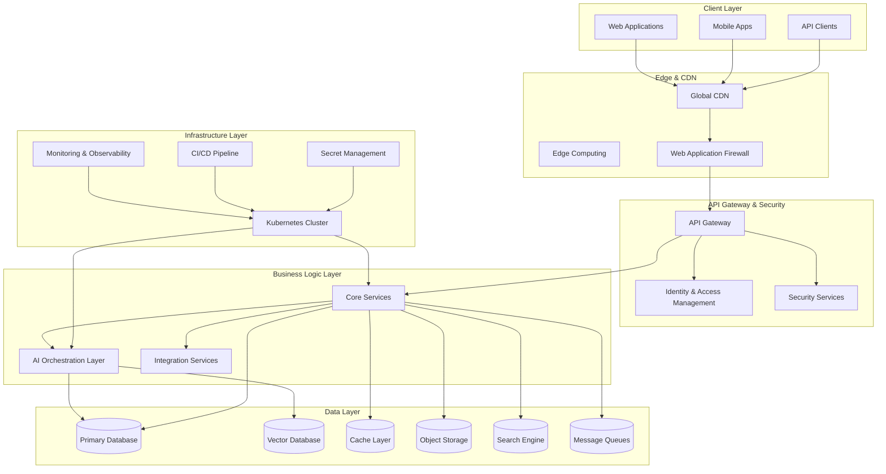
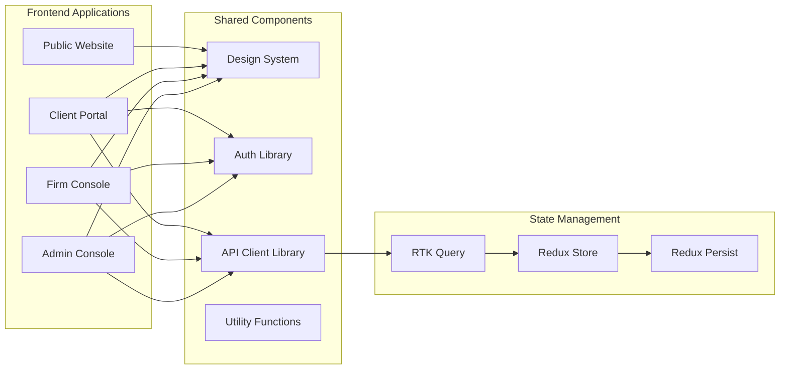
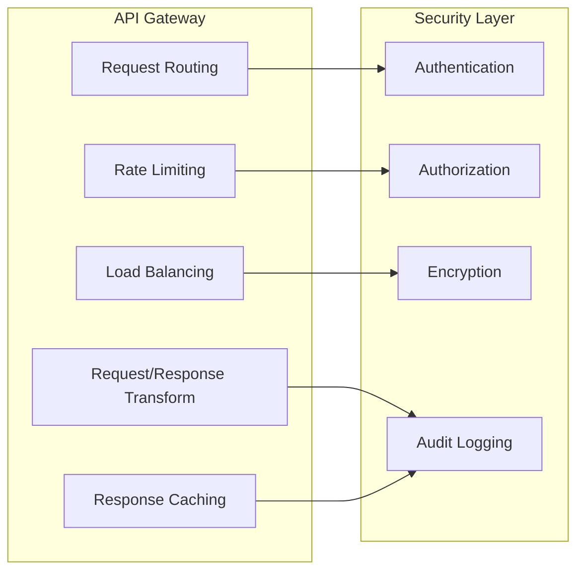
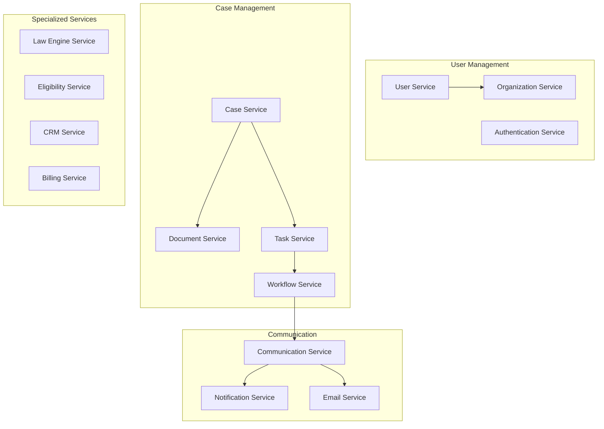
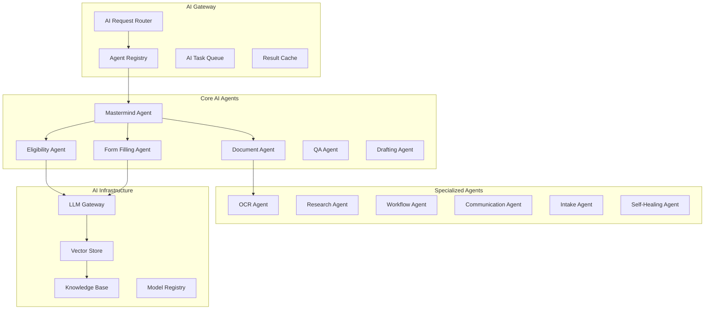
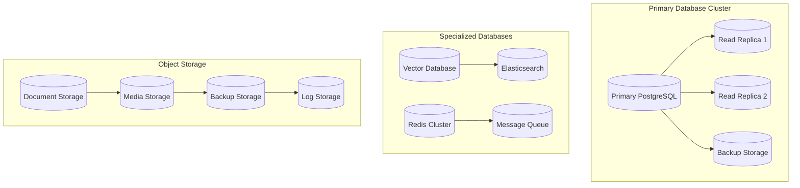
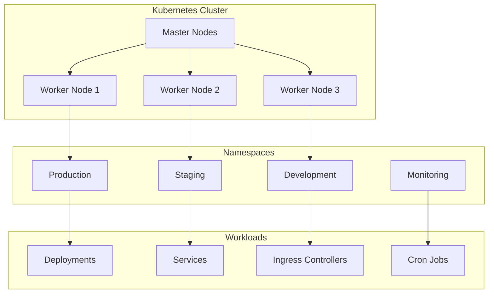

# System Architecture

## Document Purpose

This document outlines the comprehensive system architecture for the Neuron ImmigrationOS platform, including technical stack, deployment architecture, scalability patterns, and integration strategies. It serves as the definitive technical reference for all engineering decisions.

---

## Architectural Principles

### Core Principles

- **Microservices Architecture:** Loosely coupled, independently deployable services
- **Multi-Agent AI System:** Specialized AI agents with orchestrated workflows
- **Event-Driven Architecture:** Asynchronous communication and real-time processing
- **Cloud-Native Design:** Kubernetes-based deployment with auto-scaling
- **Security by Design:** Zero-trust security model with end-to-end encryption
- **API-First Approach:** All functionality exposed through well-defined APIs

### Design Philosophy

- **Scalability First:** Horizontal scaling capabilities built-in
- **Resilience by Default:** Fault tolerance and self-healing mechanisms
- **Observability:** Comprehensive monitoring, logging, and tracing
- **Developer Experience:** Tools and processes that enhance productivity
- **Compliance Ready:** Built-in audit trails and regulatory compliance

---

## High-Level Architecture Overview

---

## Technology Stack

### Frontend Technologies

#### Web Applications

- **Framework:** React 18+ with TypeScript
- **State Management:** Redux Toolkit with RTK Query
- **UI Framework:** Custom design system with Tailwind CSS
- **Build Tool:** Vite for fast development and builds
- **Testing:** Jest, React Testing Library, Playwright E2E
- **Deployment:** Static hosting with CDN distribution

#### Mobile Applications

- **Framework:** React Native with TypeScript
- **State Management:** Redux Toolkit
- **Navigation:** React Navigation 6
- **Offline Support:** Redux Persist with AsyncStorage
- **Push Notifications:** Firebase Cloud Messaging
- **Testing:** Jest, Detox for E2E testing

### Backend Technologies

#### Core Services

- **Runtime:** Node.js 20+ LTS
- **Framework:** Express.js with TypeScript
- **API Documentation:** OpenAPI 3.0 with Swagger
- **Validation:** Joi for request validation
- **Authentication:** Passport.js with JWT
- **Testing:** Jest, Supertest for integration tests

#### Alternative Services (Python)

- **Runtime:** Python 3.11+
- **Framework:** FastAPI for high-performance APIs
- **ORM:** SQLAlchemy with Alembic migrations
- **Validation:** Pydantic for data validation
- **Testing:** pytest with comprehensive test coverage

### Database Technologies

#### Primary Database

- **Database:** PostgreSQL 15+
- **Features:** JSONB, Full-text search, Row-level security
- **Extensions:** pg_vector for embeddings, pg_cron for scheduling
- **Replication:** Streaming replication with read replicas
- **Backup:** Continuous backup with point-in-time recovery

#### Vector Database

- **Database:** Pinecone or Weaviate
- **Purpose:** AI embeddings and semantic search
- **Integration:** Python/Node.js SDKs
- **Scaling:** Managed service with auto-scaling

#### Cache Layer

- **Technology:** Redis 7+
- **Configuration:** Redis Cluster for high availability
- **Use Cases:** Session storage, API caching, rate limiting
- **Persistence:** RDB + AOF for data durability

#### Search Engine

- **Technology:** Elasticsearch 8+
- **Purpose:** Full-text search, analytics, logging
- **Configuration:** Multi-node cluster with replicas
- **Integration:** Official client libraries

### AI and Machine Learning

#### Large Language Models

- **Primary:** OpenAI GPT-4 and GPT-3.5-turbo
- **Alternative:** Anthropic Claude, Google Gemini
- **Local Models:** Ollama for on-premises deployment
- **Fine-tuning:** Custom models for immigration domain

#### AI Infrastructure

- **Orchestration:** LangChain for agent workflows
- **Vector Storage:** Embeddings for semantic search
- **Model Management:** MLflow for model versioning
- **Monitoring:** Custom metrics for AI performance

### Infrastructure Technologies

#### Container Orchestration

- **Platform:** Kubernetes 1.28+
- **Distribution:** Amazon EKS, Google GKE, or Azure AKS
- **Service Mesh:** Istio for advanced traffic management
- **Ingress:** NGINX Ingress Controller

#### CI/CD Pipeline

- **Version Control:** Git with GitHub/GitLab
- **CI/CD:** GitHub Actions or GitLab CI
- **Container Registry:** Docker Hub or cloud-native registries
- **Deployment:** Helm charts for Kubernetes

#### Monitoring and Observability

- **Metrics:** Prometheus with Grafana dashboards
- **Logging:** ELK Stack (Elasticsearch, Logstash, Kibana)
- **Tracing:** Jaeger for distributed tracing
- **APM:** New Relic or Datadog for application monitoring

---

## Detailed Architecture Layers

### 1. Client Layer Architecture

#### Web Application Architecture

#### Mobile Application Architecture

- **Cross-Platform:** Single codebase for iOS and Android
- **Native Modules:** Platform-specific functionality when needed
- **Offline-First:** Core features work without internet connection
- **Push Notifications:** Real-time updates and alerts
- **Biometric Auth:** Fingerprint and face recognition

### 2. API Gateway and Security Layer

#### API Gateway Configuration

#### Security Architecture

- **Zero Trust Model:** Never trust, always verify
- **OAuth 2.0 + OIDC:** Industry-standard authentication
- **JWT Tokens:** Stateless authentication with short expiry
- **RBAC:** Role-based access control with fine-grained permissions
- **API Security:** Rate limiting, input validation, output sanitization

### 3. Business Logic Layer (Microservices)

#### Core Services Architecture

#### Service Communication Patterns

- **Synchronous:** REST APIs for real-time operations
- **Asynchronous:** Message queues for background processing
- **Event-Driven:** Domain events for loose coupling
- **Circuit Breakers:** Prevent cascade failures
- **Retry Logic:** Exponential backoff with jitter

### 4. AI Orchestration Layer

#### Multi-Agent AI Architecture

#### AI Agent Orchestration

- **Agent Registry:** Central registry of available agents
- **Task Distribution:** Intelligent task routing to appropriate agents
- **Context Sharing:** Shared context and memory between agents
- **Result Aggregation:** Combining results from multiple agents
- **Quality Assurance:** Multi-layer validation and verification

### 5. Data Layer Architecture

#### Database Architecture

#### Data Flow Patterns

- **CQRS:** Command Query Responsibility Segregation
- **Event Sourcing:** Audit trail and state reconstruction
- **Data Partitioning:** Horizontal scaling for large datasets
- **Caching Strategy:** Multi-level caching for performance
- **Backup Strategy:** Continuous backup with point-in-time recovery

### 6. Infrastructure Layer

#### Kubernetes Architecture

#### Infrastructure Components

- **Auto-Scaling:** Horizontal Pod Autoscaler (HPA) and Vertical Pod Autoscaler (VPA)
- **Service Mesh:** Istio for traffic management and security
- **Ingress:** NGINX for load balancing and SSL termination
- **Storage:** Persistent volumes for stateful services
- **Networking:** CNI plugins for pod networking

---

## Scalability Patterns

### Horizontal Scaling

- **Stateless Services:** All services designed to be stateless
- **Load Balancing:** Distribute traffic across multiple instances
- **Database Sharding:** Partition data across multiple databases
- **Microservices:** Independent scaling of individual services
- **Auto-Scaling:** Automatic scaling based on metrics

### Performance Optimization

- **Caching:** Multi-level caching strategy
- **CDN:** Global content delivery network
- **Database Optimization:** Query optimization and indexing
- **Async Processing:** Background job processing
- **Connection Pooling:** Efficient database connections

### Geographic Distribution

- **Multi-Region:** Deploy across multiple geographic regions
- **Edge Computing:** Process data closer to users
- **Data Replication:** Replicate data across regions
- **Latency Optimization:** Minimize network latency
- **Disaster Recovery:** Cross-region backup and recovery

---

## Security Architecture

### Defense in Depth

- **Network Security:** Firewalls, VPNs, and network segmentation
- **Application Security:** Input validation, output encoding, OWASP compliance
- **Data Security:** Encryption at rest and in transit
- **Identity Security:** Multi-factor authentication and authorization
- **Infrastructure Security:** Container security and Kubernetes hardening

### Compliance and Governance

- **PIPEDA Compliance:** Canadian privacy law requirements
- **GDPR Compliance:** European data protection standards
- **SOC 2:** Security and availability controls
- **Audit Trails:** Comprehensive logging and monitoring
- **Data Governance:** Data classification and retention policies

---

## Integration Architecture

### External Integrations

- **IRCC Systems:** Immigration application submission and tracking
- **Payment Gateways:** Stripe, PayPal for payment processing
- **Communication:** Email, SMS, video conferencing services
- **Document Services:** E-signature, OCR, translation services
- **Business Systems:** Accounting, CRM, calendar applications

### API Design Principles

- **RESTful APIs:** Standard HTTP methods and status codes
- **GraphQL:** Flexible data querying for complex requirements
- **Webhooks:** Real-time event notifications
- **Rate Limiting:** Prevent API abuse and ensure fair usage
- **Versioning:** Backward-compatible API evolution

---

## Monitoring and Observability

### Monitoring Stack

- **Metrics:** Prometheus for metrics collection
- **Visualization:** Grafana for dashboards and alerting
- **Logging:** ELK stack for centralized logging
- **Tracing:** Jaeger for distributed tracing
- **APM:** Application performance monitoring

### Key Metrics

- **Business Metrics:** Case completion rates, client satisfaction
- **Technical Metrics:** Response times, error rates, throughput
- **Infrastructure Metrics:** CPU, memory, disk, network usage
- **Security Metrics:** Failed login attempts, suspicious activities
- **AI Metrics:** Model accuracy, processing times, token usage

---

## Deployment Architecture

### Environment Strategy

- **Development:** Local development and testing
- **Staging:** Pre-production testing and validation
- **Production:** Live production environment
- **Disaster Recovery:** Backup production environment

### CI/CD Pipeline

```mermaid
graph LR
    CODE[Code Commit] --> BUILD[Build & Test]
    BUILD --> SECURITY[Security Scan]
    SECURITY --> DEPLOY_DEV[Deploy to Dev]
    DEPLOY_DEV --> TEST[Automated Tests]
    TEST --> DEPLOY_STAGING[Deploy to Staging]
    DEPLOY_STAGING --> MANUAL_TEST[Manual Testing]
    MANUAL_TEST --> DEPLOY_PROD[Deploy to Production]
    DEPLOY_PROD --> MONITOR[Monitor & Alert]
```

### Deployment Strategies

- **Blue-Green Deployment:** Zero-downtime deployments
- **Canary Releases:** Gradual rollout to subset of users
- **Feature Flags:** Runtime feature toggling
- **Rollback Capability:** Quick reversion to previous version
- **Health Checks:** Automated health monitoring

---

## Disaster Recovery and Business Continuity

### Backup Strategy

- **Database Backups:** Continuous backup with point-in-time recovery
- **File Backups:** Regular backup of documents and media
- **Configuration Backups:** Infrastructure as code backups
- **Cross-Region Replication:** Geographic redundancy
- **Backup Testing:** Regular restore testing

### Recovery Procedures

- **RTO (Recovery Time Objective):** < 1 hour
- **RPO (Recovery Point Objective):** < 15 minutes
- **Failover Procedures:** Automated failover to backup systems
- **Communication Plan:** Stakeholder notification procedures
- **Testing Schedule:** Regular disaster recovery testing

---

_Document Version: 1.0_
_Last Updated: 2025-11-17_
_Source: Consolidated from system architecture documentation and technical specifications_
