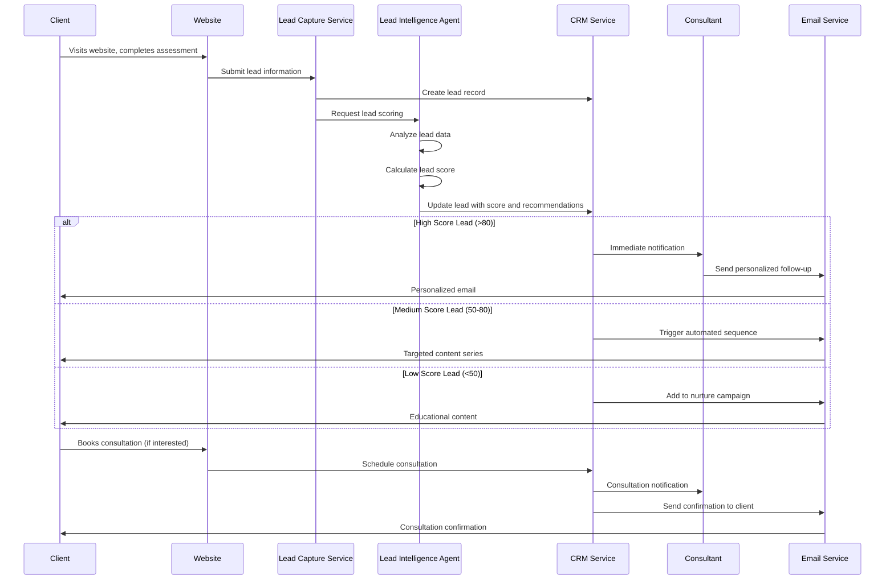
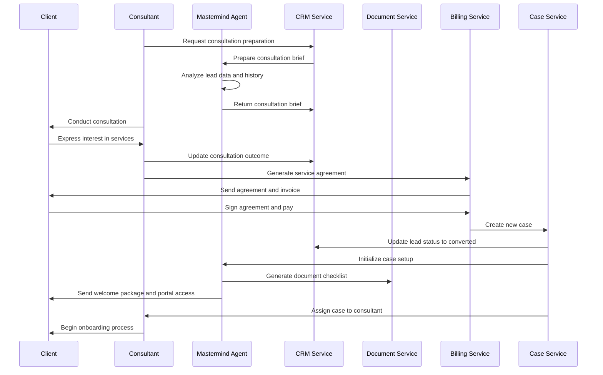
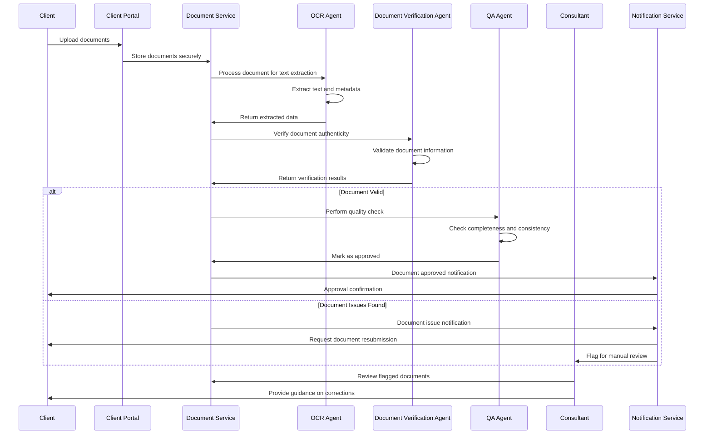
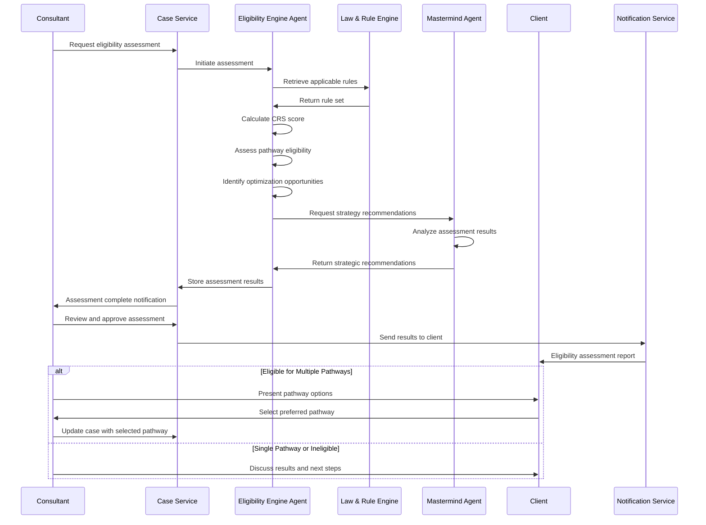
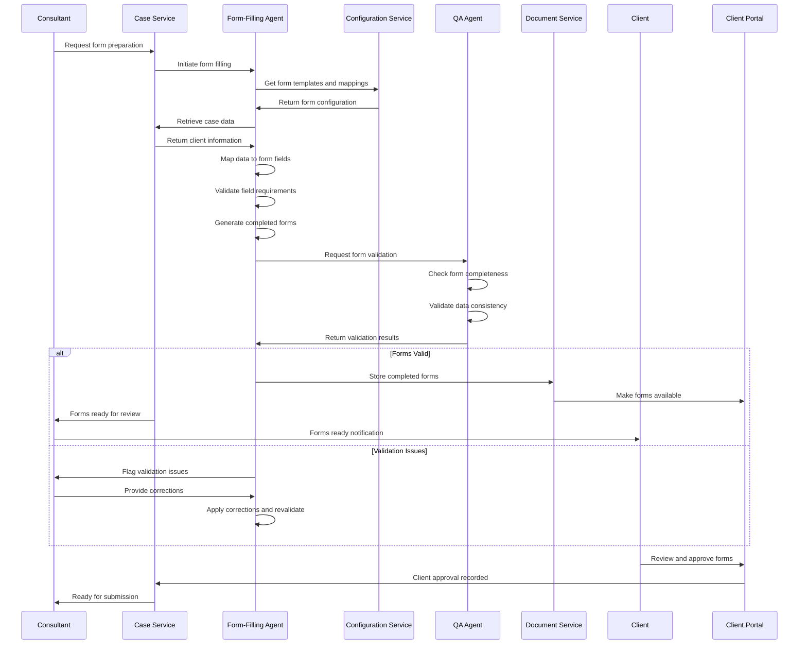
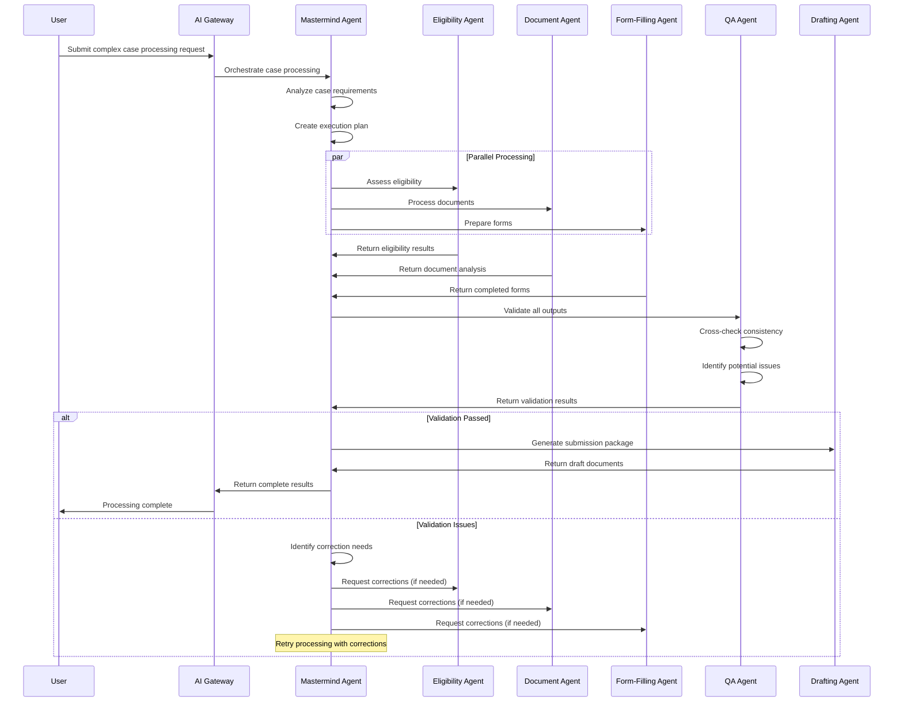
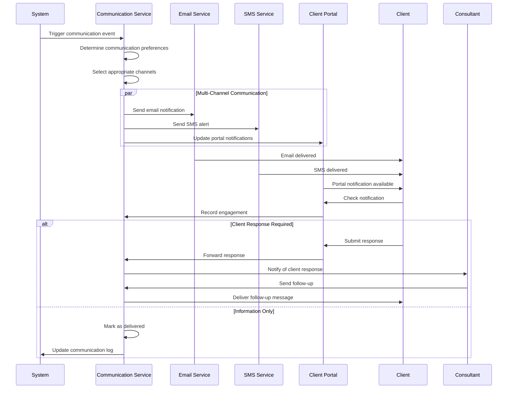
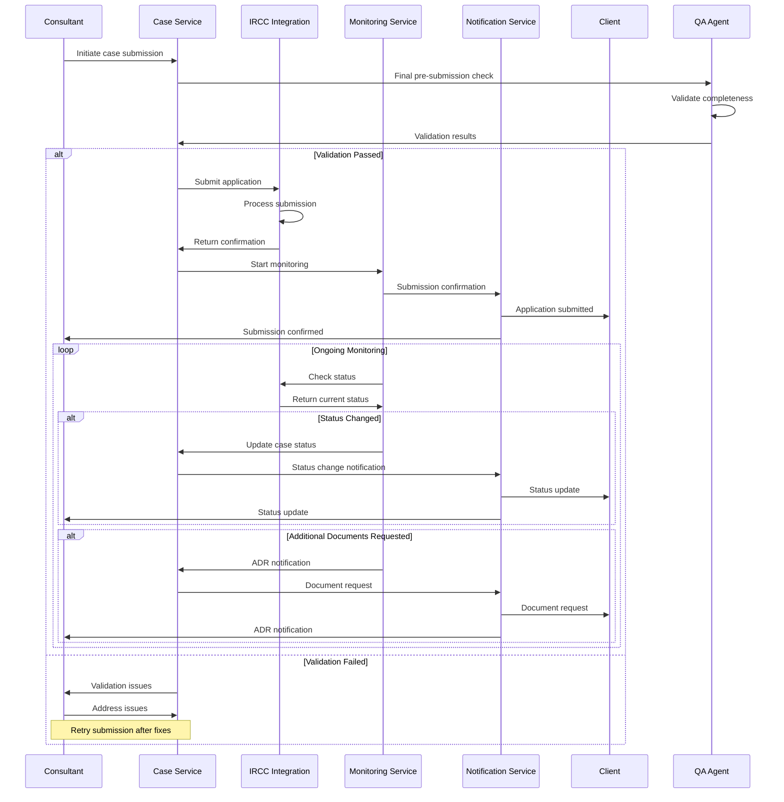
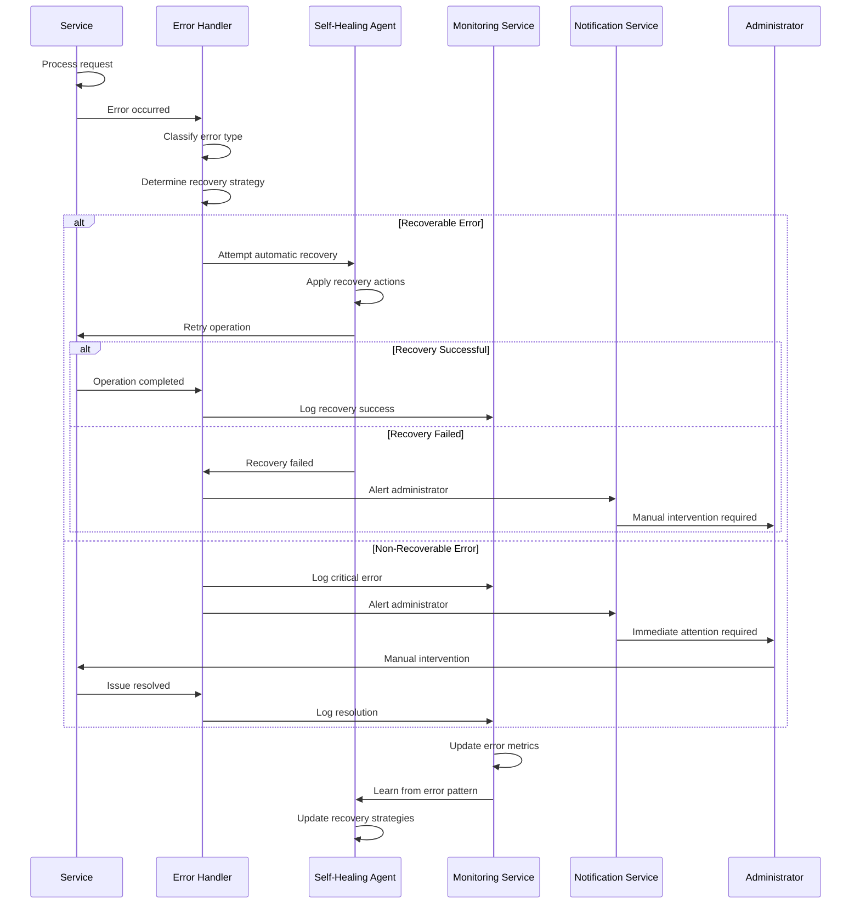
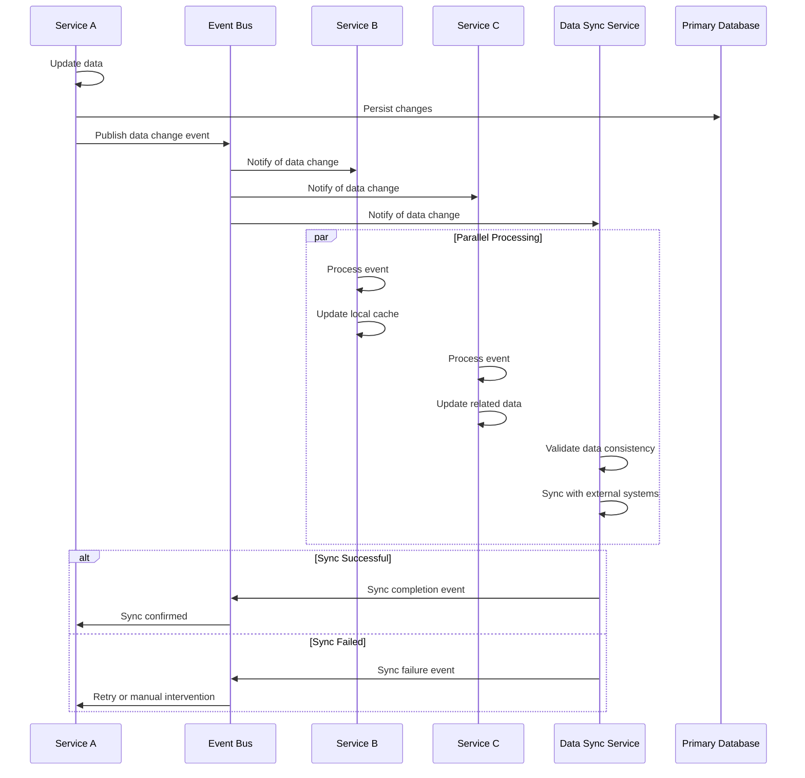

# Workflows and Sequence Diagrams

## Document Purpose

This document defines the key workflows and sequence diagrams for the Neuron ImmigrationOS platform, illustrating how different components interact to deliver core functionality. These diagrams serve as the definitive reference for understanding system behavior and integration patterns.

---

## Core Workflow Categories

### 1. Client Onboarding Workflows

- Lead capture and qualification
- Client consultation and conversion
- Case setup and initialization
- Document collection and validation

### 2. Case Processing Workflows

- Eligibility assessment and pathway analysis
- Document processing and verification
- Form preparation and auto-filling
- Quality assurance and review

### 3. AI Agent Workflows

- Multi-agent orchestration
- Task distribution and execution
- Result aggregation and validation
- Error handling and recovery

### 4. Communication Workflows

- Client communication and updates
- Internal team collaboration
- Automated notifications and alerts
- Document sharing and approval

---

## 1. Lead Capture and Qualification Workflow

### Overview

This workflow handles the initial client interaction from lead capture through qualification and assignment to consultants.

### Key Decision Points

- **Lead Scoring Threshold:** Determines immediate vs. nurture follow-up
- **Response Time:** High-score leads get immediate attention
- **Content Personalization:** Based on lead profile and interests

---

## 2. Client Consultation and Conversion Workflow

### Overview

This workflow manages the consultation process from preparation through client conversion.

### Key Components

- **Consultation Brief:** AI-generated summary of lead information
- **Service Agreement:** Automated contract generation
- **Case Initialization:** Automatic case setup upon payment
- **Welcome Package:** Onboarding materials and portal access

---

## 3. Document Collection and Processing Workflow

### Overview

This workflow handles the collection, processing, and validation of client documents.

### Processing Steps

1. **Upload and Storage:** Secure document storage with encryption
2. **OCR Processing:** Text extraction and metadata identification
3. **Document Verification:** Authenticity and validity checks
4. **Quality Assurance:** Completeness and consistency validation
5. **Manual Review:** Consultant review for flagged items

---

## 4. Eligibility Assessment Workflow

### Overview

This workflow performs comprehensive eligibility assessment for immigration pathways.

### Assessment Components

- **CRS Scoring:** Comprehensive Ranking System calculation
- **Pathway Analysis:** Multiple immigration program evaluation
- **Optimization:** Recommendations for improving eligibility
- **Strategic Planning:** Long-term immigration strategy

---

## 5. Form Preparation and Auto-Filling Workflow

### Overview

This workflow automates the preparation and filling of IRCC forms.

### Form Processing Features

- **Template Management:** Configurable form templates and mappings
- **Data Validation:** Multi-layer validation for accuracy
- **Auto-Population:** Intelligent field mapping and filling
- **Quality Assurance:** Automated and manual review processes

---

## 6. Multi-Agent AI Orchestration Workflow

### Overview

This workflow demonstrates how multiple AI agents collaborate to process complex tasks.

### Orchestration Features

- **Task Decomposition:** Breaking complex tasks into manageable parts
- **Parallel Processing:** Simultaneous execution of independent tasks
- **Result Aggregation:** Combining outputs from multiple agents
- **Quality Validation:** Multi-layer validation and error correction
- **Error Recovery:** Automatic retry and correction mechanisms

---

## 7. Client Communication Workflow

### Overview

This workflow manages automated and manual client communication throughout the case lifecycle.

### Communication Features

- **Multi-Channel:** Email, SMS, in-app notifications
- **Preference Management:** Client communication preferences
- **Engagement Tracking:** Monitor client interaction
- **Response Handling:** Automated and manual response processing

---

## 8. Case Submission and Monitoring Workflow

### Overview

This workflow handles the submission of applications to IRCC and ongoing monitoring.

### Monitoring Features

- **Real-time Status:** Continuous IRCC status monitoring
- **Automated Updates:** Proactive client and consultant notifications
- **ADR Handling:** Automatic processing of additional document requests
- **Timeline Tracking:** Processing time monitoring and predictions

---

## 9. Error Handling and Recovery Workflow

### Overview

This workflow demonstrates how the system handles errors and recovers from failures.

### Recovery Mechanisms

- **Error Classification:** Automatic error type identification
- **Self-Healing:** Automated recovery for common issues
- **Escalation:** Manual intervention for complex problems
- **Learning:** Continuous improvement of recovery strategies

---

## 10. Data Synchronization Workflow

### Overview

This workflow ensures data consistency across different services and databases.

### Synchronization Features

- **Event-Driven:** Asynchronous data synchronization
- **Consistency Checks:** Validation of data integrity
- **Conflict Resolution:** Handling of concurrent updates
- **Retry Mechanisms:** Automatic retry for failed synchronizations

---

## Workflow Integration Patterns

### 1. Event-Driven Architecture

- **Domain Events:** Business events trigger workflows
- **Event Sourcing:** Complete audit trail of all changes
- **CQRS:** Separate read and write operations
- **Saga Pattern:** Distributed transaction management

### 2. Microservices Communication

- **Synchronous:** REST APIs for immediate responses
- **Asynchronous:** Message queues for background processing
- **Circuit Breakers:** Prevent cascade failures
- **Retry Logic:** Exponential backoff with jitter

### 3. AI Agent Coordination

- **Task Distribution:** Intelligent routing of tasks
- **Context Sharing:** Shared memory and state
- **Result Aggregation:** Combining multiple agent outputs
- **Quality Assurance:** Multi-layer validation

### 4. Error Handling Strategies

- **Graceful Degradation:** Reduced functionality during issues
- **Bulkhead Pattern:** Isolated failure domains
- **Timeout Handling:** Prevent resource exhaustion
- **Dead Letter Queues:** Handle failed message processing

---

## Performance Considerations

### 1. Workflow Optimization

- **Parallel Processing:** Execute independent tasks simultaneously
- **Caching:** Cache frequently accessed data
- **Lazy Loading:** Load data only when needed
- **Batch Processing:** Group similar operations

### 2. Scalability Patterns

- **Horizontal Scaling:** Add more instances to handle load
- **Load Balancing:** Distribute requests across instances
- **Database Sharding:** Partition data for better performance
- **CDN Usage:** Cache static content globally

### 3. Monitoring and Alerting

- **Real-time Metrics:** Monitor workflow performance
- **SLA Tracking:** Ensure service level agreements
- **Bottleneck Identification:** Find and resolve performance issues
- **Capacity Planning:** Predict and prepare for growth

---

_Document Version: 1.0_
_Last Updated: 2025-11-17_
_Source: Consolidated from workflow documentation and system design_
