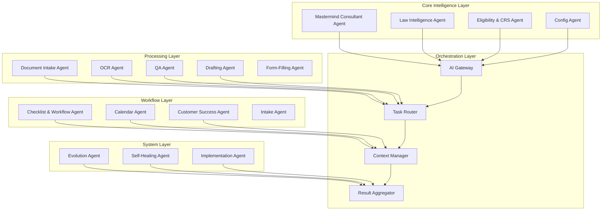
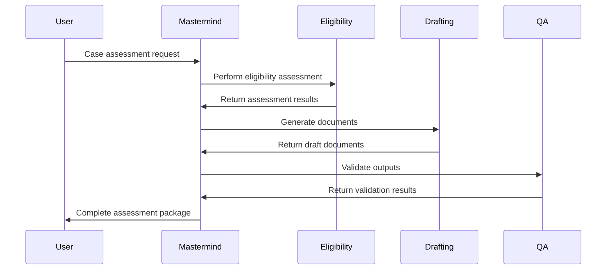
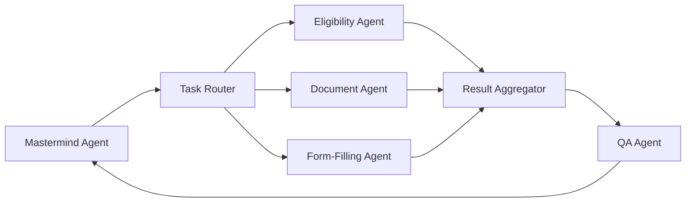

# AI Agents and Orchestration

## Document Purpose

This document defines the comprehensive AI agent architecture for the Neuron ImmigrationOS platform, including individual agent specifications, orchestration patterns, and coordination mechanisms. This multi-agent system is the core intelligence layer that automates immigration consulting workflows.

---

## AI Architecture Overview

### Core Principles

- **Specialized Agents:** Each agent has a specific domain expertise
- **Orchestrated Workflows:** Agents collaborate through structured workflows
- **Human-in-the-Loop:** Critical decisions require human approval
- **Explainable AI:** All decisions are traceable and explainable
- **Continuous Learning:** Agents improve through feedback and experience
- **Safety First:** Legal compliance and risk mitigation built-in

### Agent Categories

1. **Core Intelligence Agents:** Domain expertise and decision-making
2. **Processing Agents:** Document and data processing
3. **Workflow Agents:** Task orchestration and automation
4. **Communication Agents:** Client and team interaction
5. **System Agents:** Platform maintenance and evolution

---

## Agent Architecture Diagram



---

## Core Intelligence Agents

### 1. Mastermind Consultant Agent

#### Role and Purpose

Simulated 50-year Canada immigration consultant/lawyer serving as the domain brain and strategic orchestrator.

#### Core Responsibilities

- **Domain Expertise:** Deep understanding of IRCC and PNP policies
- **Strategic Planning:** Design optimal workflows and case strategies
- **Rule Proposal:** Propose new rules in structured format
- **Quality Oversight:** Validate other agents' outputs for domain correctness
- **Case Orchestration:** Coordinate complex multi-step processes

#### Technical Specifications

```yaml
agent_name: mastermind_consultant
model: gpt-4-turbo
temperature: 0.3
max_tokens: 4000
context_window: 32000
specialization: canadian_immigration_law
```

#### Key Capabilities

- **Case Analysis:** Comprehensive case assessment and strategy development
- **Pathway Optimization:** Identify optimal immigration pathways
- **Risk Assessment:** Evaluate potential issues and mitigation strategies
- **Precedent Analysis:** Apply historical case knowledge
- **Regulatory Interpretation:** Understand complex immigration regulations

#### Input/Output Specifications

```json
{
  "input": {
    "case_data": "Complete client information and documents",
    "assessment_type": "eligibility|strategy|review|optimization",
    "context": "Previous assessments and case history"
  },
  "output": {
    "recommendations": "Strategic recommendations and next steps",
    "risk_assessment": "Identified risks and mitigation strategies",
    "pathway_analysis": "Optimal immigration pathway selection",
    "reasoning": "Detailed explanation of recommendations"
  }
}
```

### 2. Law Intelligence Agent

#### Role and Purpose

Specialized agent for monitoring, extracting, and interpreting Canadian immigration law and policy changes.

#### Core Responsibilities

- **Web Scraping:** Monitor IRCC, PNP, and legal websites for updates
- **Policy Analysis:** Extract and interpret policy changes
- **Rule Extraction:** Convert policies into structured rules
- **Change Detection:** Identify and alert on regulatory changes
- **Knowledge Base Maintenance:** Keep legal knowledge current

#### Technical Specifications

```yaml
agent_name: law_intelligence
model: gpt-4-turbo
temperature: 0.1
max_tokens: 8000
tools: [web_scraper, pdf_parser, change_detector]
update_frequency: daily
```

#### Monitoring Sources

- **IRCC Website:** Immigration policies and program updates
- **Provincial Websites:** PNP program changes
- **Legal Databases:** Case law and precedents
- **Government Gazettes:** Regulatory changes
- **Professional Publications:** Industry updates

#### Output Format

```json
{
  "change_type": "policy_update|new_program|regulation_change",
  "source": "URL and document reference",
  "summary": "Brief description of change",
  "impact_assessment": "Potential impact on cases",
  "proposed_rules": "Structured rule updates",
  "effective_date": "When changes take effect"
}
```

### 3. Eligibility & CRS Agent

#### Role and Purpose

Specialized agent for immigration eligibility assessment and Comprehensive Ranking System (CRS) scoring.

#### Core Responsibilities

- **CRS Calculation:** Accurate CRS score computation
- **Eligibility Assessment:** Multi-program eligibility evaluation
- **Points Optimization:** Identify ways to improve scores
- **Pathway Comparison:** Compare different immigration routes
- **Requirement Validation:** Ensure all requirements are met

#### Technical Specifications

```yaml
agent_name: eligibility_crs
model: gpt-4-turbo
temperature: 0.0
max_tokens: 4000
deterministic: true
rule_engine_integration: required
```

#### Assessment Capabilities

- **Express Entry:** FSW, CEC, FST eligibility and CRS scoring
- **Provincial Nominee:** PNP eligibility for major provinces
- **Study Permits:** Academic and financial eligibility
- **Work Permits:** LMIA and LMIA-exempt categories
- **Family Class:** Sponsorship eligibility assessment

#### Scoring Algorithm

```python
def calculate_crs_score(applicant_data):
    core_factors = calculate_core_factors(applicant_data)
    spouse_factors = calculate_spouse_factors(applicant_data)
    transferability = calculate_transferability(applicant_data)
    additional_points = calculate_additional_points(applicant_data)

    total_score = core_factors + spouse_factors + transferability + additional_points

    return {
        "total_score": total_score,
        "breakdown": {
            "core_factors": core_factors,
            "spouse_factors": spouse_factors,
            "transferability": transferability,
            "additional_points": additional_points
        },
        "optimization_suggestions": generate_optimization_suggestions(applicant_data)
    }
```

### 4. Config Agent

#### Role and Purpose

Configuration and metadata manager for forms, fields, case types, and system settings.

#### Core Responsibilities

- **Form Management:** Maintain IRCC form templates and mappings
- **Field Configuration:** Define form fields and validation rules
- **Case Type Setup:** Configure immigration program workflows
- **Template Management:** Maintain document and email templates
- **System Configuration:** Manage platform settings and parameters

#### Technical Specifications

```yaml
agent_name: config_manager
model: gpt-3.5-turbo
temperature: 0.1
max_tokens: 2000
database_access: configuration_tables
version_control: enabled
```

#### Configuration Categories

- **IRCC Forms:** Form templates, field mappings, validation rules
- **Case Types:** Workflow definitions, document requirements
- **Templates:** Email, document, and letter templates
- **Business Rules:** Configurable business logic
- **System Settings:** Platform-wide configuration parameters

---

## Processing Agents

### 5. Document Intake Agent

#### Role and Purpose

Comprehensive document processing agent handling OCR, metadata extraction, and document quality control.

#### Core Responsibilities

- **Document Classification:** Automatically categorize uploaded documents
- **OCR Processing:** Extract text and structured data from documents
- **Metadata Extraction:** Identify key information and data points
- **Quality Control:** Validate document quality and completeness
- **Fraud Detection:** Identify potentially fraudulent documents

#### Technical Specifications

```yaml
agent_name: document_intake
model: gpt-4-vision
temperature: 0.2
max_tokens: 4000
tools: [ocr_engine, image_processor, fraud_detector]
supported_formats: [pdf, jpg, png, tiff]
```

#### Processing Pipeline

1. **Document Reception:** Secure upload and storage
2. **Format Detection:** Identify document type and format
3. **OCR Processing:** Extract text and structured data
4. **Classification:** Categorize document type and purpose
5. **Validation:** Verify document authenticity and quality
6. **Metadata Extraction:** Extract key information points
7. **Quality Scoring:** Assign quality and completeness scores

### 6. OCR Agent

#### Role and Purpose

Specialized optical character recognition agent for extracting text and data from various document types.

#### Core Responsibilities

- **Text Extraction:** Convert images to machine-readable text
- **Table Processing:** Extract structured data from tables
- **Handwriting Recognition:** Process handwritten text
- **Multi-Language Support:** Handle documents in various languages
- **Quality Enhancement:** Improve image quality for better recognition

#### Technical Specifications

```yaml
agent_name: ocr_processor
model: custom_ocr_model
engines: [tesseract, aws_textract, google_vision]
languages: [english, french, spanish, mandarin]
accuracy_threshold: 0.95
```

#### Document Type Specialization

- **Passports:** Extract personal information and travel history
- **Educational Documents:** Extract degrees, transcripts, grades
- **Employment Letters:** Extract job details and employment history
- **Financial Documents:** Extract income and financial information
- **Immigration Documents:** Extract visa and permit information

### 7. QA Agent

#### Role and Purpose

Quality assurance agent that cross-checks consistency across documents and data.

#### Core Responsibilities

- **Consistency Checking:** Validate information across multiple sources
- **Completeness Verification:** Ensure all required information is present
- **Error Detection:** Identify potential errors and inconsistencies
- **Risk Assessment:** Evaluate application risks and issues
- **Compliance Validation:** Ensure regulatory compliance

#### Technical Specifications

```yaml
agent_name: qa_validator
model: gpt-4-turbo
temperature: 0.1
max_tokens: 6000
validation_rules: comprehensive_ruleset
error_detection: advanced
```

#### Validation Categories

- **Personal Information:** Name, date of birth, nationality consistency
- **Timeline Validation:** Employment, education, travel history gaps
- **Document Authenticity:** Fraud detection and verification
- **Requirement Compliance:** Program-specific requirement validation
- **Risk Factors:** Inadmissibility and refusal risk assessment

### 8. Drafting Agent

#### Role and Purpose

Specialized agent for creating immigration documents, letters, and submissions.

#### Core Responsibilities

- **Document Creation:** Generate SOPs, LOEs, cover letters
- **Legal Writing:** Create affidavits and legal documents
- **Submission Packages:** Compile complete application packages
- **Template Customization:** Adapt templates to specific cases
- **Style Adaptation:** Adjust writing style based on requirements

#### Technical Specifications

```yaml
agent_name: drafting_specialist
model: gpt-4-turbo
temperature: 0.4
max_tokens: 8000
writing_styles: [formal, legal, empathetic, concise]
template_library: extensive
```

#### Document Types

- **Statement of Purpose (SOP):** Study permit applications
- **Letter of Explanation (LOE):** Clarifications and explanations
- **Cover Letters:** Application submission letters
- **Affidavits:** Legal declarations and statements
- **Support Letters:** Sponsor and employer support letters

### 9. Form-Filling Agent

#### Role and Purpose

Automated form completion agent for IRCC and provincial forms.

#### Core Responsibilities

- **Form Population:** Auto-fill forms with client data
- **Field Mapping:** Map data to appropriate form fields
- **Validation:** Ensure form completeness and accuracy
- **Multi-Form Coordination:** Handle related forms consistently
- **PDF Generation:** Create submission-ready PDF forms

#### Technical Specifications

```yaml
agent_name: form_filler
model: gpt-4-turbo
temperature: 0.0
max_tokens: 4000
form_library: ircc_complete_set
validation_engine: comprehensive
```

#### Supported Forms

- **IMM 1295:** Work permit applications
- **IMM 5257:** Visitor visa applications
- **IMM 5669:** Background/Declaration forms
- **IMM 0008:** Generic application forms
- **Provincial Forms:** PNP-specific applications

---

## Workflow Agents

### 10. Checklist & Workflow Agent

#### Role and Purpose

Task orchestration agent that creates and manages checklists, workflows, and process automation.

#### Core Responsibilities

- **Workflow Design:** Create case-specific workflows
- **Task Generation:** Generate tasks based on case requirements
- **Progress Tracking:** Monitor workflow completion
- **Deadline Management:** Manage timelines and deadlines
- **Process Optimization:** Improve workflow efficiency

#### Technical Specifications

```yaml
agent_name: workflow_orchestrator
model: gpt-4-turbo
temperature: 0.2
max_tokens: 4000
workflow_engine: advanced
task_management: comprehensive
```

### 11. Calendar Agent

#### Role and Purpose

Calendar synchronization and scheduling agent for appointments and deadlines.

#### Core Responsibilities

- **Calendar Integration:** Sync with Google Calendar, Outlook
- **Appointment Scheduling:** Automated booking and confirmation
- **Deadline Tracking:** Monitor important dates and deadlines
- **Conflict Resolution:** Handle scheduling conflicts
- **Reminder Management:** Send automated reminders

#### Technical Specifications

```yaml
agent_name: calendar_manager
model: gpt-3.5-turbo
temperature: 0.1
max_tokens: 2000
integrations: [google_calendar, outlook, apple_calendar]
timezone_support: global
```

### 12. Customer Success Agent (CSA)

#### Role and Purpose

Client success and communication agent for customer support and engagement.

#### Core Responsibilities

- **Client Communication:** Handle client inquiries and updates
- **Success Monitoring:** Track client satisfaction and success
- **Issue Resolution:** Resolve client concerns and problems
- **Onboarding Support:** Guide new clients through processes
- **Feedback Collection:** Gather and analyze client feedback

#### Technical Specifications

```yaml
agent_name: customer_success
model: gpt-4-turbo
temperature: 0.6
max_tokens: 4000
communication_channels: [email, chat, phone]
sentiment_analysis: enabled
```

### 13. Intake Agent

#### Role and Purpose

Client intake and initial assessment agent for new case setup.

#### Core Responsibilities

- **Initial Assessment:** Conduct preliminary eligibility assessment
- **Information Gathering:** Collect comprehensive client information
- **Case Setup:** Initialize new cases with proper configuration
- **Document Requirements:** Generate initial document checklists
- **Pathway Recommendation:** Suggest optimal immigration pathways

#### Technical Specifications

```yaml
agent_name: intake_specialist
model: gpt-4-turbo
temperature: 0.3
max_tokens: 4000
assessment_tools: comprehensive
questionnaire_engine: dynamic
```

---

## System Agents

### 14. Evolution Agent

#### Role and Purpose

Self-evolution planner that identifies opportunities for platform improvement and feature development.

#### Core Responsibilities

- **Performance Analysis:** Monitor system performance and efficiency
- **Feature Suggestions:** Propose new features and improvements
- **UX Optimization:** Identify user experience enhancements
- **Process Improvement:** Suggest workflow optimizations
- **Technology Updates:** Recommend technology upgrades

#### Technical Specifications

```yaml
agent_name: evolution_planner
model: gpt-4-turbo
temperature: 0.5
max_tokens: 6000
analytics_access: comprehensive
improvement_tracking: enabled
```

### 15. Self-Healing Agent

#### Role and Purpose

System maintenance agent that detects and resolves issues automatically.

#### Core Responsibilities

- **Error Detection:** Identify system errors and anomalies
- **Automatic Recovery:** Implement recovery procedures
- **Performance Monitoring:** Track system performance metrics
- **Preventive Maintenance:** Perform proactive maintenance tasks
- **Issue Escalation:** Escalate complex issues to human operators

#### Technical Specifications

```yaml
agent_name: self_healing
model: gpt-4-turbo
temperature: 0.1
max_tokens: 4000
monitoring_tools: comprehensive
recovery_procedures: automated
```

### 16. Implementation Agent

#### Role and Purpose

Development and deployment agent that codes, tests, and deploys system changes.

#### Core Responsibilities

- **Code Generation:** Generate code based on specifications
- **Testing:** Create and run automated tests
- **Deployment:** Deploy changes to production systems
- **Bug Fixing:** Identify and fix software bugs
- **Documentation:** Maintain technical documentation

#### Technical Specifications

```yaml
agent_name: implementation_specialist
model: gpt-4-turbo
temperature: 0.2
max_tokens: 8000
programming_languages: [python, typescript, sql]
deployment_tools: [docker, kubernetes, github_actions]
```

---

## Agent Orchestration Patterns

### 1. Sequential Processing



### 2. Parallel Processing



### 3. Hierarchical Coordination

- **Mastermind Agent:** Top-level orchestrator and decision maker
- **Specialized Agents:** Domain-specific processing and analysis
- **Support Agents:** Utility functions and system maintenance
- **Quality Agents:** Validation and error checking

### 4. Event-Driven Coordination

- **Event Bus:** Central event distribution system
- **Event Handlers:** Agents subscribe to relevant events
- **State Management:** Shared state across agent interactions
- **Workflow Triggers:** Events trigger workflow execution

---

## Agent Communication Protocols

### 1. Message Format

```json
{
  "message_id": "unique_identifier",
  "sender_agent": "agent_name",
  "recipient_agent": "agent_name",
  "message_type": "request|response|notification",
  "timestamp": "ISO_8601_timestamp",
  "payload": {
    "task_type": "specific_task",
    "input_data": "task_input",
    "context": "shared_context",
    "priority": "high|medium|low"
  },
  "correlation_id": "workflow_identifier"
}
```

### 2. Context Sharing

- **Shared Memory:** Common context store for all agents
- **Context Inheritance:** Child tasks inherit parent context
- **Context Updates:** Agents update shared context as needed
- **Context Cleanup:** Automatic cleanup of expired context

### 3. Error Handling

- **Error Propagation:** Errors bubble up through agent hierarchy
- **Retry Logic:** Automatic retry with exponential backoff
- **Fallback Mechanisms:** Alternative processing paths
- **Human Escalation:** Complex errors escalated to humans

---

## Quality Assurance and Validation

### 1. Multi-Layer Validation

- **Input Validation:** Validate all agent inputs
- **Process Validation:** Monitor agent processing steps
- **Output Validation:** Verify agent outputs for quality
- **Cross-Validation:** Multiple agents validate critical outputs

### 2. Performance Monitoring

- **Response Times:** Monitor agent response times
- **Accuracy Metrics:** Track agent accuracy and quality
- **Resource Usage:** Monitor computational resource usage
- **Error Rates:** Track and analyze error patterns

### 3. Continuous Improvement

- **Feedback Loops:** Collect feedback on agent performance
- **Model Updates:** Regular updates to underlying models
- **Rule Refinement:** Continuous improvement of business rules
- **Performance Optimization:** Ongoing optimization efforts

---

## Security and Compliance

### 1. Data Security

- **Encryption:** All agent communications encrypted
- **Access Controls:** Role-based access to agent functions
- **Audit Trails:** Complete logging of agent activities
- **Data Isolation:** Multi-tenant data separation

### 2. Legal Compliance

- **Human Oversight:** Critical decisions require human approval
- **Audit Trails:** Complete traceability of all decisions
- **Regulatory Compliance:** Adherence to immigration law requirements
- **Risk Management:** Built-in risk assessment and mitigation

### 3. Ethical AI

- **Bias Detection:** Monitor for algorithmic bias
- **Fairness:** Ensure fair treatment of all clients
- **Transparency:** Explainable AI decisions
- **Accountability:** Clear responsibility for AI decisions

---

_Document Version: 1.0_
_Last Updated: 2025-11-17_
_Source: Consolidated from master specifications and AI architecture design_
