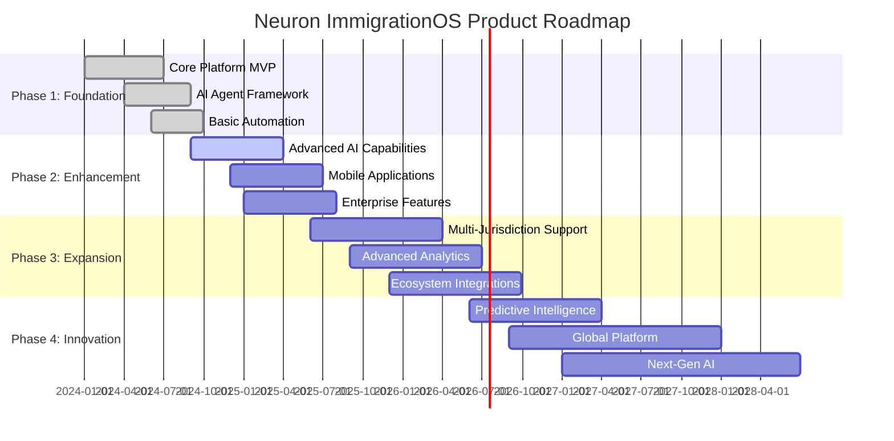

# Future Backlog and Expansion

## Document Purpose

This document outlines the strategic roadmap, future feature backlog, and expansion opportunities for the Neuron ImmigrationOS platform. It serves as a forward-looking guide for product evolution, market expansion, and technological advancement over the next 3-5 years.

---

## Strategic Vision and Long-Term Goals

### 5-Year Vision Statement

**"To become the definitive global platform for immigration consulting, powered by AI, serving consultants and clients across multiple jurisdictions while maintaining the highest standards of legal compliance and professional service."**

### Strategic Pillars

1. **Market Leadership:** Dominant position in Canadian immigration consulting
2. **Global Expansion:** Extension to other major immigration markets
3. **AI Innovation:** Cutting-edge AI capabilities and automation
4. **Ecosystem Integration:** Comprehensive immigration ecosystem platform
5. **Professional Empowerment:** Tools that enhance consultant capabilities

### Success Metrics (5-Year Targets)

```yaml
strategic_targets:
  market_metrics:
    - "50% market share in Canadian immigration consulting"
    - "Presence in 5+ major immigration markets"
    - "100,000+ active users globally"
    - "$100M+ annual recurring revenue"

  product_metrics:
    - "95% automation of routine immigration tasks"
    - "99.5% application accuracy rate"
    - "90% customer satisfaction score"
    - "50+ integrated third-party services"

  innovation_metrics:
    - "10+ proprietary AI models"
    - "100+ automated workflows"
    - "Real-time regulatory compliance"
    - "Predictive immigration analytics"
```

---

## Product Roadmap Overview

### Roadmap Phases



---

## Phase 2: Enhanced Platform (2025)

### 2.1 Advanced AI Capabilities

#### Next-Generation AI Agents

```yaml
advanced_ai_features:
  predictive_analytics:
    - "Immigration outcome prediction models"
    - "Processing time estimation algorithms"
    - "Success probability calculations"
    - "Risk assessment and mitigation recommendations"

  natural_language_processing:
    - "Advanced document understanding"
    - "Multi-language support (10+ languages)"
    - "Sentiment analysis for client communications"
    - "Automated translation services"

  computer_vision:
    - "Advanced document fraud detection"
    - "Biometric verification integration"
    - "Photo quality assessment"
    - "Document authenticity validation"

  conversational_ai:
    - "Advanced chatbot for client support"
    - "Voice-activated case management"
    - "Natural language query interface"
    - "Multilingual conversation support"
```

#### AI Model Improvements

- **Custom Fine-Tuned Models:** Domain-specific models for immigration
- **Federated Learning:** Privacy-preserving model training
- **Edge AI:** On-device processing for sensitive data
- **Explainable AI:** Enhanced transparency and interpretability

### 2.2 Mobile-First Experience

#### Native Mobile Applications

```yaml
mobile_applications:
  consultant_mobile_app:
    features:
      - "Full case management on mobile"
      - "Offline capability for core functions"
      - "Push notifications and alerts"
      - "Mobile document scanning and upload"
      - "Voice notes and dictation"
      - "Calendar integration and scheduling"

    platforms:
      - "iOS (iPhone and iPad)"
      - "Android (phone and tablet)"
      - "Progressive Web App (PWA)"

  client_mobile_app:
    features:
      - "Case status tracking and updates"
      - "Document upload with camera integration"
      - "Secure messaging with consultant"
      - "Appointment scheduling"
      - "Progress tracking and milestones"
      - "Educational content and resources"
```

#### Mobile-Specific Features

- **Biometric Authentication:** Fingerprint and face recognition
- **Offline Synchronization:** Work without internet connection
- **Location Services:** Geo-tagged document uploads
- **Push Notifications:** Real-time updates and reminders
- **Mobile Payments:** In-app payment processing

### 2.3 Enterprise-Grade Features

#### Advanced Security and Compliance

```yaml
enterprise_security:
  advanced_authentication:
    - "Single Sign-On (SSO) integration"
    - "Active Directory integration"
    - "Advanced MFA options (hardware tokens)"
    - "Privileged access management"

  data_governance:
    - "Advanced data loss prevention (DLP)"
    - "Data classification and labeling"
    - "Automated compliance reporting"
    - "Data residency controls"

  audit_and_monitoring:
    - "Advanced audit trail analytics"
    - "Real-time security monitoring"
    - "Behavioral analytics and anomaly detection"
    - "Compliance dashboard and reporting"
```

#### Enterprise Integration

- **API Management:** Advanced API gateway and management
- **Webhook Framework:** Real-time event notifications
- **Custom Integrations:** Tailored integration solutions
- **White-Label Options:** Branded platform solutions

---

## Phase 3: Market Expansion (2025-2026)

### 3.1 Multi-Jurisdiction Support

#### Target Markets

```yaml
expansion_markets:
  tier_1_markets:
    - "United States (EB-1, EB-2, EB-3, family-based)"
    - "Australia (skilled migration, family visas)"
    - "United Kingdom (points-based system, family visas)"
    - "New Zealand (skilled migrant category)"

  tier_2_markets:
    - "Germany (EU Blue Card, family reunification)"
    - "Netherlands (highly skilled migrant program)"
    - "Singapore (employment pass, PR applications)"
    - "Hong Kong (quality migrant admission scheme)"

  emerging_markets:
    - "Portugal (Golden Visa, D7 visa)"
    - "Ireland (critical skills employment permit)"
    - "Denmark (positive list scheme)"
    - "Sweden (work permits and residence)"
```

#### Localization Requirements

```yaml
localization_features:
  regulatory_compliance:
    - "Country-specific immigration law engines"
    - "Local regulatory monitoring and updates"
    - "Jurisdiction-specific form templates"
    - "Local professional standards compliance"

  language_support:
    - "Native language interfaces"
    - "Local currency and date formats"
    - "Cultural adaptation of workflows"
    - "Local customer support"

  business_model_adaptation:
    - "Local pricing strategies"
    - "Regional partnership programs"
    - "Local payment method integration"
    - "Regulatory approval processes"
```

### 3.2 Advanced Analytics and Intelligence

#### Business Intelligence Platform

```yaml
analytics_platform:
  predictive_analytics:
    - "Immigration trend analysis and forecasting"
    - "Success rate prediction models"
    - "Market opportunity identification"
    - "Client behavior prediction"

  operational_analytics:
    - "Consultant performance analytics"
    - "Process optimization recommendations"
    - "Resource allocation optimization"
    - "Quality metrics and improvement"

  market_intelligence:
    - "Immigration policy impact analysis"
    - "Competitive landscape monitoring"
    - "Market demand forecasting"
    - "Regulatory change impact assessment"
```

#### Data Science Capabilities

- **Machine Learning Pipeline:** Automated model training and deployment
- **Real-Time Analytics:** Live data processing and insights
- **Custom Reporting:** Tailored analytics for different user types
- **Data Visualization:** Interactive dashboards and reports

### 3.3 Ecosystem Integration Platform

#### Third-Party Integration Marketplace

```yaml
integration_marketplace:
  professional_services:
    - "Legal research platforms (Westlaw, LexisNexis)"
    - "Accounting software (QuickBooks, Xero)"
    - "CRM systems (Salesforce, HubSpot)"
    - "Project management tools (Asana, Monday.com)"

  government_services:
    - "Direct government portal integration"
    - "Real-time status checking APIs"
    - "Electronic filing systems"
    - "Biometric appointment booking"

  financial_services:
    - "Banking and financial verification"
    - "Currency exchange services"
    - "Investment and wealth management"
    - "Insurance and protection services"

  lifestyle_services:
    - "Relocation and moving services"
    - "Housing and accommodation"
    - "Education and school enrollment"
    - "Healthcare and insurance"
```

---

## Phase 4: Innovation Leadership (2026-2028)

### 4.1 Predictive Intelligence Platform

#### Advanced Predictive Capabilities

```yaml
predictive_intelligence:
  outcome_prediction:
    - "Application approval probability"
    - "Processing time predictions"
    - "Interview likelihood assessment"
    - "Appeal success probability"

  policy_prediction:
    - "Immigration policy change forecasting"
    - "Program closure/opening predictions"
    - "Quota and cap predictions"
    - "Processing time trend analysis"

  market_prediction:
    - "Immigration demand forecasting"
    - "Consultant workload prediction"
    - "Market opportunity identification"
    - "Competitive landscape evolution"
```

#### AI-Powered Recommendations

- **Personalized Pathways:** AI-recommended immigration strategies
- **Optimal Timing:** Best timing for application submission
- **Document Optimization:** AI-suggested document improvements
- **Strategy Adaptation:** Dynamic strategy adjustments

### 4.2 Global Immigration Platform

#### Unified Global Experience

```yaml
global_platform:
  multi_jurisdiction_cases:
    - "Cross-border immigration planning"
    - "Multi-country application coordination"
    - "Global mobility optimization"
    - "International family reunification"

  global_consultant_network:
    - "Worldwide consultant directory"
    - "Cross-referral system"
    - "Global expertise sharing"
    - "International collaboration tools"

  universal_client_portal:
    - "Single portal for multiple jurisdictions"
    - "Global case tracking and management"
    - "Universal document repository"
    - "Multi-currency billing and payments"
```

### 4.3 Next-Generation AI Architecture

#### Emerging AI Technologies

```yaml
next_gen_ai:
  large_language_models:
    - "Custom immigration-specific LLMs"
    - "Multimodal AI (text, image, voice)"
    - "Real-time learning and adaptation"
    - "Contextual understanding and reasoning"

  autonomous_agents:
    - "Fully autonomous case processing"
    - "Self-improving AI systems"
    - "Proactive client communication"
    - "Predictive issue resolution"

  quantum_computing:
    - "Quantum-enhanced optimization"
    - "Complex scenario modeling"
    - "Advanced cryptography"
    - "Massive parallel processing"
```

---

## Technology Evolution Roadmap

### 4.1 Infrastructure Evolution

#### Next-Generation Architecture

```yaml
infrastructure_evolution:
  cloud_native_2_0:
    - "Serverless-first architecture"
    - "Edge computing integration"
    - "Multi-cloud deployment"
    - "Quantum-ready infrastructure"

  ai_infrastructure:
    - "Dedicated AI processing clusters"
    - "GPU/TPU optimization"
    - "Model serving infrastructure"
    - "Real-time inference pipelines"

  data_architecture:
    - "Real-time data streaming"
    - "Graph database integration"
    - "Blockchain for audit trails"
    - "Decentralized data storage"
```

### 4.2 Development Platform Evolution

#### Advanced Development Capabilities

```yaml
development_evolution:
  low_code_platform:
    - "Visual workflow designer"
    - "Drag-and-drop form builder"
    - "Custom integration builder"
    - "Automated testing framework"

  ai_assisted_development:
    - "AI-powered code generation"
    - "Automated testing and QA"
    - "Intelligent debugging"
    - "Performance optimization"

  collaborative_development:
    - "Real-time collaborative editing"
    - "Version control integration"
    - "Automated documentation"
    - "Knowledge sharing platform"
```

---

## Market Expansion Strategy

### 5.1 Geographic Expansion

#### Market Entry Strategy

```yaml
expansion_strategy:
  market_research:
    - "Regulatory landscape analysis"
    - "Competitive assessment"
    - "Market size and opportunity"
    - "Local partnership opportunities"

  localization_approach:
    - "Regulatory compliance adaptation"
    - "Language and cultural localization"
    - "Local team establishment"
    - "Partnership and channel development"

  go_to_market:
    - "Pilot program with select consultants"
    - "Gradual market rollout"
    - "Local marketing and promotion"
    - "Success measurement and optimization"
```

### 5.2 Vertical Market Expansion

#### Target Verticals

```yaml
vertical_expansion:
  corporate_immigration:
    - "Enterprise HR integration"
    - "Global mobility management"
    - "Compliance and reporting"
    - "Employee self-service portals"

  educational_institutions:
    - "Student visa management"
    - "International student services"
    - "Academic institution integration"
    - "Scholarship and funding integration"

  government_agencies:
    - "Immigration processing automation"
    - "Case management systems"
    - "Fraud detection and prevention"
    - "Analytics and reporting"

  legal_services:
    - "Law firm practice management"
    - "Multi-practice area support"
    - "Client relationship management"
    - "Billing and time tracking"
```

---

## Innovation and Research Initiatives

### 6.1 Research and Development Focus Areas

#### Core R&D Initiatives

```yaml
research_initiatives:
  ai_research:
    - "Immigration-specific AI models"
    - "Explainable AI for legal decisions"
    - "Bias detection and mitigation"
    - "Federated learning for privacy"

  user_experience_research:
    - "Human-AI interaction optimization"
    - "Accessibility and inclusion"
    - "Cross-cultural UX design"
    - "Voice and conversational interfaces"

  security_research:
    - "Privacy-preserving technologies"
    - "Quantum-resistant cryptography"
    - "Zero-trust architecture"
    - "Behavioral security analytics"

  regulatory_technology:
    - "Automated compliance monitoring"
    - "Regulatory change detection"
    - "Policy impact simulation"
    - "Compliance risk assessment"
```

### 6.2 Innovation Partnerships

#### Strategic Partnerships

```yaml
innovation_partnerships:
  academic_partnerships:
    - "University research collaborations"
    - "Student internship programs"
    - "Joint research projects"
    - "Technology transfer initiatives"

  technology_partnerships:
    - "AI/ML platform partnerships"
    - "Cloud infrastructure partnerships"
    - "Security technology partnerships"
    - "Integration platform partnerships"

  industry_partnerships:
    - "Professional association partnerships"
    - "Government agency collaborations"
    - "Legal technology partnerships"
    - "Immigration service partnerships"
```

---

## Business Model Evolution

### 7.1 Revenue Model Diversification

#### New Revenue Streams

```yaml
revenue_diversification:
  platform_services:
    - "API monetization and usage fees"
    - "Third-party integration marketplace"
    - "White-label platform licensing"
    - "Custom development services"

  data_and_analytics:
    - "Immigration market intelligence"
    - "Benchmarking and analytics services"
    - "Predictive analytics licensing"
    - "Research and consulting services"

  professional_services:
    - "Implementation and training services"
    - "Consulting and optimization services"
    - "Compliance and audit services"
    - "Custom integration development"

  ecosystem_services:
    - "Referral and lead generation"
    - "Professional networking platform"
    - "Continuing education platform"
    - "Certification and accreditation"
```

### 7.2 Pricing Strategy Evolution

#### Advanced Pricing Models

```yaml
pricing_evolution:
  usage_based_pricing:
    - "Pay-per-case processing"
    - "API call-based pricing"
    - "Document processing fees"
    - "AI service consumption"

  outcome_based_pricing:
    - "Success fee models"
    - "Performance-based pricing"
    - "ROI-linked pricing"
    - "Value-based pricing tiers"

  ecosystem_pricing:
    - "Marketplace transaction fees"
    - "Integration revenue sharing"
    - "Partner referral commissions"
    - "Platform service fees"
```

---

## Risk Management and Mitigation

### 8.1 Strategic Risks

#### Risk Assessment and Mitigation

```yaml
strategic_risks:
  regulatory_risks:
    risk: "Changes in immigration laws and regulations"
    mitigation:
      - "Continuous regulatory monitoring"
      - "Flexible platform architecture"
      - "Legal expert advisory board"
      - "Rapid adaptation capabilities"

  competitive_risks:
    risk: "New competitors or market disruption"
    mitigation:
      - "Continuous innovation and R&D"
      - "Strong customer relationships"
      - "Intellectual property protection"
      - "Market leadership maintenance"

  technology_risks:
    risk: "Technology obsolescence or disruption"
    mitigation:
      - "Continuous technology evaluation"
      - "Modular architecture design"
      - "Strategic technology partnerships"
      - "Innovation culture and mindset"

  market_risks:
    risk: "Economic downturns or market changes"
    mitigation:
      - "Diversified market presence"
      - "Flexible business model"
      - "Strong financial reserves"
      - "Agile response capabilities"
```

---

## Success Metrics and KPIs

### 9.1 Long-Term Success Metrics

#### Strategic KPIs (3-5 Year Targets)

```yaml
long_term_kpis:
  market_leadership:
    - "Market share in target jurisdictions"
    - "Brand recognition and reputation"
    - "Customer satisfaction and loyalty"
    - "Industry awards and recognition"

  financial_performance:
    - "Annual recurring revenue growth"
    - "Profitability and margins"
    - "Customer lifetime value"
    - "Market valuation"

  innovation_leadership:
    - "Patent portfolio size"
    - "Research publication count"
    - "Technology adoption rates"
    - "Innovation awards and recognition"

  operational_excellence:
    - "Platform reliability and uptime"
    - "Customer support satisfaction"
    - "Employee satisfaction and retention"
    - "Operational efficiency metrics"
```

### 9.2 Innovation Metrics

#### Innovation KPIs

```yaml
innovation_metrics:
  product_innovation:
    - "New feature release frequency"
    - "Feature adoption rates"
    - "Customer feedback scores"
    - "Time to market for new features"

  technology_innovation:
    - "AI model accuracy improvements"
    - "Processing time reductions"
    - "Automation rate increases"
    - "Technology patent applications"

  market_innovation:
    - "New market entry success"
    - "Partnership development"
    - "Revenue diversification"
    - "Customer segment expansion"
```

---

## Conclusion and Next Steps

### Implementation Priorities

1. **Phase 2 Execution:** Focus on advanced AI capabilities and mobile applications
2. **Market Research:** Detailed analysis of expansion markets and opportunities
3. **Technology Investment:** R&D investment in next-generation technologies
4. **Partnership Development:** Strategic partnerships for growth and innovation
5. **Talent Acquisition:** Building teams for global expansion and innovation

### Continuous Evolution

The Neuron ImmigrationOS platform will continue to evolve based on:

- **Market Feedback:** Customer needs and market demands
- **Technology Advances:** Emerging technologies and capabilities
- **Regulatory Changes:** Immigration law and policy evolution
- **Competitive Landscape:** Market dynamics and competition
- **Innovation Opportunities:** New possibilities and breakthrough technologies

This roadmap serves as a living document that will be regularly updated to reflect changing market conditions, technological advances, and strategic priorities.

---

_Document Version: 1.0_
_Last Updated: 2025-11-17_
_Source: Strategic planning and market analysis_
