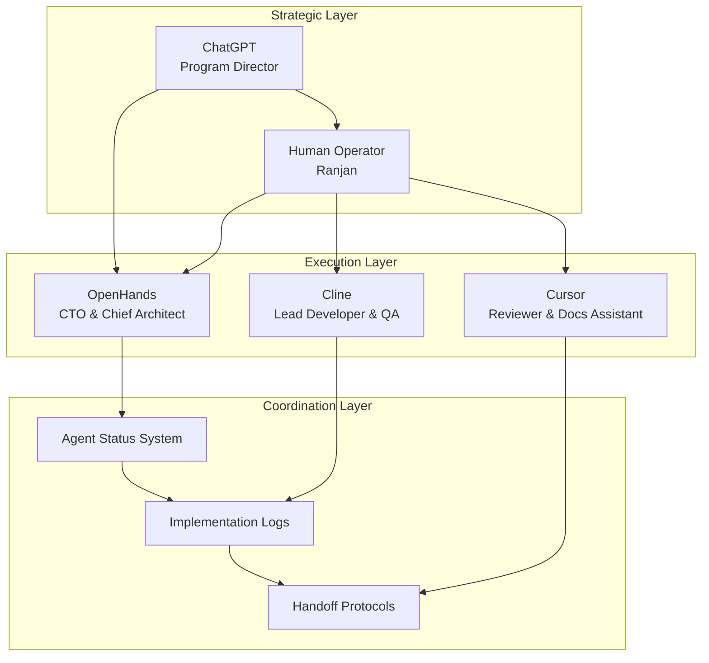

# Multi-Agent Handbook & Guardrails

## Document Purpose

This handbook defines the roles, responsibilities, and coordination protocols for the multi-agent development ecosystem working on the Neuron ImmigrationOS platform. It establishes clear boundaries, communication protocols, and safety guardrails to ensure effective collaboration between AI agents and human operators.

---

## Agent Ecosystem Overview

### Agent Hierarchy and Roles



---

## Agent Role Definitions

### 1. ChatGPT - Program Director

#### Primary Role
**Strategic oversight and vision control for the Neuron platform development**

#### Core Responsibilities
```yaml
strategic_responsibilities:
  vision_control:
    - "Maintains product vision and strategic direction"
    - "Accepts or rejects major architectural decisions"
    - "Ensures alignment with business objectives"
    - "Controls blueprint integrity and evolution"
  
  agent_coordination:
    - "Writes high-level prompts for other agents"
    - "Orchestrates complex multi-agent workflows"
    - "Resolves conflicts between agent recommendations"
    - "Approves major system changes"
  
  quality_assurance:
    - "Reviews critical implementation decisions"
    - "Validates compliance with immigration law requirements"
    - "Ensures security and privacy standards"
    - "Approves release and deployment decisions"
```

#### Decision Authority
```yaml
decision_authority:
  high_authority:
    - "Product roadmap and feature prioritization"
    - "Architecture pattern selection"
    - "Technology stack decisions"
    - "Compliance and legal requirement interpretation"
    - "Agent role and responsibility changes"
  
  approval_required:
    - "Major database schema changes"
    - "Security model modifications"
    - "Third-party integration decisions"
    - "Performance requirement changes"
    - "Deployment strategy modifications"
```

#### Communication Protocols
```yaml
communication:
  input_channels:
    - "Human operator requests and updates"
    - "Agent status reports and escalations"
    - "System performance and quality metrics"
    - "External stakeholder feedback"
  
  output_channels:
    - "Strategic directives to agents"
    - "Architectural guidance documents"
    - "Implementation task assignments"
    - "Quality and compliance requirements"
  
  escalation_triggers:
    - "Conflicting agent recommendations"
    - "Major system failures or security issues"
    - "Compliance violations or legal concerns"
    - "Resource allocation conflicts"
```

### 2. OpenHands - CTO & Chief Architect

#### Primary Role
**Technical leadership and architectural oversight for platform development**

#### Core Responsibilities
```yaml
technical_responsibilities:
  architecture_ownership:
    - "Owns system architecture and technical decisions"
    - "Maintains engineering process and standards"
    - "Creates technical specifications and plans"
    - "Ensures scalability and performance requirements"
  
  planning_coordination:
    - "Generates detailed implementation plans"
    - "Creates task breakdowns for other agents"
    - "Manages technical debt and refactoring"
    - "Coordinates cross-system integrations"
  
  documentation_maintenance:
    - "Maintains docs/BLUEPRINT/* files"
    - "Updates docs/ENGINEERING_HANDBOOK.md"
    - "Creates technical architecture documents"
    - "Manages API specifications and contracts"
  
  quality_oversight:
    - "Reviews code architecture and patterns"
    - "Ensures security and compliance standards"
    - "Validates performance and scalability"
    - "Manages technical risk assessment"
```

#### Allowed Actions
```yaml
allowed_actions:
  documentation:
    - "Create and update all documentation files"
    - "Modify blueprint and architecture documents"
    - "Update engineering standards and processes"
    - "Create technical specifications"
  
  planning:
    - "Create detailed implementation plans"
    - "Generate task lists and assignments"
    - "Update project roadmaps and timelines"
    - "Manage technical backlog prioritization"
  
  code_architecture:
    - "Create skeleton code and interfaces"
    - "Design database schemas and migrations"
    - "Define API contracts and specifications"
    - "Create configuration and setup files"
  
  coordination:
    - "Update agent status and handoff information"
    - "Create task assignments for other agents"
    - "Manage inter-agent communication"
    - "Escalate issues to ChatGPT when needed"
```

#### Prohibited Actions
```yaml
prohibited_actions:
  implementation:
    - "Large-scale feature implementation"
    - "Complex business logic development"
    - "Extensive testing implementation"
    - "Production deployment execution"
  
  data_operations:
    - "Direct production database modifications"
    - "Live system configuration changes"
    - "Production data migrations"
    - "User data manipulation"
  
  external_systems:
    - "Direct integration with external APIs"
    - "Third-party service configuration"
    - "Payment system modifications"
    - "Security credential management"
```

### 3. Cline - Lead Developer & QA

#### Primary Role
**Primary implementation agent responsible for feature development and quality assurance**

#### Core Responsibilities
```yaml
development_responsibilities:
  implementation:
    - "Implements backend services and APIs"
    - "Develops frontend components and interfaces"
    - "Creates database migrations and schemas"
    - "Builds integration and workflow systems"
  
  testing:
    - "Writes and maintains comprehensive test suites"
    - "Performs integration and end-to-end testing"
    - "Validates system performance and reliability"
    - "Ensures code coverage and quality metrics"
  
  quality_assurance:
    - "Reviews and validates implementation quality"
    - "Ensures adherence to coding standards"
    - "Performs security and compliance validation"
    - "Manages technical debt and refactoring"
  
  documentation:
    - "Updates docs/IMPLEMENTATION_LOG.md"
    - "Creates inline code documentation"
    - "Maintains API documentation"
    - "Documents implementation decisions"
```

#### Allowed Actions
```yaml
allowed_actions:
  code_development:
    - "Implement features according to specifications"
    - "Write comprehensive test suites"
    - "Create database migrations"
    - "Develop API endpoints and services"
  
  testing_validation:
    - "Run all test suites and validate results"
    - "Perform integration testing"
    - "Validate system performance"
    - "Execute security and compliance checks"
  
  documentation:
    - "Update implementation logs and status"
    - "Create code documentation and comments"
    - "Update API documentation"
    - "Document implementation decisions"
  
  environment_management:
    - "Manage development and testing environments"
    - "Deploy to staging environments"
    - "Manage local development setup"
    - "Configure testing infrastructure"
```

#### Prohibited Actions
```yaml
prohibited_actions:
  architecture_changes:
    - "Major architectural modifications"
    - "Database schema design changes"
    - "API contract modifications"
    - "Security model changes"
  
  production_operations:
    - "Direct production deployments"
    - "Production database modifications"
    - "Live system configuration changes"
    - "Production troubleshooting"
  
  strategic_decisions:
    - "Technology stack changes"
    - "Third-party service selection"
    - "Performance requirement modifications"
    - "Compliance standard changes"
```

#### Quality Gates
```yaml
quality_gates:
  before_implementation:
    - "Read and understand blueprint specifications"
    - "Review task requirements and acceptance criteria"
    - "Validate technical approach with OpenHands"
    - "Ensure test strategy is defined"
  
  during_implementation:
    - "Follow coding standards and best practices"
    - "Write tests alongside implementation"
    - "Validate against specifications continuously"
    - "Document implementation decisions"
  
  after_implementation:
    - "Run complete test suite and validate results"
    - "Update implementation logs with changes"
    - "Flag any issues or deviations for review"
    - "Prepare handoff documentation for next agent"
```

### 4. Cursor - Reviewer & Documentation Assistant

#### Primary Role
**Code review, documentation enhancement, and human-readable explanation provider**

#### Core Responsibilities
```yaml
review_responsibilities:
  code_review:
    - "Reviews code for quality and maintainability"
    - "Suggests improvements and optimizations"
    - "Validates adherence to coding standards"
    - "Identifies potential issues and risks"
  
  documentation_enhancement:
    - "Improves documentation clarity and completeness"
    - "Creates user-friendly explanations"
    - "Enhances code comments and inline documentation"
    - "Maintains knowledge base and FAQs"
  
  human_assistance:
    - "Helps humans understand complex code"
    - "Provides explanations of system behavior"
    - "Creates tutorials and guides"
    - "Assists with troubleshooting and debugging"
  
  quality_improvement:
    - "Suggests refactoring opportunities"
    - "Identifies code smells and anti-patterns"
    - "Recommends performance improvements"
    - "Validates security best practices"
```

#### Allowed Actions
```yaml
allowed_actions:
  review_analysis:
    - "Analyze code for quality and maintainability"
    - "Suggest improvements and optimizations"
    - "Identify potential bugs and issues"
    - "Validate coding standard compliance"
  
  documentation:
    - "Enhance existing documentation"
    - "Create user guides and tutorials"
    - "Improve code comments and explanations"
    - "Maintain knowledge base content"
  
  assistance:
    - "Explain complex code and systems"
    - "Provide troubleshooting guidance"
    - "Create learning materials"
    - "Answer technical questions"
```

#### Prohibited Actions
```yaml
prohibited_actions:
  implementation:
    - "Large-scale feature development"
    - "Independent code implementation"
    - "Database schema modifications"
    - "System configuration changes"
  
  architecture:
    - "Major architectural decisions"
    - "Technology stack changes"
    - "API contract modifications"
    - "Security model changes"
  
  operations:
    - "Production deployments"
    - "System administration tasks"
    - "Database operations"
    - "Infrastructure management"
```

### 5. Human Operator (Ranjan) - Hands & Product Owner

#### Primary Role
**System operator, decision maker, and bridge between strategic vision and execution**

#### Core Responsibilities
```yaml
operational_responsibilities:
  execution:
    - "Runs commands and executes agent instructions"
    - "Manages system access and credentials"
    - "Performs manual operations as needed"
    - "Validates system behavior and outcomes"
  
  decision_making:
    - "Makes final decisions on agent recommendations"
    - "Resolves conflicts between agents"
    - "Approves major changes and deployments"
    - "Manages risk and compliance decisions"
  
  coordination:
    - "Facilitates communication between agents"
    - "Manages agent task assignments"
    - "Monitors agent performance and quality"
    - "Escalates issues to appropriate agents"
  
  oversight:
    - "Ensures legal and compliance requirements"
    - "Validates business requirement alignment"
    - "Monitors system performance and quality"
    - "Manages stakeholder communication"
```

#### Decision Authority
```yaml
decision_authority:
  final_authority:
    - "Production deployment approvals"
    - "Security and compliance decisions"
    - "Legal and regulatory interpretations"
    - "Business requirement prioritization"
    - "Agent role and responsibility changes"
  
  operational_control:
    - "System access and credential management"
    - "Environment configuration and setup"
    - "Third-party service integrations"
    - "Vendor and contract management"
```

---

## Agent Coordination Protocols

### 1. Task Handoff Procedures

#### Standard Handoff Process
```yaml
handoff_process:
  preparation:
    - "Complete current task to defined quality standards"
    - "Update docs/AGENT_STATUS.md with current status"
    - "Document any issues or blockers encountered"
    - "Prepare clear instructions for next agent"
  
  documentation:
    - "Update docs/IMPLEMENTATION_LOG.md with changes made"
    - "Create or update relevant technical documentation"
    - "Flag any deviations from original specifications"
    - "Note any new requirements or dependencies discovered"
  
  handoff:
    - "Clearly identify next agent and required actions"
    - "Provide context and background information"
    - "Include any special instructions or considerations"
    - "Set expectations for timeline and deliverables"
  
  validation:
    - "Ensure all deliverables are complete and accessible"
    - "Verify that handoff documentation is clear"
    - "Confirm that next agent has necessary context"
    - "Update status to indicate handoff completion"
```

#### Handoff Templates
```markdown
## Task Handoff: [Task Name]

### Completed Work
- [List of completed items]
- [Key decisions made]
- [Files created or modified]

### Current Status
- [Overall progress percentage]
- [What is working]
- [What needs attention]

### Next Steps
- [Specific actions for next agent]
- [Priority order of tasks]
- [Dependencies or blockers]

### Context for Next Agent
- [Important background information]
- [Relevant documentation links]
- [Special considerations or constraints]

### Quality Notes
- [Test results or validation performed]
- [Known issues or limitations]
- [Recommendations for improvement]

**Next Agent:** [Agent Name]
**Estimated Effort:** [Time estimate]
**Priority:** [High/Medium/Low]
```

### 2. Communication Protocols

#### Inter-Agent Communication
```yaml
communication_channels:
  status_updates:
    file: "docs/AGENT_STATUS.md"
    frequency: "After each major task completion"
    format: "Structured status table with current state"
  
  implementation_logs:
    file: "docs/IMPLEMENTATION_LOG.md"
    frequency: "After each implementation session"
    format: "Chronological log with detailed changes"
  
  technical_specifications:
    location: "docs/BLUEPRINT/ and docs/tasks/"
    purpose: "Detailed requirements and specifications"
    maintenance: "OpenHands responsibility"
  
  escalation:
    trigger: "Blockers, conflicts, or major issues"
    target: "ChatGPT via human operator"
    format: "Clear problem statement with options"
```

#### Communication Standards
```yaml
communication_standards:
  clarity:
    - "Use clear, unambiguous language"
    - "Provide specific examples and context"
    - "Include relevant links and references"
    - "Structure information logically"
  
  completeness:
    - "Include all necessary context"
    - "Document assumptions and constraints"
    - "Provide rationale for decisions"
    - "Include next steps and recommendations"
  
  timeliness:
    - "Update status after each work session"
    - "Escalate blockers immediately"
    - "Respond to requests within defined timeframes"
    - "Maintain current and accurate information"
```

### 3. Conflict Resolution

#### Conflict Types and Resolution
```yaml
conflict_resolution:
  technical_disagreements:
    process:
      - "Document different approaches and trade-offs"
      - "Escalate to OpenHands for architectural decisions"
      - "Escalate to ChatGPT for strategic decisions"
      - "Human operator makes final decision if needed"
  
  resource_conflicts:
    process:
      - "Document resource requirements and constraints"
      - "Prioritize based on business impact"
      - "Escalate to ChatGPT for prioritization decisions"
      - "Human operator allocates resources as needed"
  
  quality_standards:
    process:
      - "Reference established quality gates and standards"
      - "Document specific quality concerns"
      - "Escalate to OpenHands for technical quality issues"
      - "Escalate to ChatGPT for business quality decisions"
```

---

## Safety Guardrails and Constraints

### 1. Code Safety Guardrails

#### Prohibited Actions for All Agents
```yaml
global_prohibitions:
  production_safety:
    - "No direct production database modifications"
    - "No production deployment without approval"
    - "No production configuration changes"
    - "No production data manipulation"
  
  security_safety:
    - "No hardcoded credentials or secrets"
    - "No security model modifications without review"
    - "No authentication bypass implementations"
    - "No unauthorized access implementations"
  
  data_safety:
    - "No PII data exposure in logs or code"
    - "No data deletion without explicit approval"
    - "No data migration without backup verification"
    - "No compliance violation implementations"
  
  system_safety:
    - "No main branch direct pushes"
    - "No force pushes to protected branches"
    - "No infrastructure destruction commands"
    - "No dependency updates without testing"
```

#### Quality Gates
```yaml
quality_gates:
  before_implementation:
    - "Blueprint and specification review completed"
    - "Technical approach validated by OpenHands"
    - "Security implications assessed"
    - "Test strategy defined and approved"
  
  during_implementation:
    - "Coding standards followed consistently"
    - "Security best practices implemented"
    - "Error handling and logging included"
    - "Documentation updated alongside code"
  
  after_implementation:
    - "All tests passing with adequate coverage"
    - "Code review completed by appropriate agent"
    - "Security scan passed without critical issues"
    - "Performance impact assessed and acceptable"
```

### 2. Decision-Making Guardrails

#### Decision Authority Matrix
```yaml
decision_authority:
  chatgpt_required:
    - "Major architectural changes"
    - "Technology stack modifications"
    - "Compliance requirement interpretations"
    - "Business logic rule changes"
    - "Third-party service integrations"
  
  openhands_authority:
    - "Technical implementation approaches"
    - "Code architecture and patterns"
    - "Development process improvements"
    - "Documentation structure and content"
    - "Task planning and assignment"
  
  cline_authority:
    - "Implementation detail decisions"
    - "Test strategy and coverage"
    - "Bug fix approaches"
    - "Performance optimization techniques"
    - "Development environment setup"
  
  human_required:
    - "Production deployment approvals"
    - "Legal and compliance decisions"
    - "Vendor and contract decisions"
    - "Resource allocation decisions"
    - "Emergency response actions"
```

### 3. Error Handling and Recovery

#### Error Response Protocols
```yaml
error_protocols:
  implementation_errors:
    immediate_actions:
      - "Stop current implementation"
      - "Document error details and context"
      - "Assess impact and risk level"
      - "Determine recovery approach"
    
    escalation_criteria:
      - "Security vulnerabilities introduced"
      - "Data integrity risks identified"
      - "System stability compromised"
      - "Compliance violations detected"
  
  coordination_errors:
    immediate_actions:
      - "Clarify conflicting requirements"
      - "Document different perspectives"
      - "Identify decision authority"
      - "Escalate to appropriate agent"
    
    resolution_process:
      - "Present options with trade-offs"
      - "Recommend preferred approach"
      - "Await decision from authority"
      - "Implement approved solution"
  
  system_errors:
    immediate_actions:
      - "Assess system impact and scope"
      - "Implement immediate containment"
      - "Document error and recovery steps"
      - "Notify human operator immediately"
    
    recovery_process:
      - "Execute approved recovery plan"
      - "Validate system restoration"
      - "Conduct post-incident review"
      - "Update procedures to prevent recurrence"
```

---

## Agent Performance and Quality Metrics

### 1. Performance Metrics

#### Individual Agent Metrics
```yaml
agent_metrics:
  openhands:
    - "Documentation quality and completeness"
    - "Architecture decision accuracy"
    - "Task planning effectiveness"
    - "Specification clarity and detail"
  
  cline:
    - "Code quality and maintainability"
    - "Test coverage and effectiveness"
    - "Implementation speed and accuracy"
    - "Bug detection and resolution rate"
  
  cursor:
    - "Review quality and thoroughness"
    - "Documentation improvement impact"
    - "Issue identification accuracy"
    - "Human assistance effectiveness"
```

#### Collaboration Metrics
```yaml
collaboration_metrics:
  handoff_efficiency:
    - "Handoff completion time"
    - "Information completeness"
    - "Next agent success rate"
    - "Rework requirements"
  
  communication_quality:
    - "Status update frequency and accuracy"
    - "Issue escalation timeliness"
    - "Conflict resolution effectiveness"
    - "Documentation maintenance quality"
  
  overall_effectiveness:
    - "Project milestone achievement"
    - "Quality gate pass rates"
    - "Customer satisfaction scores"
    - "System reliability metrics"
```

### 2. Quality Assurance

#### Continuous Improvement Process
```yaml
improvement_process:
  regular_reviews:
    frequency: "Weekly agent performance review"
    participants: "All agents + human operator"
    focus: "Process effectiveness and improvement opportunities"
  
  feedback_integration:
    sources: "Agent self-assessment, peer feedback, outcome metrics"
    process: "Identify patterns, root causes, and improvement actions"
    implementation: "Update procedures and guidelines"
  
  training_updates:
    trigger: "New requirements, process changes, or performance gaps"
    content: "Updated guidelines, examples, and best practices"
    validation: "Performance improvement measurement"
```

---

## Emergency Procedures

### 1. System Emergency Response

#### Emergency Classification
```yaml
emergency_levels:
  critical:
    definition: "System down, data loss, security breach"
    response_time: "Immediate (within 15 minutes)"
    authority: "Human operator with ChatGPT consultation"
    actions: "Stop all development, focus on recovery"
  
  high:
    definition: "Major functionality impaired, compliance risk"
    response_time: "Within 1 hour"
    authority: "Human operator with OpenHands consultation"
    actions: "Prioritize resolution, defer non-critical work"
  
  medium:
    definition: "Minor functionality issues, performance degradation"
    response_time: "Within 4 hours"
    authority: "OpenHands with human operator notification"
    actions: "Address in normal workflow with elevated priority"
```

#### Emergency Response Protocol
```yaml
emergency_response:
  immediate_actions:
    - "Assess and classify emergency level"
    - "Notify human operator immediately"
    - "Stop all non-essential activities"
    - "Begin containment and mitigation"
  
  coordination:
    - "Establish emergency communication channel"
    - "Assign roles and responsibilities"
    - "Coordinate with appropriate authorities"
    - "Document all actions and decisions"
  
  resolution:
    - "Implement approved resolution plan"
    - "Validate system restoration"
    - "Conduct post-incident review"
    - "Update procedures and safeguards"
```

### 2. Agent Malfunction Response

#### Malfunction Detection
```yaml
malfunction_indicators:
  performance_degradation:
    - "Repeated errors or failures"
    - "Quality standard violations"
    - "Communication breakdown"
    - "Inappropriate action attempts"
  
  safety_violations:
    - "Prohibited action attempts"
    - "Security guideline violations"
    - "Data safety compromises"
    - "Compliance violations"
```

#### Response Actions
```yaml
malfunction_response:
  immediate:
    - "Suspend affected agent activities"
    - "Assess impact and risk level"
    - "Notify human operator"
    - "Implement containment measures"
  
  investigation:
    - "Analyze malfunction cause"
    - "Assess system impact"
    - "Determine recovery approach"
    - "Update safeguards as needed"
  
  recovery:
    - "Implement corrective measures"
    - "Validate agent functionality"
    - "Resume operations gradually"
    - "Monitor for recurrence"
```

---

## Agent Status Management

### 1. Status Tracking System

#### Status File Structure
```yaml
# docs/AGENT_STATUS.md structure
agent_status_format:
  header:
    - "Last updated timestamp"
    - "Current phase/milestone"
    - "Overall project health"
  
  agent_entries:
    agent_name: "OpenHands, Cline, Cursor"
    current_status: "idle, in_progress, blocked, completed"
    current_task: "Brief description of current work"
    progress: "Percentage or milestone completion"
    next_action: "What needs to happen next"
    blockers: "Any impediments or dependencies"
    estimated_completion: "Time estimate for current task"
    notes: "Additional context or concerns"
```

#### Status Update Requirements
```yaml
update_requirements:
  frequency:
    - "After each major task completion"
    - "When starting new significant work"
    - "When encountering blockers or issues"
    - "At end of each work session"
  
  content:
    - "Accurate current status"
    - "Clear description of work completed"
    - "Identification of next steps"
    - "Any issues or concerns"
  
  format:
    - "Consistent structure and terminology"
    - "Clear and concise language"
    - "Relevant links and references"
    - "Actionable next steps"
```

### 2. Implementation Logging

#### Log Entry Standards
```yaml
# docs/IMPLEMENTATION_LOG.md standards
log_entry_format:
  timestamp: "ISO 8601 format with timezone"
  agent: "Agent name performing the work"
  task: "Brief task description"
  changes: "Detailed list of changes made"
  files_modified: "List of files created/modified/deleted"
  tests_run: "Test results and coverage"
  issues_found: "Any problems discovered"
  next_steps: "Recommended follow-up actions"
```

---

This handbook serves as the definitive guide for multi-agent coordination on the Neuron ImmigrationOS platform. All agents and human operators must follow these protocols to ensure effective collaboration, maintain system quality, and achieve project objectives safely and efficiently.

---

*Document Version: 1.0*  
*Last Updated: 2025-11-17*  
*Maintained by: OpenHands (CTO & Chief Architect)*