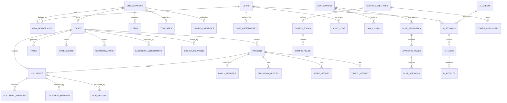

# Data Model and Entity Relationship Diagram

## Document Purpose

This document defines the comprehensive data model for the Neuron ImmigrationOS platform, including entity relationships, database schemas, data governance policies, and architectural decisions. The model supports multi-tenancy, legal compliance, audit requirements, and scalable operations.

---

## Design Principles

### Core Principles
- **Multi-Tenant Architecture:** Complete data isolation between organizations
- **Audit Trail Compliance:** Full history tracking for legal requirements
- **Flexible Schema:** JSONB fields for evolving immigration requirements
- **Performance Optimization:** Strategic indexing and partitioning
- **Data Privacy:** Encryption and access controls for sensitive information
- **Referential Integrity:** Strong foreign key relationships
- **Temporal Data:** Version control and historical tracking

### Data Governance
- **Data Classification:** Sensitive, confidential, and public data categories
- **Access Controls:** Role-based data access permissions
- **Retention Policies:** Regulatory compliance for data retention
- **Data Quality:** Validation rules and consistency checks
- **Privacy by Design:** Built-in privacy protection mechanisms

---

## High-Level Entity Relationship Diagram



---

## Core Entity Definitions

### 1. Organization and User Management

#### Organizations
**Purpose:** Multi-tenant organization management

```sql
CREATE TABLE organizations (
    id UUID PRIMARY KEY DEFAULT gen_random_uuid(),
    name VARCHAR(255) NOT NULL,
    domain VARCHAR(255) UNIQUE,
    type VARCHAR(50) NOT NULL DEFAULT 'law_firm',
    settings JSONB DEFAULT '{}',
    subscription_tier VARCHAR(50) DEFAULT 'starter',
    subscription_status VARCHAR(50) DEFAULT 'active',
    billing_info JSONB DEFAULT '{}',
    branding JSONB DEFAULT '{}',
    compliance_settings JSONB DEFAULT '{}',
    created_at TIMESTAMP DEFAULT NOW(),
    updated_at TIMESTAMP DEFAULT NOW(),
    deleted_at TIMESTAMP NULL
);
```

**Key Fields:**
- `type`: law_firm, solo_practice, consultancy, corporate
- `settings`: Organization-specific configuration
- `subscription_tier`: starter, professional, enterprise
- `branding`: Logo, colors, custom styling
- `compliance_settings`: Regulatory compliance configuration

#### Users
**Purpose:** User authentication and profile management

```sql
CREATE TABLE users (
    id UUID PRIMARY KEY DEFAULT gen_random_uuid(),
    email VARCHAR(255) UNIQUE NOT NULL,
    encrypted_password VARCHAR(255) NOT NULL,
    first_name VARCHAR(100) NOT NULL,
    last_name VARCHAR(100) NOT NULL,
    phone VARCHAR(20),
    profile_data JSONB DEFAULT '{}',
    preferences JSONB DEFAULT '{}',
    last_login_at TIMESTAMP,
    email_verified_at TIMESTAMP,
    phone_verified_at TIMESTAMP,
    mfa_enabled BOOLEAN DEFAULT FALSE,
    mfa_secret VARCHAR(255),
    status VARCHAR(20) DEFAULT 'active',
    created_at TIMESTAMP DEFAULT NOW(),
    updated_at TIMESTAMP DEFAULT NOW()
);
```

#### Organization Memberships
**Purpose:** User-organization relationships with roles

```sql
CREATE TABLE org_memberships (
    id UUID PRIMARY KEY DEFAULT gen_random_uuid(),
    organization_id UUID NOT NULL REFERENCES organizations(id),
    user_id UUID NOT NULL REFERENCES users(id),
    role VARCHAR(50) NOT NULL DEFAULT 'member',
    permissions JSONB DEFAULT '{}',
    status VARCHAR(20) DEFAULT 'active',
    joined_at TIMESTAMP DEFAULT NOW(),
    left_at TIMESTAMP NULL,
    UNIQUE(organization_id, user_id)
);
```

**Roles:**
- `owner`: Full organization control
- `admin`: Administrative privileges
- `consultant`: Case management and client interaction
- `paralegal`: Case support and document management
- `staff`: Limited access for specific tasks

### 2. Case Management

#### Cases
**Purpose:** Central case management entity

```sql
CREATE TABLE cases (
    id UUID PRIMARY KEY DEFAULT gen_random_uuid(),
    organization_id UUID NOT NULL REFERENCES organizations(id),
    case_number VARCHAR(50) UNIQUE NOT NULL,
    case_type VARCHAR(100) NOT NULL,
    case_subtype VARCHAR(100),
    status VARCHAR(50) DEFAULT 'draft',
    priority VARCHAR(20) DEFAULT 'medium',
    primary_applicant_id UUID REFERENCES persons(id),
    assigned_consultant_id UUID REFERENCES users(id),
    case_data JSONB DEFAULT '{}',
    timeline_data JSONB DEFAULT '{}',
    compliance_flags JSONB DEFAULT '{}',
    created_at TIMESTAMP DEFAULT NOW(),
    updated_at TIMESTAMP DEFAULT NOW(),
    closed_at TIMESTAMP NULL
);
```

**Case Types:**
- Express Entry (FSW, CEC, FST)
- Provincial Nominee Program
- Study Permit
- Work Permit
- Family Class
- Visitor Visa
- Citizenship

**Status Flow:**
- draft → active → ready_for_submission → submitted → in_progress → decision_made → closed

#### Persons
**Purpose:** Individual person records (applicants, family members)

```sql
CREATE TABLE persons (
    id UUID PRIMARY KEY DEFAULT gen_random_uuid(),
    organization_id UUID NOT NULL REFERENCES organizations(id),
    case_id UUID REFERENCES cases(id),
    person_type VARCHAR(50) NOT NULL,
    first_name VARCHAR(100) NOT NULL,
    last_name VARCHAR(100) NOT NULL,
    date_of_birth DATE,
    place_of_birth VARCHAR(255),
    nationality VARCHAR(100),
    gender VARCHAR(20),
    marital_status VARCHAR(50),
    contact_info JSONB DEFAULT '{}',
    personal_data JSONB DEFAULT '{}',
    immigration_history JSONB DEFAULT '{}',
    created_at TIMESTAMP DEFAULT NOW(),
    updated_at TIMESTAMP DEFAULT NOW()
);
```

**Person Types:**
- primary_applicant
- spouse_partner
- dependent_child
- sponsor
- family_member

#### Family Members
**Purpose:** Family relationship tracking

```sql
CREATE TABLE family_members (
    id UUID PRIMARY KEY DEFAULT gen_random_uuid(),
    person_id UUID NOT NULL REFERENCES persons(id),
    related_person_id UUID NOT NULL REFERENCES persons(id),
    relationship_type VARCHAR(50) NOT NULL,
    relationship_data JSONB DEFAULT '{}',
    created_at TIMESTAMP DEFAULT NOW()
);
```

### 3. Document Management

#### Documents
**Purpose:** Document storage and management

```sql
CREATE TABLE documents (
    id UUID PRIMARY KEY DEFAULT gen_random_uuid(),
    organization_id UUID NOT NULL REFERENCES organizations(id),
    case_id UUID REFERENCES cases(id),
    person_id UUID REFERENCES persons(id),
    document_type VARCHAR(100) NOT NULL,
    document_category VARCHAR(50) NOT NULL,
    title VARCHAR(255) NOT NULL,
    description TEXT,
    file_path VARCHAR(500) NOT NULL,
    file_name VARCHAR(255) NOT NULL,
    file_size BIGINT NOT NULL,
    mime_type VARCHAR(100) NOT NULL,
    checksum VARCHAR(64) NOT NULL,
    encryption_key_id VARCHAR(255),
    status VARCHAR(50) DEFAULT 'uploaded',
    metadata JSONB DEFAULT '{}',
    processing_status VARCHAR(50) DEFAULT 'pending',
    processing_results JSONB DEFAULT '{}',
    uploaded_by UUID REFERENCES users(id),
    created_at TIMESTAMP DEFAULT NOW(),
    updated_at TIMESTAMP DEFAULT NOW()
);
```

**Document Categories:**
- identity (passport, ID cards)
- education (degrees, transcripts)
- employment (letters, pay stubs)
- financial (bank statements, tax returns)
- immigration (visas, permits)
- supporting (photos, translations)

#### Document Versions
**Purpose:** Document version control

```sql
CREATE TABLE document_versions (
    id UUID PRIMARY KEY DEFAULT gen_random_uuid(),
    document_id UUID NOT NULL REFERENCES documents(id),
    version_number INTEGER NOT NULL,
    file_path VARCHAR(500) NOT NULL,
    file_size BIGINT NOT NULL,
    checksum VARCHAR(64) NOT NULL,
    changes_description TEXT,
    created_by UUID REFERENCES users(id),
    created_at TIMESTAMP DEFAULT NOW()
);
```

#### OCR Results
**Purpose:** Document processing and extraction results

```sql
CREATE TABLE ocr_results (
    id UUID PRIMARY KEY DEFAULT gen_random_uuid(),
    document_id UUID NOT NULL REFERENCES documents(id),
    processing_engine VARCHAR(50) NOT NULL,
    extracted_text TEXT,
    structured_data JSONB DEFAULT '{}',
    confidence_score DECIMAL(5,4),
    processing_time_ms INTEGER,
    error_details JSONB,
    created_at TIMESTAMP DEFAULT NOW()
);
```

### 4. Task and Workflow Management

#### Tasks
**Purpose:** Task management and workflow automation

```sql
CREATE TABLE tasks (
    id UUID PRIMARY KEY DEFAULT gen_random_uuid(),
    organization_id UUID NOT NULL REFERENCES organizations(id),
    case_id UUID REFERENCES cases(id),
    parent_task_id UUID REFERENCES tasks(id),
    task_type VARCHAR(100) NOT NULL,
    title VARCHAR(255) NOT NULL,
    description TEXT,
    status VARCHAR(50) DEFAULT 'pending',
    priority VARCHAR(20) DEFAULT 'medium',
    assigned_to UUID REFERENCES users(id),
    assigned_by UUID REFERENCES users(id),
    due_date TIMESTAMP,
    task_data JSONB DEFAULT '{}',
    completion_data JSONB DEFAULT '{}',
    created_at TIMESTAMP DEFAULT NOW(),
    updated_at TIMESTAMP DEFAULT NOW(),
    completed_at TIMESTAMP NULL
);
```

**Task Types:**
- document_collection
- form_preparation
- eligibility_assessment
- quality_review
- client_communication
- submission_preparation

#### Case Events
**Purpose:** Case activity and audit trail

```sql
CREATE TABLE case_events (
    id UUID PRIMARY KEY DEFAULT gen_random_uuid(),
    case_id UUID NOT NULL REFERENCES cases(id),
    event_type VARCHAR(100) NOT NULL,
    event_category VARCHAR(50) NOT NULL,
    description TEXT NOT NULL,
    event_data JSONB DEFAULT '{}',
    triggered_by UUID REFERENCES users(id),
    triggered_by_system VARCHAR(100),
    created_at TIMESTAMP DEFAULT NOW()
);
```

### 5. AI and Rules Engine

#### AI Agents
**Purpose:** AI agent configuration and management

```sql
CREATE TABLE ai_agents (
    id UUID PRIMARY KEY DEFAULT gen_random_uuid(),
    agent_name VARCHAR(100) UNIQUE NOT NULL,
    agent_type VARCHAR(50) NOT NULL,
    description TEXT,
    configuration JSONB DEFAULT '{}',
    model_config JSONB DEFAULT '{}',
    status VARCHAR(20) DEFAULT 'active',
    version VARCHAR(20) NOT NULL,
    created_at TIMESTAMP DEFAULT NOW(),
    updated_at TIMESTAMP DEFAULT NOW()
);
```

**Agent Types:**
- mastermind
- eligibility_engine
- document_processor
- form_filler
- qa_validator
- drafting_agent

#### AI Sessions
**Purpose:** AI processing session tracking

```sql
CREATE TABLE ai_sessions (
    id UUID PRIMARY KEY DEFAULT gen_random_uuid(),
    organization_id UUID NOT NULL REFERENCES organizations(id),
    case_id UUID REFERENCES cases(id),
    agent_id UUID NOT NULL REFERENCES ai_agents(id),
    session_type VARCHAR(50) NOT NULL,
    input_data JSONB DEFAULT '{}',
    output_data JSONB DEFAULT '{}',
    status VARCHAR(50) DEFAULT 'running',
    started_by UUID REFERENCES users(id),
    processing_time_ms INTEGER,
    token_usage JSONB DEFAULT '{}',
    error_details JSONB,
    created_at TIMESTAMP DEFAULT NOW(),
    completed_at TIMESTAMP NULL
);
```

#### Approved Rules
**Purpose:** Immigration law rules and regulations

```sql
CREATE TABLE approved_rules (
    id UUID PRIMARY KEY DEFAULT gen_random_uuid(),
    rule_name VARCHAR(255) NOT NULL,
    rule_category VARCHAR(100) NOT NULL,
    rule_type VARCHAR(50) NOT NULL,
    rule_logic JSONB NOT NULL,
    conditions JSONB DEFAULT '{}',
    parameters JSONB DEFAULT '{}',
    source_reference VARCHAR(500),
    effective_date DATE NOT NULL,
    expiry_date DATE,
    status VARCHAR(20) DEFAULT 'active',
    approved_by UUID REFERENCES users(id),
    approved_at TIMESTAMP,
    created_at TIMESTAMP DEFAULT NOW()
);
```

#### Eligibility Assessments
**Purpose:** Immigration eligibility evaluation results

```sql
CREATE TABLE eligibility_assessments (
    id UUID PRIMARY KEY DEFAULT gen_random_uuid(),
    case_id UUID NOT NULL REFERENCES cases(id),
    assessment_type VARCHAR(100) NOT NULL,
    program_type VARCHAR(100) NOT NULL,
    assessment_data JSONB NOT NULL,
    results JSONB NOT NULL,
    score DECIMAL(10,2),
    eligibility_status VARCHAR(50) NOT NULL,
    recommendations JSONB DEFAULT '{}',
    rules_applied JSONB DEFAULT '{}',
    assessed_by UUID REFERENCES users(id),
    assessed_at TIMESTAMP DEFAULT NOW(),
    created_at TIMESTAMP DEFAULT NOW()
);
```

### 6. Communication and Client Management

#### Communications
**Purpose:** Client and internal communication tracking

```sql
CREATE TABLE communications (
    id UUID PRIMARY KEY DEFAULT gen_random_uuid(),
    organization_id UUID NOT NULL REFERENCES organizations(id),
    case_id UUID REFERENCES cases(id),
    communication_type VARCHAR(50) NOT NULL,
    direction VARCHAR(20) NOT NULL,
    subject VARCHAR(255),
    content TEXT,
    metadata JSONB DEFAULT '{}',
    sender_id UUID REFERENCES users(id),
    recipient_data JSONB DEFAULT '{}',
    status VARCHAR(50) DEFAULT 'sent',
    sent_at TIMESTAMP,
    delivered_at TIMESTAMP,
    read_at TIMESTAMP,
    created_at TIMESTAMP DEFAULT NOW()
);
```

**Communication Types:**
- email
- sms
- in_app_message
- phone_call
- video_conference
- document_sharing

#### Leads
**Purpose:** Lead management and conversion tracking

```sql
CREATE TABLE leads (
    id UUID PRIMARY KEY DEFAULT gen_random_uuid(),
    organization_id UUID NOT NULL REFERENCES organizations(id),
    lead_source VARCHAR(100),
    contact_info JSONB NOT NULL,
    lead_data JSONB DEFAULT '{}',
    score INTEGER DEFAULT 0,
    status VARCHAR(50) DEFAULT 'new',
    assigned_to UUID REFERENCES users(id),
    converted_to_case_id UUID REFERENCES cases(id),
    created_at TIMESTAMP DEFAULT NOW(),
    updated_at TIMESTAMP DEFAULT NOW(),
    converted_at TIMESTAMP NULL
);
```

### 7. Configuration and Templates

#### Configuration Case Types
**Purpose:** Immigration program configuration

```sql
CREATE TABLE config_case_types (
    id UUID PRIMARY KEY DEFAULT gen_random_uuid(),
    case_type VARCHAR(100) UNIQUE NOT NULL,
    display_name VARCHAR(255) NOT NULL,
    description TEXT,
    configuration JSONB DEFAULT '{}',
    requirements JSONB DEFAULT '{}',
    workflow_template JSONB DEFAULT '{}',
    is_active BOOLEAN DEFAULT TRUE,
    created_at TIMESTAMP DEFAULT NOW(),
    updated_at TIMESTAMP DEFAULT NOW()
);
```

#### Configuration Forms
**Purpose:** IRCC form definitions and mappings

```sql
CREATE TABLE config_forms (
    id UUID PRIMARY KEY DEFAULT gen_random_uuid(),
    form_code VARCHAR(50) UNIQUE NOT NULL,
    form_name VARCHAR(255) NOT NULL,
    form_version VARCHAR(20) NOT NULL,
    case_types JSONB DEFAULT '[]',
    field_mappings JSONB DEFAULT '{}',
    validation_rules JSONB DEFAULT '{}',
    pdf_template_path VARCHAR(500),
    is_active BOOLEAN DEFAULT TRUE,
    created_at TIMESTAMP DEFAULT NOW(),
    updated_at TIMESTAMP DEFAULT NOW()
);
```

### 8. Audit and Compliance

#### Audit Logs
**Purpose:** Comprehensive audit trail for compliance

```sql
CREATE TABLE audit_logs (
    id UUID PRIMARY KEY DEFAULT gen_random_uuid(),
    organization_id UUID REFERENCES organizations(id),
    user_id UUID REFERENCES users(id),
    action VARCHAR(100) NOT NULL,
    resource_type VARCHAR(100) NOT NULL,
    resource_id UUID,
    old_values JSONB,
    new_values JSONB,
    metadata JSONB DEFAULT '{}',
    ip_address INET,
    user_agent TEXT,
    created_at TIMESTAMP DEFAULT NOW()
);
```

#### Data Retention Policies
**Purpose:** Regulatory compliance for data retention

```sql
CREATE TABLE data_retention_policies (
    id UUID PRIMARY KEY DEFAULT gen_random_uuid(),
    organization_id UUID REFERENCES organizations(id),
    data_type VARCHAR(100) NOT NULL,
    retention_period_days INTEGER NOT NULL,
    deletion_policy VARCHAR(50) NOT NULL,
    legal_basis TEXT,
    is_active BOOLEAN DEFAULT TRUE,
    created_at TIMESTAMP DEFAULT NOW(),
    updated_at TIMESTAMP DEFAULT NOW()
);
```

---

## Data Relationships and Constraints

### Primary Relationships
1. **Organizations** are the root tenant entities
2. **Users** belong to organizations through memberships
3. **Cases** are owned by organizations and assigned to users
4. **Persons** are associated with cases (applicants, family members)
5. **Documents** belong to cases and persons
6. **Tasks** are generated for cases and assigned to users
7. **AI Sessions** process cases using configured agents
8. **Rules** are applied to generate eligibility assessments

### Key Constraints
- **Multi-tenancy:** All data is scoped to organizations
- **Referential Integrity:** Foreign key constraints ensure data consistency
- **Soft Deletes:** Important entities use soft deletion for audit trails
- **Unique Constraints:** Prevent duplicate critical data
- **Check Constraints:** Ensure data validity and business rules

---

## Indexing Strategy

### Performance Indexes
```sql
-- Organization-scoped queries
CREATE INDEX idx_cases_org_status ON cases(organization_id, status);
CREATE INDEX idx_documents_org_case ON documents(organization_id, case_id);
CREATE INDEX idx_tasks_org_assigned ON tasks(organization_id, assigned_to, status);

-- Time-based queries
CREATE INDEX idx_cases_created_at ON cases(created_at);
CREATE INDEX idx_audit_logs_created_at ON audit_logs(created_at);
CREATE INDEX idx_communications_sent_at ON communications(sent_at);

-- Search and filtering
CREATE INDEX idx_persons_name ON persons USING gin(to_tsvector('english', first_name || ' ' || last_name));
CREATE INDEX idx_documents_content ON documents USING gin(to_tsvector('english', title || ' ' || description));

-- JSONB indexes for flexible queries
CREATE INDEX idx_case_data_gin ON cases USING gin(case_data);
CREATE INDEX idx_document_metadata_gin ON documents USING gin(metadata);
```

### Partitioning Strategy
- **Audit Logs:** Partitioned by month for performance and archival
- **Communications:** Partitioned by organization and date
- **Document Versions:** Partitioned by document creation date

---

## Data Security and Privacy

### Encryption
- **At Rest:** AES-256 encryption for sensitive fields
- **In Transit:** TLS 1.3 for all data transmission
- **Application Level:** Field-level encryption for PII
- **Key Management:** Separate key management service

### Access Controls
- **Row-Level Security:** PostgreSQL RLS for multi-tenancy
- **Column-Level Security:** Sensitive data access restrictions
- **API-Level Security:** JWT-based authentication and authorization
- **Audit Trail:** All data access logged for compliance

### Privacy Compliance
- **Data Minimization:** Collect only necessary information
- **Consent Tracking:** Record and manage user consent
- **Right to Erasure:** Complete data deletion capability
- **Data Portability:** Export functionality for user data

---

## Backup and Recovery

### Backup Strategy
- **Continuous Backup:** Point-in-time recovery capability
- **Cross-Region Replication:** Geographic redundancy
- **Encrypted Backups:** All backups encrypted at rest
- **Retention Policy:** 7-year backup retention for compliance

### Recovery Procedures
- **RTO Target:** < 1 hour for critical systems
- **RPO Target:** < 15 minutes data loss maximum
- **Testing:** Monthly backup restoration testing
- **Documentation:** Detailed recovery procedures

---

## Migration and Evolution

### Schema Evolution
- **Versioned Migrations:** All schema changes versioned
- **Backward Compatibility:** Maintain API compatibility
- **Feature Flags:** Gradual rollout of schema changes
- **Rollback Capability:** Safe rollback procedures

### Data Migration
- **ETL Processes:** Extract, transform, load procedures
- **Data Validation:** Comprehensive validation after migration
- **Parallel Running:** Run old and new systems in parallel
- **Cutover Planning:** Minimal downtime migration strategy

---

*Document Version: 1.0*  
*Last Updated: 2025-11-17*  
*Source: Consolidated from architecture documentation and database design*