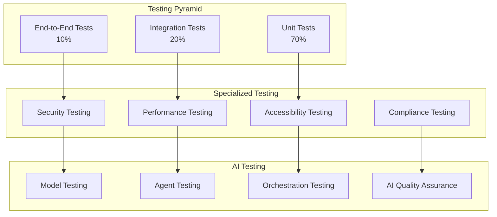

# Test Strategy and Quality Model

## Document Purpose

This document defines the comprehensive test strategy and quality assurance model for the Neuron ImmigrationOS platform, ensuring high-quality software delivery, regulatory compliance, and exceptional user experience through systematic testing approaches.

---

## Quality Philosophy and Principles

### Core Quality Principles
- **Quality by Design:** Quality built into every stage of development
- **Shift-Left Testing:** Early detection and prevention of defects
- **Risk-Based Testing:** Focus testing efforts on highest-risk areas
- **Continuous Testing:** Automated testing throughout the development lifecycle
- **User-Centric Quality:** Quality measured by user satisfaction and outcomes
- **Compliance First:** Regulatory compliance as a quality gate

### Quality Objectives
- **Functional Correctness:** Software behaves as specified
- **Reliability:** Consistent performance under expected conditions
- **Security:** Protection of sensitive data and systems
- **Performance:** Meets or exceeds performance requirements
- **Usability:** Intuitive and accessible user experience
- **Maintainability:** Easy to modify and extend

---

## Test Strategy Overview

### Testing Pyramid


### Test Types and Coverage
- **Unit Tests:** 70% of total tests, >80% code coverage
- **Integration Tests:** 20% of total tests, critical path coverage
- **End-to-End Tests:** 10% of total tests, user journey coverage
- **Specialized Tests:** Security, performance, accessibility, compliance
- **AI Tests:** Model validation, agent behavior, orchestration

---

## Unit Testing Strategy

### 1. Unit Test Framework

#### Technology Stack
```yaml
unit_testing:
  backend:
    framework: "Jest (Node.js) / pytest (Python)"
    coverage_tool: "Istanbul / Coverage.py"
    mocking: "Jest mocks / unittest.mock"
    assertions: "Jest matchers / pytest assertions"
  
  frontend:
    framework: "Jest + React Testing Library"
    coverage_tool: "Istanbul"
    mocking: "MSW (Mock Service Worker)"
    component_testing: "React Testing Library"
  
  mobile:
    framework: "Jest + React Native Testing Library"
    device_testing: "Detox for E2E"
    mocking: "Jest mocks"
    snapshot_testing: "Jest snapshots"
```

#### Coverage Requirements
```yaml
coverage_targets:
  overall_coverage: ">80%"
  critical_modules: ">90%"
  new_code: ">85%"
  
  coverage_types:
    line_coverage: "Primary metric"
    branch_coverage: "Secondary metric"
    function_coverage: "Tertiary metric"
  
  exclusions:
    - "Configuration files"
    - "Third-party libraries"
    - "Generated code"
    - "Test utilities"
```

### 2. Unit Test Categories

#### Business Logic Tests
- **Eligibility Calculations:** CRS scoring, pathway assessment
- **Document Processing:** OCR validation, metadata extraction
- **Form Generation:** Auto-filling logic, validation rules
- **Workflow Engine:** Task creation, status transitions
- **Communication Logic:** Message formatting, delivery rules

#### Data Layer Tests
- **Database Operations:** CRUD operations, query optimization
- **Data Validation:** Input validation, constraint checking
- **Migration Tests:** Schema changes, data integrity
- **Repository Pattern:** Data access layer testing
- **ORM Behavior:** Object-relational mapping validation

#### API Layer Tests
- **Request Handling:** Input validation, error handling
- **Response Formatting:** Output serialization, status codes
- **Authentication:** Token validation, permission checking
- **Rate Limiting:** Throttling behavior, quota management
- **Error Handling:** Exception handling, error responses

### 3. Test Data Management

#### Test Data Strategy
```yaml
test_data:
  synthetic_data:
    - "Generated test data for privacy compliance"
    - "Realistic but non-sensitive information"
    - "Automated data generation tools"
  
  anonymized_data:
    - "Production data with PII removed"
    - "Maintains data relationships and patterns"
    - "Regular refresh from production"
  
  fixtures:
    - "Static test data for consistent testing"
    - "Version-controlled test datasets"
    - "Shared across test environments"
```

---

## Integration Testing Strategy

### 1. Integration Test Scope

#### Service Integration Tests
```yaml
integration_testing:
  api_integration:
    - "Service-to-service communication"
    - "Database integration testing"
    - "External API integration"
    - "Message queue integration"
  
  component_integration:
    - "Frontend-backend integration"
    - "Mobile app integration"
    - "Third-party service integration"
    - "AI agent integration"
  
  data_integration:
    - "Data flow between services"
    - "Data consistency validation"
    - "Transaction integrity"
    - "Event processing"
```

#### AI Integration Tests
- **Agent Orchestration:** Multi-agent workflow testing
- **Model Integration:** AI model integration with services
- **Context Sharing:** Shared context between agents
- **Result Aggregation:** Combining outputs from multiple agents
- **Error Handling:** AI error propagation and recovery

### 2. Contract Testing

#### API Contract Testing
```yaml
contract_testing:
  provider_contracts:
    - "API schema validation"
    - "Response format verification"
    - "Error response validation"
    - "Performance contract testing"
  
  consumer_contracts:
    - "Client expectation validation"
    - "Backward compatibility testing"
    - "Version compatibility"
    - "Breaking change detection"
  
  tools:
    - "Pact for contract testing"
    - "OpenAPI schema validation"
    - "JSON Schema validation"
    - "GraphQL schema testing"
```

### 3. Database Integration Testing

#### Data Integrity Tests
- **ACID Properties:** Transaction consistency testing
- **Referential Integrity:** Foreign key constraint validation
- **Data Migration:** Schema change validation
- **Backup/Recovery:** Data recovery testing
- **Multi-Tenant Isolation:** Data separation validation

---

## End-to-End Testing Strategy

### 1. E2E Test Framework

#### Technology Stack
```yaml
e2e_testing:
  web_testing:
    framework: "Playwright"
    browsers: ["Chromium", "Firefox", "Safari"]
    parallel_execution: "Yes"
    visual_testing: "Percy integration"
  
  mobile_testing:
    framework: "Detox (React Native)"
    platforms: ["iOS", "Android"]
    device_testing: "Simulator and real devices"
    cloud_testing: "BrowserStack/Sauce Labs"
  
  api_testing:
    framework: "Postman/Newman"
    environment_management: "Multiple environments"
    data_driven_testing: "CSV/JSON data sources"
    monitoring: "Continuous API monitoring"
```

### 2. User Journey Testing

#### Critical User Journeys
```yaml
user_journeys:
  client_onboarding:
    - "Lead capture and qualification"
    - "Consultation booking and completion"
    - "Service agreement and payment"
    - "Case setup and document upload"
  
  case_processing:
    - "Document processing and validation"
    - "Eligibility assessment and pathway selection"
    - "Form preparation and review"
    - "Application submission and tracking"
  
  consultant_workflows:
    - "Case management and assignment"
    - "Client communication and updates"
    - "Document review and approval"
    - "Quality assurance and submission"
  
  administrative_tasks:
    - "User management and permissions"
    - "Organization setup and configuration"
    - "Billing and subscription management"
    - "Reporting and analytics"
```

### 3. Cross-Browser and Device Testing

#### Compatibility Matrix
```yaml
compatibility_testing:
  browsers:
    desktop: ["Chrome 90+", "Firefox 88+", "Safari 14+", "Edge 90+"]
    mobile: ["Chrome Mobile", "Safari Mobile", "Samsung Internet"]
  
  devices:
    mobile: ["iPhone 12+", "Samsung Galaxy S21+", "Google Pixel 5+"]
    tablet: ["iPad Pro", "Samsung Galaxy Tab", "Surface Pro"]
  
  screen_sizes:
    - "320px (Mobile)"
    - "768px (Tablet)"
    - "1024px (Desktop)"
    - "1920px (Large Desktop)"
```

---

## Specialized Testing Strategies

### 1. Security Testing

#### Security Test Categories
```yaml
security_testing:
  authentication_testing:
    - "Login/logout functionality"
    - "Multi-factor authentication"
    - "Session management"
    - "Password policy enforcement"
  
  authorization_testing:
    - "Role-based access control"
    - "Permission validation"
    - "Privilege escalation prevention"
    - "Multi-tenant isolation"
  
  input_validation:
    - "SQL injection prevention"
    - "XSS prevention"
    - "CSRF protection"
    - "Input sanitization"
  
  data_protection:
    - "Encryption at rest and transit"
    - "PII handling and masking"
    - "Data leakage prevention"
    - "Secure data disposal"
```

#### Security Testing Tools
- **Static Analysis:** SonarQube, CodeQL, Semgrep
- **Dynamic Analysis:** OWASP ZAP, Burp Suite
- **Dependency Scanning:** Snyk, WhiteSource
- **Container Security:** Twistlock, Aqua Security

### 2. Performance Testing

#### Performance Test Types
```yaml
performance_testing:
  load_testing:
    - "Normal expected load simulation"
    - "Concurrent user testing"
    - "Transaction throughput testing"
    - "Resource utilization monitoring"
  
  stress_testing:
    - "Beyond normal capacity testing"
    - "Breaking point identification"
    - "Recovery behavior validation"
    - "Error handling under stress"
  
  spike_testing:
    - "Sudden load increase testing"
    - "Auto-scaling behavior"
    - "Performance degradation analysis"
    - "Recovery time measurement"
  
  endurance_testing:
    - "Extended period testing"
    - "Memory leak detection"
    - "Performance degradation over time"
    - "Resource cleanup validation"
```

#### Performance Metrics
```yaml
performance_metrics:
  response_time:
    api_endpoints: "<150ms (95th percentile)"
    page_load: "<2 seconds"
    database_queries: "<50ms average"
  
  throughput:
    api_requests: "1000 requests/second"
    concurrent_users: "10000 users"
    document_processing: "100 documents/minute"
  
  resource_utilization:
    cpu_usage: "<70% under normal load"
    memory_usage: "<80% of available memory"
    disk_io: "<80% of capacity"
```

### 3. Accessibility Testing

#### Accessibility Standards
```yaml
accessibility_testing:
  standards:
    - "WCAG 2.1 AA compliance"
    - "AODA compliance (Ontario)"
    - "Section 508 compliance (US)"
  
  testing_areas:
    - "Keyboard navigation"
    - "Screen reader compatibility"
    - "Color contrast ratios"
    - "Alternative text for images"
    - "Form labeling and validation"
    - "Focus management"
  
  tools:
    - "axe-core for automated testing"
    - "WAVE for web accessibility evaluation"
    - "Screen readers (NVDA, JAWS, VoiceOver)"
    - "Keyboard-only navigation testing"
```

### 4. Compliance Testing

#### Regulatory Compliance Tests
```yaml
compliance_testing:
  privacy_compliance:
    - "PIPEDA compliance validation"
    - "GDPR compliance testing"
    - "Consent management testing"
    - "Data retention policy enforcement"
  
  immigration_law_compliance:
    - "IRCC regulation adherence"
    - "Form accuracy validation"
    - "Eligibility calculation verification"
    - "Document requirement compliance"
  
  professional_standards:
    - "Law society requirement compliance"
    - "RCIC standard adherence"
    - "Professional oversight validation"
    - "Client disclosure compliance"
```

---

## AI and Machine Learning Testing

### 1. AI Model Testing

#### Model Validation Framework
```yaml
ai_model_testing:
  accuracy_testing:
    - "Model prediction accuracy"
    - "Precision and recall metrics"
    - "F1 score validation"
    - "Confusion matrix analysis"
  
  bias_testing:
    - "Demographic bias detection"
    - "Fairness metric evaluation"
    - "Disparate impact analysis"
    - "Bias mitigation validation"
  
  robustness_testing:
    - "Adversarial input testing"
    - "Edge case handling"
    - "Input variation testing"
    - "Model stability validation"
  
  performance_testing:
    - "Inference time measurement"
    - "Resource utilization"
    - "Scalability testing"
    - "Batch processing performance"
```

### 2. AI Agent Testing

#### Agent Behavior Testing
```yaml
agent_testing:
  individual_agents:
    - "Agent response accuracy"
    - "Task completion rates"
    - "Error handling behavior"
    - "Performance metrics"
  
  multi_agent_orchestration:
    - "Agent coordination testing"
    - "Workflow completion testing"
    - "Context sharing validation"
    - "Result aggregation testing"
  
  human_ai_interaction:
    - "Human oversight validation"
    - "Approval workflow testing"
    - "Escalation procedure testing"
    - "Quality assurance validation"
```

### 3. AI Quality Assurance

#### Continuous AI Monitoring
```yaml
ai_quality_monitoring:
  model_drift_detection:
    - "Performance degradation monitoring"
    - "Data distribution changes"
    - "Prediction accuracy tracking"
    - "Retraining trigger conditions"
  
  output_quality_monitoring:
    - "Generated content quality"
    - "Consistency checking"
    - "Factual accuracy validation"
    - "Compliance adherence"
  
  feedback_loop_testing:
    - "Human feedback integration"
    - "Model improvement validation"
    - "Learning effectiveness"
    - "Adaptation capability"
```

---

## Test Environment Strategy

### 1. Environment Management

#### Environment Types
```yaml
test_environments:
  development:
    purpose: "Developer testing and debugging"
    data: "Synthetic test data"
    deployment: "Continuous deployment"
    access: "Development team"
  
  testing:
    purpose: "Automated testing and QA"
    data: "Anonymized production data"
    deployment: "Automated deployment"
    access: "QA team and automated tests"
  
  staging:
    purpose: "Pre-production validation"
    data: "Production-like data"
    deployment: "Release candidate deployment"
    access: "Stakeholders and final testing"
  
  production:
    purpose: "Live system"
    data: "Real production data"
    deployment: "Controlled release deployment"
    access: "End users and monitoring"
```

### 2. Test Data Management

#### Data Strategy
```yaml
test_data_management:
  data_generation:
    - "Automated synthetic data generation"
    - "Realistic but non-sensitive data"
    - "Configurable data scenarios"
    - "Consistent data relationships"
  
  data_refresh:
    - "Regular data refresh from production"
    - "Automated anonymization process"
    - "Data subset selection"
    - "Performance optimization"
  
  data_privacy:
    - "PII removal and masking"
    - "Compliance with privacy regulations"
    - "Secure data handling"
    - "Data retention policies"
```

---

## Test Automation Strategy

### 1. Automation Framework

#### CI/CD Integration
```yaml
test_automation:
  continuous_integration:
    - "Automated test execution on commit"
    - "Parallel test execution"
    - "Fast feedback loops"
    - "Build quality gates"
  
  continuous_deployment:
    - "Automated deployment testing"
    - "Smoke test execution"
    - "Rollback testing"
    - "Production monitoring"
  
  test_orchestration:
    - "Test suite management"
    - "Test execution scheduling"
    - "Result aggregation"
    - "Failure analysis"
```

### 2. Test Reporting and Analytics

#### Quality Metrics Dashboard
```yaml
quality_metrics:
  test_execution_metrics:
    - "Test pass/fail rates"
    - "Test execution time"
    - "Test coverage metrics"
    - "Defect detection rates"
  
  quality_indicators:
    - "Code quality scores"
    - "Security vulnerability counts"
    - "Performance benchmark results"
    - "Accessibility compliance scores"
  
  trend_analysis:
    - "Quality trend over time"
    - "Defect density trends"
    - "Test automation coverage"
    - "Performance trend analysis"
```

---

## Quality Gates and Release Criteria

### 1. Quality Gates

#### Development Quality Gates
```yaml
quality_gates:
  code_commit:
    - "Unit tests pass (100%)"
    - "Code coverage >80%"
    - "Static analysis passes"
    - "Security scan passes"
  
  pull_request:
    - "Integration tests pass"
    - "Code review approved"
    - "Documentation updated"
    - "Performance impact assessed"
  
  release_candidate:
    - "All automated tests pass"
    - "Security testing complete"
    - "Performance testing complete"
    - "Accessibility testing complete"
  
  production_release:
    - "Stakeholder approval"
    - "Compliance validation"
    - "Rollback plan verified"
    - "Monitoring configured"
```

### 2. Release Criteria

#### Go/No-Go Criteria
```yaml
release_criteria:
  functional_criteria:
    - "All critical features working"
    - "No critical or high-severity bugs"
    - "User acceptance testing complete"
    - "Performance requirements met"
  
  non_functional_criteria:
    - "Security requirements satisfied"
    - "Accessibility standards met"
    - "Compliance requirements fulfilled"
    - "Documentation complete"
  
  operational_criteria:
    - "Monitoring and alerting configured"
    - "Backup and recovery tested"
    - "Support procedures documented"
    - "Rollback procedures verified"
```

---

## Defect Management

### 1. Defect Classification

#### Severity Levels
```yaml
defect_classification:
  critical:
    description: "System unusable or data loss"
    response_time: "Immediate (within 1 hour)"
    resolution_time: "4 hours"
    escalation: "Automatic to senior management"
  
  high:
    description: "Major functionality impaired"
    response_time: "4 hours"
    resolution_time: "24 hours"
    escalation: "To development lead"
  
  medium:
    description: "Minor functionality issues"
    response_time: "24 hours"
    resolution_time: "1 week"
    escalation: "Standard process"
  
  low:
    description: "Cosmetic or enhancement requests"
    response_time: "1 week"
    resolution_time: "Next release"
    escalation: "None required"
```

### 2. Defect Lifecycle

#### Defect Process
```yaml
defect_lifecycle:
  identification:
    - "Defect discovery and reporting"
    - "Initial triage and classification"
    - "Assignment to appropriate team"
    - "Priority and severity assessment"
  
  resolution:
    - "Root cause analysis"
    - "Fix development and testing"
    - "Code review and approval"
    - "Deployment to test environment"
  
  verification:
    - "Fix verification testing"
    - "Regression testing"
    - "User acceptance testing"
    - "Production deployment"
  
  closure:
    - "Defect closure verification"
    - "Documentation update"
    - "Lessons learned capture"
    - "Process improvement"
```

---

## Continuous Improvement

### 1. Quality Metrics and KPIs

#### Key Performance Indicators
```yaml
quality_kpis:
  defect_metrics:
    - "Defect density (defects per KLOC)"
    - "Defect escape rate"
    - "Mean time to resolution"
    - "Customer-reported defects"
  
  test_effectiveness:
    - "Test coverage percentage"
    - "Test automation percentage"
    - "Test execution efficiency"
    - "Defect detection effectiveness"
  
  process_metrics:
    - "Release frequency"
    - "Lead time for changes"
    - "Deployment success rate"
    - "Mean time to recovery"
```

### 2. Process Improvement

#### Continuous Improvement Process
```yaml
improvement_process:
  regular_reviews:
    - "Weekly quality reviews"
    - "Monthly process assessments"
    - "Quarterly strategy reviews"
    - "Annual quality audits"
  
  feedback_integration:
    - "Customer feedback analysis"
    - "Team retrospectives"
    - "Stakeholder input"
    - "Industry best practices"
  
  process_updates:
    - "Process refinement"
    - "Tool and technology updates"
    - "Training and skill development"
    - "Knowledge sharing"
```

---

*Document Version: 1.0*  
*Last Updated: 2025-11-17*  
*Source: Consolidated from testing best practices and quality assurance frameworks*