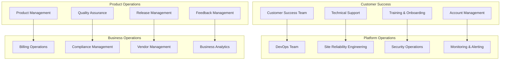

# Operating Model and Support

## Document Purpose

This document defines the comprehensive operating model and support framework for the Neuron ImmigrationOS platform, including operational procedures, support structures, monitoring strategies, and service level agreements to ensure reliable platform operation and exceptional customer experience.

---

## Operating Model Overview

### Core Operating Principles
- **Customer-Centric:** All operations focused on customer success
- **Proactive Support:** Prevent issues before they impact customers
- **Continuous Availability:** 24/7 platform availability and monitoring
- **Rapid Response:** Quick resolution of issues and customer requests
- **Continuous Improvement:** Regular optimization of operations and processes
- **Compliance First:** All operations maintain regulatory compliance

### Operating Model Structure


---

## Service Level Agreements (SLAs)

### 1. Platform Availability SLAs

#### Availability Targets
```yaml
availability_slas:
  platform_uptime:
    target: "99.9% monthly uptime"
    measurement: "External monitoring from multiple locations"
    exclusions: "Planned maintenance windows"
    penalty: "Service credits for SLA breaches"
  
  api_availability:
    target: "99.95% API uptime"
    measurement: "API endpoint monitoring"
    response_time: "95% of requests <150ms"
    error_rate: "<0.1% error rate"
  
  database_availability:
    target: "99.99% database uptime"
    measurement: "Database connection monitoring"
    backup_recovery: "RTO <1 hour, RPO <15 minutes"
    data_integrity: "100% data integrity guarantee"
```

#### Planned Maintenance
```yaml
maintenance_windows:
  scheduled_maintenance:
    frequency: "Monthly maintenance window"
    duration: "Maximum 4 hours"
    timing: "Sunday 2:00-6:00 AM EST"
    notification: "72 hours advance notice"
  
  emergency_maintenance:
    approval: "CTO approval required"
    notification: "Immediate customer notification"
    duration: "Minimize to essential fixes only"
    communication: "Real-time status updates"
```

### 2. Support Response SLAs

#### Support Tier Structure
```yaml
support_tiers:
  critical:
    definition: "System down or data loss"
    response_time: "15 minutes"
    resolution_time: "4 hours"
    escalation: "Immediate to on-call engineer"
    communication: "Hourly updates"
  
  high:
    definition: "Major functionality impaired"
    response_time: "1 hour"
    resolution_time: "8 hours"
    escalation: "To senior support after 2 hours"
    communication: "Every 2 hours"
  
  medium:
    definition: "Minor functionality issues"
    response_time: "4 hours"
    resolution_time: "24 hours"
    escalation: "To L2 support after 8 hours"
    communication: "Daily updates"
  
  low:
    definition: "General questions or requests"
    response_time: "24 hours"
    resolution_time: "5 business days"
    escalation: "Standard queue management"
    communication: "As needed"
```

### 3. Performance SLAs

#### Performance Metrics
```yaml
performance_slas:
  response_times:
    api_endpoints: "95% <150ms, 99% <500ms"
    web_pages: "95% <2 seconds, 99% <5 seconds"
    document_processing: "95% <10 seconds"
    ai_processing: "95% <30 seconds"
  
  throughput:
    concurrent_users: "Support 10,000 concurrent users"
    api_requests: "Handle 50,000 requests/minute"
    document_uploads: "Process 1,000 documents/hour"
    batch_operations: "Complete within defined windows"
```

---

## Customer Success Framework

### 1. Customer Success Team Structure

#### Team Roles and Responsibilities
```yaml
customer_success_roles:
  customer_success_manager:
    responsibilities:
      - "Strategic customer relationship management"
      - "Customer onboarding and adoption"
      - "Success metrics tracking and reporting"
      - "Expansion and renewal management"
    metrics:
      - "Customer satisfaction scores"
      - "Product adoption rates"
      - "Customer retention rates"
      - "Revenue expansion"
  
  technical_account_manager:
    responsibilities:
      - "Technical relationship management"
      - "Integration support and guidance"
      - "Performance optimization"
      - "Technical escalation management"
    metrics:
      - "Technical issue resolution time"
      - "Integration success rates"
      - "Customer technical satisfaction"
      - "Platform utilization rates"
  
  support_specialist:
    responsibilities:
      - "Day-to-day customer support"
      - "Issue triage and resolution"
      - "Documentation and knowledge base"
      - "Customer training and guidance"
    metrics:
      - "Ticket resolution time"
      - "First contact resolution rate"
      - "Customer satisfaction scores"
      - "Knowledge base contributions"
```

### 2. Customer Onboarding Process

#### Onboarding Journey
```yaml
onboarding_process:
  pre_onboarding:
    duration: "1-2 weeks before go-live"
    activities:
      - "Welcome call and expectation setting"
      - "Technical requirements review"
      - "Integration planning session"
      - "Training schedule coordination"
  
  initial_setup:
    duration: "Week 1"
    activities:
      - "Account provisioning and configuration"
      - "Initial data migration"
      - "Basic training sessions"
      - "First case setup"
  
  adoption_phase:
    duration: "Weeks 2-4"
    activities:
      - "Advanced feature training"
      - "Workflow optimization"
      - "Performance monitoring"
      - "Success metrics establishment"
  
  optimization_phase:
    duration: "Weeks 5-8"
    activities:
      - "Usage analysis and optimization"
      - "Advanced configuration"
      - "Integration completion"
      - "Success milestone achievement"
```

### 3. Customer Health Monitoring

#### Health Score Metrics
```yaml
customer_health_metrics:
  usage_metrics:
    - "Daily/weekly active users"
    - "Feature adoption rates"
    - "Case processing volume"
    - "API usage patterns"
  
  engagement_metrics:
    - "Support ticket frequency"
    - "Training session attendance"
    - "Community participation"
    - "Feedback submission"
  
  satisfaction_metrics:
    - "NPS scores"
    - "CSAT ratings"
    - "Renewal probability"
    - "Expansion opportunities"
  
  risk_indicators:
    - "Declining usage patterns"
    - "Increased support tickets"
    - "Low satisfaction scores"
    - "Contract renewal concerns"
```

---

## Technical Support Operations

### 1. Support Channel Strategy

#### Multi-Channel Support
```yaml
support_channels:
  self_service:
    - "Comprehensive knowledge base"
    - "Video tutorials and guides"
    - "Community forums"
    - "In-app help and tooltips"
  
  assisted_support:
    - "Email support (24/7)"
    - "Live chat (business hours)"
    - "Phone support (enterprise)"
    - "Screen sharing sessions"
  
  proactive_support:
    - "Health check reports"
    - "Performance optimization recommendations"
    - "Proactive issue notifications"
    - "Best practice guidance"
```

### 2. Support Process Framework

#### Ticket Lifecycle Management
```yaml
support_process:
  ticket_creation:
    - "Automatic ticket creation from multiple channels"
    - "Initial classification and prioritization"
    - "Customer notification and acknowledgment"
    - "Assignment to appropriate support tier"
  
  investigation:
    - "Issue reproduction and analysis"
    - "Log analysis and debugging"
    - "Collaboration with engineering teams"
    - "Solution development and testing"
  
  resolution:
    - "Solution implementation and verification"
    - "Customer communication and validation"
    - "Documentation and knowledge base update"
    - "Ticket closure and satisfaction survey"
  
  follow_up:
    - "Post-resolution check-in"
    - "Preventive measures implementation"
    - "Process improvement identification"
    - "Customer feedback integration"
```

### 3. Escalation Procedures

#### Escalation Matrix
```yaml
escalation_procedures:
  level_1_support:
    scope: "General questions and basic issues"
    escalation_criteria: "Unable to resolve within 2 hours"
    escalation_target: "Level 2 Support"
  
  level_2_support:
    scope: "Complex technical issues"
    escalation_criteria: "Unable to resolve within 4 hours"
    escalation_target: "Engineering Team"
  
  engineering_team:
    scope: "Product bugs and system issues"
    escalation_criteria: "Critical impact or no resolution within 8 hours"
    escalation_target: "Senior Engineering/CTO"
  
  executive_escalation:
    scope: "Business-critical issues"
    escalation_criteria: "Customer satisfaction risk or SLA breach"
    escalation_target: "Executive Team"
```

---

## Platform Operations

### 1. Site Reliability Engineering (SRE)

#### SRE Responsibilities
```yaml
sre_responsibilities:
  reliability:
    - "System uptime and availability monitoring"
    - "Performance optimization and tuning"
    - "Capacity planning and scaling"
    - "Disaster recovery and business continuity"
  
  monitoring:
    - "Comprehensive system monitoring"
    - "Alerting and incident response"
    - "Performance metrics and SLI tracking"
    - "Error budget management"
  
  automation:
    - "Infrastructure as code implementation"
    - "Automated deployment and rollback"
    - "Self-healing system implementation"
    - "Operational task automation"
  
  improvement:
    - "Post-incident reviews and learning"
    - "System reliability improvements"
    - "Process optimization"
    - "Tool and technology evaluation"
```

### 2. Monitoring and Alerting

#### Monitoring Stack
```yaml
monitoring_infrastructure:
  infrastructure_monitoring:
    tools: ["Prometheus", "Grafana", "AlertManager"]
    metrics: ["CPU", "Memory", "Disk", "Network"]
    alerting: "Multi-channel alerting (PagerDuty, Slack, Email)"
  
  application_monitoring:
    tools: ["New Relic", "Datadog", "Sentry"]
    metrics: ["Response times", "Error rates", "Throughput"]
    tracing: "Distributed tracing with Jaeger"
  
  business_monitoring:
    tools: ["Custom dashboards", "Business intelligence tools"]
    metrics: ["User activity", "Feature usage", "Business KPIs"]
    reporting: "Real-time and scheduled reports"
  
  security_monitoring:
    tools: ["SIEM", "Security scanners", "Intrusion detection"]
    metrics: ["Security events", "Vulnerability scans", "Access patterns"]
    response: "Automated security incident response"
```

#### Alert Management
```yaml
alert_management:
  alert_categories:
    critical:
      - "System outages"
      - "Data loss events"
      - "Security breaches"
      - "SLA violations"
    
    warning:
      - "Performance degradation"
      - "Resource utilization high"
      - "Error rate increases"
      - "Capacity thresholds"
    
    informational:
      - "Deployment notifications"
      - "Scheduled maintenance"
      - "System updates"
      - "Performance reports"
  
  alert_routing:
    - "Intelligent alert routing based on severity"
    - "On-call rotation management"
    - "Escalation procedures"
    - "Alert suppression and grouping"
```

### 3. Incident Management

#### Incident Response Process
```yaml
incident_response:
  detection:
    - "Automated monitoring and alerting"
    - "Customer-reported issues"
    - "Proactive system checks"
    - "Third-party service notifications"
  
  response:
    - "Immediate acknowledgment and triage"
    - "Incident commander assignment"
    - "War room establishment for critical incidents"
    - "Customer communication initiation"
  
  resolution:
    - "Root cause analysis and fix implementation"
    - "Solution testing and validation"
    - "Gradual rollout and monitoring"
    - "Incident closure and documentation"
  
  post_incident:
    - "Post-incident review meeting"
    - "Root cause analysis documentation"
    - "Action item tracking and implementation"
    - "Process improvement recommendations"
```

---

## Release Management

### 1. Release Process

#### Release Lifecycle
```yaml
release_management:
  planning:
    - "Release planning and scheduling"
    - "Feature prioritization and roadmap"
    - "Resource allocation and timeline"
    - "Risk assessment and mitigation"
  
  development:
    - "Feature development and testing"
    - "Code review and quality assurance"
    - "Integration testing and validation"
    - "Documentation and training material"
  
  deployment:
    - "Staged deployment process"
    - "Blue-green deployment strategy"
    - "Canary releases for major changes"
    - "Rollback procedures and testing"
  
  post_release:
    - "Release monitoring and validation"
    - "Customer communication and training"
    - "Feedback collection and analysis"
    - "Success metrics tracking"
```

### 2. Change Management

#### Change Control Process
```yaml
change_management:
  change_categories:
    emergency:
      - "Critical security fixes"
      - "System outage resolution"
      - "Data integrity issues"
      - "Immediate business impact"
    
    standard:
      - "Regular feature releases"
      - "Bug fixes and improvements"
      - "Configuration changes"
      - "Scheduled maintenance"
    
    normal:
      - "Minor updates and patches"
      - "Documentation updates"
      - "Process improvements"
      - "Tool upgrades"
  
  approval_process:
    - "Change request submission and review"
    - "Impact assessment and risk analysis"
    - "Stakeholder approval and sign-off"
    - "Implementation scheduling and communication"
```

---

## Business Operations

### 1. Billing and Subscription Management

#### Billing Operations
```yaml
billing_operations:
  subscription_management:
    - "Plan upgrades and downgrades"
    - "Usage tracking and billing"
    - "Invoice generation and delivery"
    - "Payment processing and reconciliation"
  
  customer_lifecycle:
    - "Trial management and conversion"
    - "Renewal processing and reminders"
    - "Cancellation handling and retention"
    - "Refund processing and approvals"
  
  revenue_operations:
    - "Revenue recognition and reporting"
    - "Churn analysis and prevention"
    - "Expansion opportunity identification"
    - "Financial forecasting and planning"
```

### 2. Compliance Operations

#### Compliance Management
```yaml
compliance_operations:
  regulatory_compliance:
    - "PIPEDA and GDPR compliance monitoring"
    - "Immigration law compliance validation"
    - "Professional standards adherence"
    - "Audit preparation and response"
  
  security_compliance:
    - "SOC 2 compliance maintenance"
    - "Security audit coordination"
    - "Vulnerability management"
    - "Incident reporting and response"
  
  data_governance:
    - "Data retention policy enforcement"
    - "Data subject rights management"
    - "Consent management and tracking"
    - "Data breach response procedures"
```

### 3. Vendor Management

#### Third-Party Service Management
```yaml
vendor_management:
  service_providers:
    - "Cloud infrastructure providers"
    - "AI/ML service providers"
    - "Security service providers"
    - "Monitoring and analytics tools"
  
  vendor_oversight:
    - "SLA monitoring and enforcement"
    - "Performance review and optimization"
    - "Cost management and optimization"
    - "Risk assessment and mitigation"
  
  contract_management:
    - "Contract negotiation and renewal"
    - "Compliance monitoring and auditing"
    - "Dispute resolution and escalation"
    - "Vendor relationship management"
```

---

## Performance Management

### 1. Key Performance Indicators (KPIs)

#### Operational KPIs
```yaml
operational_kpis:
  availability_metrics:
    - "System uptime percentage"
    - "Mean time to recovery (MTTR)"
    - "Mean time between failures (MTBF)"
    - "Planned vs unplanned downtime"
  
  performance_metrics:
    - "Average response time"
    - "95th percentile response time"
    - "Throughput (requests per second)"
    - "Error rate percentage"
  
  customer_metrics:
    - "Customer satisfaction score (CSAT)"
    - "Net Promoter Score (NPS)"
    - "Customer retention rate"
    - "Support ticket resolution time"
  
  business_metrics:
    - "Monthly recurring revenue (MRR)"
    - "Customer acquisition cost (CAC)"
    - "Customer lifetime value (CLV)"
    - "Churn rate"
```

### 2. Reporting and Analytics

#### Operational Reporting
```yaml
reporting_framework:
  real_time_dashboards:
    - "System health and performance"
    - "Customer activity and usage"
    - "Support queue and resolution"
    - "Business metrics and KPIs"
  
  scheduled_reports:
    - "Daily operational summary"
    - "Weekly performance review"
    - "Monthly business review"
    - "Quarterly strategic assessment"
  
  ad_hoc_analysis:
    - "Incident analysis and root cause"
    - "Performance optimization opportunities"
    - "Customer behavior analysis"
    - "Market trend analysis"
```

---

## Continuous Improvement

### 1. Operational Excellence

#### Improvement Process
```yaml
continuous_improvement:
  regular_reviews:
    - "Weekly operational reviews"
    - "Monthly performance assessments"
    - "Quarterly strategic reviews"
    - "Annual operational audits"
  
  feedback_integration:
    - "Customer feedback analysis"
    - "Employee feedback and suggestions"
    - "Industry best practice adoption"
    - "Technology trend evaluation"
  
  process_optimization:
    - "Workflow automation opportunities"
    - "Tool consolidation and optimization"
    - "Training and skill development"
    - "Knowledge sharing and documentation"
```

### 2. Innovation and Evolution

#### Innovation Framework
```yaml
innovation_process:
  technology_evaluation:
    - "Emerging technology assessment"
    - "Proof of concept development"
    - "Pilot program implementation"
    - "Full-scale deployment planning"
  
  process_innovation:
    - "Operational process improvement"
    - "Customer experience enhancement"
    - "Automation and efficiency gains"
    - "Quality and reliability improvements"
  
  cultural_development:
    - "Learning and development programs"
    - "Cross-functional collaboration"
    - "Innovation time and resources"
    - "Recognition and reward systems"
```

---

## Training and Knowledge Management

### 1. Team Training Programs

#### Training Framework
```yaml
training_programs:
  technical_training:
    - "Platform architecture and systems"
    - "Troubleshooting and debugging"
    - "New technology and tool training"
    - "Security and compliance training"
  
  customer_service_training:
    - "Customer communication skills"
    - "Immigration domain knowledge"
    - "Product feature training"
    - "Escalation and conflict resolution"
  
  professional_development:
    - "Leadership and management skills"
    - "Industry certification programs"
    - "Conference and workshop attendance"
    - "Mentoring and coaching programs"
```

### 2. Knowledge Management

#### Knowledge Base Management
```yaml
knowledge_management:
  documentation:
    - "Operational procedures and runbooks"
    - "Troubleshooting guides and FAQs"
    - "Best practices and lessons learned"
    - "Training materials and resources"
  
  knowledge_sharing:
    - "Regular team knowledge sharing sessions"
    - "Cross-team collaboration and learning"
    - "External knowledge source integration"
    - "Community participation and contribution"
  
  knowledge_maintenance:
    - "Regular content review and updates"
    - "Accuracy validation and verification"
    - "Accessibility and searchability"
    - "Version control and change tracking"
```

---

*Document Version: 1.0*  
*Last Updated: 2025-11-17*  
*Source: Consolidated from operational best practices and service management frameworks*