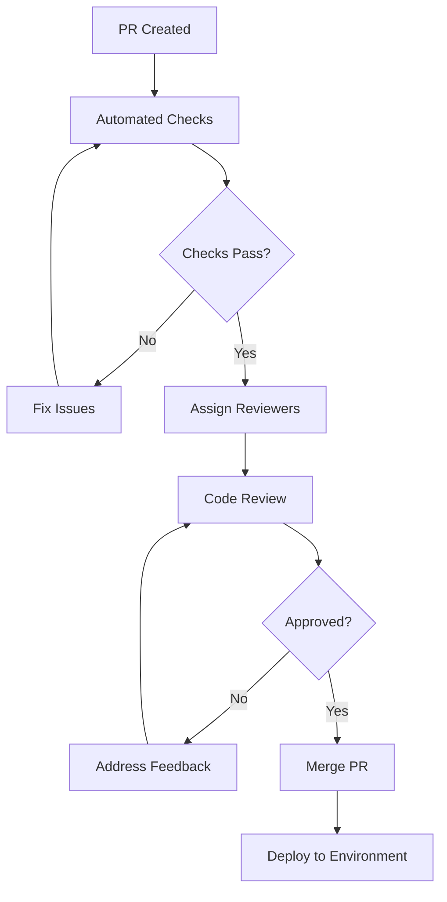

# Engineering Handbook

## Document Purpose

This handbook serves as the definitive guide for engineering practices, standards, and processes for the Neuron ImmigrationOS platform. It establishes FAANG-grade engineering standards to ensure code quality, maintainability, security, and scalability.

---

## Table of Contents

1. [Tech Stack Overview](#tech-stack-overview)
2. [Development Environment](#development-environment)
3. [Coding Standards](#coding-standards)
4. [Architecture Principles](#architecture-principles)
5. [Branching Strategy](#branching-strategy)
6. [Pull Request Guidelines](#pull-request-guidelines)
7. [Testing Policy](#testing-policy)
8. [CI/CD Pipeline](#cicd-pipeline)
9. [Security Guidelines](#security-guidelines)
10. [Performance Standards](#performance-standards)
11. [Documentation Standards](#documentation-standards)
12. [Code Review Process](#code-review-process)
13. [Deployment Procedures](#deployment-procedures)
14. [Monitoring and Observability](#monitoring-and-observability)

---

## Tech Stack Overview

### Backend Technologies

#### Primary Stack
```yaml
backend_stack:
  runtime: "Node.js 20+ LTS"
  framework: "Express.js with TypeScript"
  database: "PostgreSQL 15+"
  orm: "Prisma or TypeORM"
  cache: "Redis 7+"
  queue: "Bull/BullMQ with Redis"
  search: "Elasticsearch 8+"
  
  alternative_stack:
    runtime: "Python 3.11+"
    framework: "FastAPI"
    orm: "SQLAlchemy with Alembic"
    validation: "Pydantic"
```

#### Supporting Technologies
```yaml
supporting_tech:
  authentication: "Passport.js / FastAPI Security"
  validation: "Joi / Pydantic"
  logging: "Winston / structlog"
  monitoring: "Prometheus + Grafana"
  error_tracking: "Sentry"
  documentation: "OpenAPI 3.0 / Swagger"
```

### Frontend Technologies

#### Web Applications
```yaml
frontend_stack:
  framework: "React 18+ with TypeScript"
  build_tool: "Vite"
  state_management: "Redux Toolkit + RTK Query"
  ui_framework: "Custom Design System + Tailwind CSS"
  routing: "React Router 6"
  forms: "React Hook Form + Zod validation"
  testing: "Jest + React Testing Library"
  e2e_testing: "Playwright"
```

#### Mobile Applications
```yaml
mobile_stack:
  framework: "React Native with TypeScript"
  state_management: "Redux Toolkit"
  navigation: "React Navigation 6"
  ui_components: "React Native Elements / NativeBase"
  offline_storage: "Redux Persist + AsyncStorage"
  push_notifications: "Firebase Cloud Messaging"
```

### Infrastructure Technologies

#### Container and Orchestration
```yaml
infrastructure:
  containerization: "Docker"
  orchestration: "Kubernetes"
  service_mesh: "Istio (optional)"
  ingress: "NGINX Ingress Controller"
  secrets: "Kubernetes Secrets / HashiCorp Vault"
```

#### Cloud and DevOps
```yaml
cloud_devops:
  cloud_provider: "AWS / GCP / Azure"
  ci_cd: "GitHub Actions / GitLab CI"
  infrastructure_as_code: "Terraform / Pulumi"
  monitoring: "Prometheus + Grafana + AlertManager"
  logging: "ELK Stack (Elasticsearch, Logstash, Kibana)"
  tracing: "Jaeger"
```

### AI and Machine Learning

#### AI Infrastructure
```yaml
ai_stack:
  llm_providers: "OpenAI, Anthropic, Together AI"
  vector_database: "Pinecone / Weaviate / pgvector"
  ml_framework: "LangChain / LlamaIndex"
  model_serving: "FastAPI / TorchServe"
  embeddings: "OpenAI Embeddings / Sentence Transformers"
```

---

## Development Environment

### Local Development Setup

#### Prerequisites
```bash
# Required software versions
node --version    # v20.x.x or higher
python --version  # 3.11.x or higher
docker --version  # 24.x.x or higher
git --version     # 2.40.x or higher
```

#### Environment Configuration
```yaml
development_setup:
  package_managers:
    node: "npm (preferred) or yarn"
    python: "pip with virtual environments"
  
  code_editor:
    recommended: "VS Code"
    extensions:
      - "ESLint"
      - "Prettier"
      - "TypeScript"
      - "Python"
      - "Docker"
      - "GitLens"
  
  database:
    local: "Docker Compose with PostgreSQL"
    test: "In-memory SQLite for unit tests"
```

#### Project Structure
```
neuron-immigration-os/
├── backend/
│   ├── src/
│   │   ├── controllers/
│   │   ├── services/
│   │   ├── models/
│   │   ├── middleware/
│   │   ├── utils/
│   │   └── types/
│   ├── tests/
│   ├── migrations/
│   └── docs/
├── frontend/
│   ├── src/
│   │   ├── components/
│   │   ├── pages/
│   │   ├── hooks/
│   │   ├── store/
│   │   ├── services/
│   │   └── utils/
│   ├── public/
│   └── tests/
├── mobile/
├── infrastructure/
├── docs/
└── scripts/
```

---

## Coding Standards

### TypeScript/JavaScript Standards

#### Code Style
```typescript
// Use TypeScript strict mode
// tsconfig.json
{
  "compilerOptions": {
    "strict": true,
    "noImplicitAny": true,
    "noImplicitReturns": true,
    "noUnusedLocals": true,
    "noUnusedParameters": true
  }
}

// Naming conventions
class UserService {}           // PascalCase for classes
const getUserById = () => {}   // camelCase for functions/variables
const API_BASE_URL = ''        // UPPER_SNAKE_CASE for constants
interface UserData {}         // PascalCase for interfaces
type UserId = string          // PascalCase for types

// Function declarations
const processDocument = async (
  documentId: string,
  options: ProcessingOptions
): Promise<ProcessingResult> => {
  // Implementation
}
```

#### ESLint Configuration
```json
{
  "extends": [
    "@typescript-eslint/recommended",
    "prettier"
  ],
  "rules": {
    "no-console": "warn",
    "no-unused-vars": "error",
    "@typescript-eslint/no-explicit-any": "error",
    "@typescript-eslint/explicit-function-return-type": "warn",
    "prefer-const": "error",
    "no-var": "error"
  }
}
```

### Python Standards

#### Code Style (PEP 8 + Black)
```python
# Use type hints for all functions
from typing import Optional, List, Dict, Any

def process_eligibility_assessment(
    applicant_data: Dict[str, Any],
    program_type: str,
    include_spouse: bool = False
) -> Optional[EligibilityResult]:
    """
    Process eligibility assessment for immigration program.
    
    Args:
        applicant_data: Dictionary containing applicant information
        program_type: Type of immigration program
        include_spouse: Whether to include spouse in assessment
        
    Returns:
        EligibilityResult object or None if assessment fails
    """
    # Implementation
    pass

# Class naming and structure
class EligibilityService:
    """Service for handling immigration eligibility assessments."""
    
    def __init__(self, rule_engine: RuleEngine) -> None:
        self._rule_engine = rule_engine
    
    async def assess_eligibility(
        self, 
        case_id: str
    ) -> EligibilityResult:
        """Assess eligibility for a specific case."""
        # Implementation
        pass
```

#### Python Tools Configuration
```toml
# pyproject.toml
[tool.black]
line-length = 88
target-version = ['py311']

[tool.isort]
profile = "black"
multi_line_output = 3

[tool.mypy]
python_version = "3.11"
warn_return_any = true
warn_unused_configs = true
disallow_untyped_defs = true
```

### Database Standards

#### SQL Style Guide
```sql
-- Use uppercase for SQL keywords
-- Use snake_case for table and column names
-- Always use explicit JOIN syntax

SELECT 
    u.id,
    u.email,
    u.first_name,
    u.last_name,
    o.name AS organization_name
FROM users u
INNER JOIN org_memberships om ON u.id = om.user_id
INNER JOIN organizations o ON om.organization_id = o.id
WHERE u.status = 'active'
    AND o.subscription_status = 'active'
ORDER BY u.created_at DESC;
```

#### Migration Standards
```sql
-- Always include rollback migrations
-- Use descriptive migration names
-- Include comments for complex changes

-- Migration: 20241117_add_ai_agent_configuration_table.sql
CREATE TABLE ai_agent_configurations (
    id UUID PRIMARY KEY DEFAULT gen_random_uuid(),
    agent_name VARCHAR(100) NOT NULL,
    agent_type VARCHAR(50) NOT NULL,
    configuration JSONB NOT NULL DEFAULT '{}',
    is_active BOOLEAN NOT NULL DEFAULT true,
    created_at TIMESTAMP NOT NULL DEFAULT NOW(),
    updated_at TIMESTAMP NOT NULL DEFAULT NOW()
);

-- Add indexes for performance
CREATE INDEX idx_ai_agent_configurations_agent_name 
ON ai_agent_configurations(agent_name);

CREATE INDEX idx_ai_agent_configurations_agent_type 
ON ai_agent_configurations(agent_type);
```

---

## Architecture Principles

### Core Principles

#### SOLID Principles
```typescript
// Single Responsibility Principle
class UserAuthenticationService {
  async authenticateUser(credentials: LoginCredentials): Promise<AuthResult> {
    // Only handles user authentication
  }
}

class UserProfileService {
  async updateUserProfile(userId: string, data: ProfileData): Promise<User> {
    // Only handles profile updates
  }
}

// Dependency Inversion Principle
interface EmailService {
  sendEmail(to: string, subject: string, body: string): Promise<void>;
}

class NotificationService {
  constructor(private emailService: EmailService) {}
  
  async sendWelcomeEmail(user: User): Promise<void> {
    await this.emailService.sendEmail(
      user.email,
      'Welcome to Neuron',
      this.generateWelcomeMessage(user)
    );
  }
}
```

#### Clean Architecture
```
┌─────────────────────────────────────┐
│           Presentation Layer        │
│        (Controllers, Routes)        │
├─────────────────────────────────────┤
│          Application Layer          │
│         (Use Cases, Services)       │
├─────────────────────────────────────┤
│            Domain Layer             │
│        (Entities, Business Logic)   │
├─────────────────────────────────────┤
│         Infrastructure Layer        │
│    (Database, External Services)    │
└─────────────────────────────────────┘
```

### Microservices Principles

#### Service Design
```yaml
service_design_principles:
  single_responsibility:
    - "Each service has one business responsibility"
    - "Services are independently deployable"
    - "Clear service boundaries"
  
  data_ownership:
    - "Each service owns its data"
    - "No direct database access between services"
    - "Use APIs for inter-service communication"
  
  failure_isolation:
    - "Circuit breakers for external calls"
    - "Graceful degradation"
    - "Bulkhead pattern for resource isolation"
```

---

## Branching Strategy

### Repository Status (Updated 2025-11-18)

**Current State**: The repository has been normalized with `main` branch as the canonical source of truth.

#### Historical Branches (Preserved as Backups)
- `foundation-scaffolding-complete` - Complete foundation scaffold (merged into main)
- `feature/thread-a-meta-engines` - Thread A AI_CORE documentation (integrated into main)
- `phase-0-research-architecture-docs` - Early research documentation (preserved)

#### Working Rules for Future Development
1. **Main Branch Authority** - `main` branch contains all canonical documentation and code
2. **Feature Development** - All new features branch from and merge back to `main`
3. **Documentation Updates** - All documentation changes go through `main` branch
4. **Historical Preservation** - Historical branches preserved as backups, not for active development

### Git Flow Model

#### Branch Types
```yaml
branch_strategy:
  main:
    purpose: "Production-ready code"
    protection: "Protected, requires PR approval"
    deployment: "Automatic to production"
  
  develop:
    purpose: "Integration branch for features"
    protection: "Protected, requires PR approval"
    deployment: "Automatic to staging"
  
  feature/*:
    purpose: "New feature development"
    naming: "feature/TICKET-123-short-description"
    base: "develop"
    merge_target: "develop"
  
  fix/*:
    purpose: "Bug fixes"
    naming: "fix/TICKET-456-bug-description"
    base: "develop or main (for hotfixes)"
    merge_target: "develop or main"
  
  release/*:
    purpose: "Release preparation"
    naming: "release/v1.2.0"
    base: "develop"
    merge_target: "main and develop"
  
  hotfix/*:
    purpose: "Critical production fixes"
    naming: "hotfix/TICKET-789-critical-fix"
    base: "main"
    merge_target: "main and develop"
```

#### Branch Protection Rules
```yaml
branch_protection:
  main:
    - "Require pull request reviews (2 approvals)"
    - "Require status checks to pass"
    - "Require branches to be up to date"
    - "Restrict pushes to administrators only"
    - "Require signed commits"
  
  develop:
    - "Require pull request reviews (1 approval)"
    - "Require status checks to pass"
    - "Allow force pushes by administrators"
```

### Commit Standards

#### Conventional Commits
```bash
# Format: <type>[optional scope]: <description>
# Types: feat, fix, docs, style, refactor, test, chore

feat(auth): add multi-factor authentication support
fix(api): resolve user profile update validation error
docs(readme): update installation instructions
refactor(services): extract common validation logic
test(eligibility): add comprehensive CRS calculation tests
chore(deps): update dependencies to latest versions

# Breaking changes
feat(api)!: change user authentication endpoint structure

BREAKING CHANGE: The /auth/login endpoint now returns a different response format
```

---

## Pull Request Guidelines

### PR Template
```markdown
## Description
Brief description of changes made.

## Type of Change
- [ ] Bug fix (non-breaking change which fixes an issue)
- [ ] New feature (non-breaking change which adds functionality)
- [ ] Breaking change (fix or feature that would cause existing functionality to not work as expected)
- [ ] Documentation update

## Testing
- [ ] Unit tests added/updated
- [ ] Integration tests added/updated
- [ ] Manual testing completed
- [ ] All tests pass

## Security
- [ ] No sensitive data exposed
- [ ] Input validation implemented
- [ ] Authorization checks in place
- [ ] Security review completed (if applicable)

## Performance
- [ ] Performance impact assessed
- [ ] Database queries optimized
- [ ] Caching implemented where appropriate
- [ ] Load testing completed (if applicable)

## Documentation
- [ ] Code comments added/updated
- [ ] API documentation updated
- [ ] README updated (if applicable)
- [ ] Architecture documentation updated (if applicable)

## Checklist
- [ ] Code follows style guidelines
- [ ] Self-review completed
- [ ] Code is properly commented
- [ ] No console.log or debug statements
- [ ] Migration scripts included (if applicable)
```

### PR Size Guidelines
```yaml
pr_size_guidelines:
  small: 
    lines: "< 100 lines changed"
    review_time: "< 30 minutes"
    approval_time: "Same day"
  
  medium:
    lines: "100-300 lines changed"
    review_time: "30-60 minutes"
    approval_time: "1-2 days"
  
  large:
    lines: "300-500 lines changed"
    review_time: "1-2 hours"
    approval_time: "2-3 days"
    note: "Consider breaking into smaller PRs"
  
  extra_large:
    lines: "> 500 lines changed"
    action: "Must be broken down into smaller PRs"
    exception: "Only for generated code or large refactors"
```

### Review Process
```yaml
review_process:
  automated_checks:
    - "All CI/CD pipeline checks pass"
    - "Code coverage meets minimum threshold"
    - "Security scans pass"
    - "Performance benchmarks pass"
  
  human_review:
    - "Code quality and style"
    - "Business logic correctness"
    - "Security considerations"
    - "Performance implications"
    - "Documentation completeness"
  
  approval_requirements:
    - "At least 1 approval from code owner"
    - "At least 1 approval from senior developer"
    - "Security team approval (for security-related changes)"
    - "Architecture team approval (for architectural changes)"
```

---

## Testing Policy

### Testing Pyramid

#### Unit Tests (70% of tests)
```typescript
// Example unit test
describe('EligibilityService', () => {
  let service: EligibilityService;
  let mockRuleEngine: jest.Mocked<RuleEngine>;

  beforeEach(() => {
    mockRuleEngine = createMockRuleEngine();
    service = new EligibilityService(mockRuleEngine);
  });

  describe('calculateCRSScore', () => {
    it('should calculate correct CRS score for single applicant', async () => {
      // Arrange
      const applicantData = createMockApplicantData();
      mockRuleEngine.evaluateRules.mockResolvedValue(mockRuleResult);

      // Act
      const result = await service.calculateCRSScore(applicantData);

      // Assert
      expect(result.totalScore).toBe(450);
      expect(result.breakdown.coreFactors).toBe(350);
      expect(result.breakdown.additionalPoints).toBe(100);
    });
  });
});
```

#### Integration Tests (20% of tests)
```typescript
// Example integration test
describe('User Registration API', () => {
  let app: Application;
  let database: Database;

  beforeAll(async () => {
    app = await createTestApp();
    database = await setupTestDatabase();
  });

  afterAll(async () => {
    await cleanupTestDatabase(database);
  });

  it('should register new user successfully', async () => {
    const userData = {
      email: 'test@example.com',
      password: 'SecurePassword123!',
      firstName: 'John',
      lastName: 'Doe'
    };

    const response = await request(app)
      .post('/api/auth/register')
      .send(userData)
      .expect(201);

    expect(response.body.user.email).toBe(userData.email);
    expect(response.body.user.password).toBeUndefined();
    
    // Verify user was created in database
    const user = await database.users.findByEmail(userData.email);
    expect(user).toBeDefined();
  });
});
```

#### End-to-End Tests (10% of tests)
```typescript
// Example E2E test with Playwright
import { test, expect } from '@playwright/test';

test('complete case creation workflow', async ({ page }) => {
  // Login as consultant
  await page.goto('/login');
  await page.fill('[data-testid=email]', 'consultant@example.com');
  await page.fill('[data-testid=password]', 'password');
  await page.click('[data-testid=login-button]');

  // Navigate to case creation
  await page.click('[data-testid=create-case-button]');
  
  // Fill case details
  await page.selectOption('[data-testid=case-type]', 'express-entry');
  await page.fill('[data-testid=client-name]', 'John Doe');
  await page.fill('[data-testid=client-email]', 'john@example.com');
  
  // Submit case
  await page.click('[data-testid=submit-case]');
  
  // Verify case was created
  await expect(page.locator('[data-testid=success-message]')).toBeVisible();
  await expect(page.locator('[data-testid=case-number]')).toContainText('CASE-');
});
```

### Coverage Requirements
```yaml
coverage_requirements:
  overall_coverage: ">= 80%"
  new_code_coverage: ">= 85%"
  critical_paths: ">= 95%"
  
  coverage_types:
    line_coverage: "Primary metric"
    branch_coverage: "Must be >= 75%"
    function_coverage: "Must be >= 90%"
  
  exclusions:
    - "Configuration files"
    - "Migration scripts"
    - "Third-party integrations (mocked)"
    - "Generated code"
```

### Test Data Management
```yaml
test_data_strategy:
  unit_tests:
    - "Use factory functions for test data"
    - "Mock external dependencies"
    - "Isolated test data per test"
  
  integration_tests:
    - "Use test database with fixtures"
    - "Clean database between tests"
    - "Realistic but anonymized data"
  
  e2e_tests:
    - "Dedicated test environment"
    - "Stable test data sets"
    - "Automated data cleanup"
```

---

## CI/CD Pipeline

### Pipeline Stages

#### Continuous Integration
```yaml
ci_pipeline:
  trigger:
    - "Push to any branch"
    - "Pull request creation/update"
  
  stages:
    lint_and_format:
      - "ESLint for TypeScript/JavaScript"
      - "Black and isort for Python"
      - "Prettier for code formatting"
      - "Dockerfile linting"
    
    security_scan:
      - "Dependency vulnerability scan"
      - "Static code analysis (SonarQube)"
      - "Secret detection"
      - "License compliance check"
    
    unit_tests:
      - "Run all unit tests"
      - "Generate coverage reports"
      - "Fail if coverage below threshold"
    
    integration_tests:
      - "Start test database"
      - "Run integration tests"
      - "Generate test reports"
    
    build:
      - "Build Docker images"
      - "Run container security scan"
      - "Push to container registry"
```

#### Continuous Deployment
```yaml
cd_pipeline:
  development:
    trigger: "Merge to develop branch"
    environment: "Development"
    approval: "Automatic"
    tests: "Smoke tests"
  
  staging:
    trigger: "Merge to develop branch"
    environment: "Staging"
    approval: "Automatic"
    tests: "Full E2E test suite"
  
  production:
    trigger: "Merge to main branch"
    environment: "Production"
    approval: "Manual approval required"
    strategy: "Blue-green deployment"
    tests: "Smoke tests + health checks"
    rollback: "Automatic on failure"
```

### GitHub Actions Configuration
```yaml
# .github/workflows/ci.yml
name: CI Pipeline

on:
  push:
    branches: [ main, develop ]
  pull_request:
    branches: [ main, develop ]

jobs:
  lint:
    runs-on: ubuntu-latest
    steps:
      - uses: actions/checkout@v4
      - uses: actions/setup-node@v4
        with:
          node-version: '20'
          cache: 'npm'
      - run: npm ci
      - run: npm run lint
      - run: npm run format:check

  test:
    runs-on: ubuntu-latest
    services:
      postgres:
        image: postgres:15
        env:
          POSTGRES_PASSWORD: postgres
        options: >-
          --health-cmd pg_isready
          --health-interval 10s
          --health-timeout 5s
          --health-retries 5
    steps:
      - uses: actions/checkout@v4
      - uses: actions/setup-node@v4
        with:
          node-version: '20'
          cache: 'npm'
      - run: npm ci
      - run: npm run test:unit
      - run: npm run test:integration
      - uses: codecov/codecov-action@v3
        with:
          file: ./coverage/lcov.info

  security:
    runs-on: ubuntu-latest
    steps:
      - uses: actions/checkout@v4
      - uses: github/super-linter@v4
        env:
          DEFAULT_BRANCH: main
          GITHUB_TOKEN: ${{ secrets.GITHUB_TOKEN }}
      - run: npm audit
      - run: npm run security:scan
```

---

## Security Guidelines

### Secure Coding Practices

#### Input Validation
```typescript
// Always validate and sanitize inputs
import Joi from 'joi';

const userRegistrationSchema = Joi.object({
  email: Joi.string().email().required(),
  password: Joi.string().min(12).pattern(/^(?=.*[a-z])(?=.*[A-Z])(?=.*\d)(?=.*[@$!%*?&])[A-Za-z\d@$!%*?&]/).required(),
  firstName: Joi.string().min(1).max(100).required(),
  lastName: Joi.string().min(1).max(100).required()
});

export const registerUser = async (req: Request, res: Response) => {
  const { error, value } = userRegistrationSchema.validate(req.body);
  if (error) {
    return res.status(400).json({ error: error.details[0].message });
  }
  
  // Process validated data
  const userData = value;
  // ...
};
```

#### Authentication and Authorization
```typescript
// JWT token handling
import jwt from 'jsonwebtoken';
import bcrypt from 'bcrypt';

export const authenticateToken = (req: Request, res: Response, next: NextFunction) => {
  const authHeader = req.headers['authorization'];
  const token = authHeader && authHeader.split(' ')[1];

  if (!token) {
    return res.status(401).json({ error: 'Access token required' });
  }

  jwt.verify(token, process.env.JWT_SECRET!, (err, user) => {
    if (err) {
      return res.status(403).json({ error: 'Invalid or expired token' });
    }
    req.user = user;
    next();
  });
};

// Password hashing
export const hashPassword = async (password: string): Promise<string> => {
  const saltRounds = 12;
  return bcrypt.hash(password, saltRounds);
};
```

#### SQL Injection Prevention
```typescript
// Use parameterized queries
import { Pool } from 'pg';

export class UserRepository {
  constructor(private db: Pool) {}

  async findUserByEmail(email: string): Promise<User | null> {
    // Good: Parameterized query
    const query = 'SELECT * FROM users WHERE email = $1 AND deleted_at IS NULL';
    const result = await this.db.query(query, [email]);
    
    return result.rows[0] || null;
  }

  // Bad: String concatenation (vulnerable to SQL injection)
  // const query = `SELECT * FROM users WHERE email = '${email}'`;
}
```

### Security Checklist
```yaml
security_checklist:
  authentication:
    - "Strong password requirements"
    - "Multi-factor authentication"
    - "Session timeout and management"
    - "Account lockout after failed attempts"
  
  authorization:
    - "Role-based access control"
    - "Principle of least privilege"
    - "Resource-level permissions"
    - "API endpoint protection"
  
  data_protection:
    - "Encryption at rest and in transit"
    - "PII data masking in logs"
    - "Secure data disposal"
    - "Data backup encryption"
  
  input_validation:
    - "Server-side validation"
    - "Input sanitization"
    - "File upload restrictions"
    - "Rate limiting"
  
  error_handling:
    - "No sensitive data in error messages"
    - "Proper exception handling"
    - "Security event logging"
    - "Graceful failure modes"
```

---

## Performance Standards

### Performance Requirements
```yaml
performance_targets:
  api_response_times:
    p50: "< 100ms"
    p95: "< 150ms"
    p99: "< 500ms"
  
  database_queries:
    simple_queries: "< 10ms"
    complex_queries: "< 50ms"
    bulk_operations: "< 200ms"
  
  page_load_times:
    first_contentful_paint: "< 1.5s"
    largest_contentful_paint: "< 2.5s"
    cumulative_layout_shift: "< 0.1"
  
  throughput:
    api_requests: "> 1000 RPS"
    concurrent_users: "> 10000"
    document_processing: "> 100/minute"
```

### Performance Optimization

#### Database Optimization
```sql
-- Use appropriate indexes
CREATE INDEX CONCURRENTLY idx_cases_org_status 
ON cases(organization_id, status) 
WHERE deleted_at IS NULL;

-- Optimize queries with EXPLAIN ANALYZE
EXPLAIN ANALYZE 
SELECT c.id, c.case_number, u.first_name, u.last_name
FROM cases c
INNER JOIN users u ON c.assigned_consultant_id = u.id
WHERE c.organization_id = $1 
  AND c.status = 'active'
  AND c.deleted_at IS NULL
ORDER BY c.updated_at DESC
LIMIT 20;
```

#### Caching Strategy
```typescript
// Redis caching implementation
import Redis from 'ioredis';

export class CacheService {
  private redis: Redis;

  constructor() {
    this.redis = new Redis(process.env.REDIS_URL);
  }

  async get<T>(key: string): Promise<T | null> {
    const cached = await this.redis.get(key);
    return cached ? JSON.parse(cached) : null;
  }

  async set(key: string, value: any, ttlSeconds: number = 3600): Promise<void> {
    await this.redis.setex(key, ttlSeconds, JSON.stringify(value));
  }

  async invalidate(pattern: string): Promise<void> {
    const keys = await this.redis.keys(pattern);
    if (keys.length > 0) {
      await this.redis.del(...keys);
    }
  }
}

// Usage in service
export class UserService {
  constructor(
    private userRepository: UserRepository,
    private cacheService: CacheService
  ) {}

  async getUserById(id: string): Promise<User | null> {
    const cacheKey = `user:${id}`;
    
    // Try cache first
    let user = await this.cacheService.get<User>(cacheKey);
    if (user) {
      return user;
    }

    // Fetch from database
    user = await this.userRepository.findById(id);
    if (user) {
      // Cache for 1 hour
      await this.cacheService.set(cacheKey, user, 3600);
    }

    return user;
  }
}
```

#### Frontend Performance
```typescript
// Code splitting and lazy loading
import { lazy, Suspense } from 'react';

const CaseManagement = lazy(() => import('./pages/CaseManagement'));
const ClientPortal = lazy(() => import('./pages/ClientPortal'));

function App() {
  return (
    <Router>
      <Routes>
        <Route 
          path="/cases" 
          element={
            <Suspense fallback={<LoadingSpinner />}>
              <CaseManagement />
            </Suspense>
          } 
        />
        <Route 
          path="/portal" 
          element={
            <Suspense fallback={<LoadingSpinner />}>
              <ClientPortal />
            </Suspense>
          } 
        />
      </Routes>
    </Router>
  );
}

// Memoization for expensive computations
import { useMemo } from 'react';

const EligibilityCalculator = ({ applicantData }) => {
  const crsScore = useMemo(() => {
    return calculateCRSScore(applicantData);
  }, [applicantData]);

  return <div>CRS Score: {crsScore}</div>;
};
```

---

## Documentation Standards

### Code Documentation

#### Function Documentation
```typescript
/**
 * Calculates the Comprehensive Ranking System (CRS) score for Express Entry
 * 
 * @param applicantData - Complete applicant information including personal details,
 *                       education, work experience, and language test results
 * @param includeSpouse - Whether to include spouse/partner information in calculation
 * @returns Promise resolving to CRS calculation result with score breakdown
 * 
 * @throws {ValidationError} When applicant data is invalid or incomplete
 * @throws {CalculationError} When CRS calculation fails due to business rule errors
 * 
 * @example
 * ```typescript
 * const result = await calculateCRSScore({
 *   age: 30,
 *   education: 'bachelors',
 *   workExperience: 3,
 *   languageScores: { ielts: { listening: 8, reading: 7, writing: 7, speaking: 8 } }
 * }, false);
 * 
 * console.log(`Total CRS Score: ${result.totalScore}`);
 * ```
 */
export async function calculateCRSScore(
  applicantData: ApplicantData,
  includeSpouse: boolean = false
): Promise<CRSCalculationResult> {
  // Implementation
}
```

#### API Documentation
```yaml
# OpenAPI 3.0 specification
openapi: 3.0.0
info:
  title: Neuron Immigration OS API
  version: 1.0.0
  description: Comprehensive API for immigration case management

paths:
  /api/cases:
    post:
      summary: Create a new immigration case
      description: Creates a new case with the provided information and assigns it to the specified consultant
      tags:
        - Cases
      requestBody:
        required: true
        content:
          application/json:
            schema:
              $ref: '#/components/schemas/CreateCaseRequest'
      responses:
        '201':
          description: Case created successfully
          content:
            application/json:
              schema:
                $ref: '#/components/schemas/Case'
        '400':
          description: Invalid request data
        '401':
          description: Authentication required
        '403':
          description: Insufficient permissions

components:
  schemas:
    CreateCaseRequest:
      type: object
      required:
        - caseType
        - clientEmail
        - assignedConsultantId
      properties:
        caseType:
          type: string
          enum: [express-entry, study-permit, work-permit, family-class]
        clientEmail:
          type: string
          format: email
        assignedConsultantId:
          type: string
          format: uuid
```

### Architecture Documentation

#### Architecture Decision Records (ADRs)
```markdown
# ADR-001: Use PostgreSQL as Primary Database

## Status
Accepted

## Context
We need to choose a primary database for the Neuron Immigration OS platform that can handle:
- Complex relational data (users, cases, documents, relationships)
- JSONB for flexible schema requirements
- Full-text search capabilities
- Strong consistency and ACID compliance
- Multi-tenant data isolation

## Decision
We will use PostgreSQL 15+ as our primary database.

## Consequences

### Positive
- Excellent support for both relational and document data (JSONB)
- Strong consistency and ACID compliance
- Mature ecosystem with excellent tooling
- Built-in full-text search capabilities
- Row-level security for multi-tenancy
- Excellent performance characteristics

### Negative
- Requires more operational overhead than managed NoSQL solutions
- Vertical scaling limitations (though horizontal scaling possible with sharding)
- Learning curve for team members unfamiliar with advanced PostgreSQL features

## Implementation Notes
- Use connection pooling (PgBouncer) for production
- Implement read replicas for read-heavy workloads
- Use JSONB indexes for flexible schema queries
- Implement proper backup and recovery procedures
```

---

## Code Review Process

### Review Checklist

#### Functionality Review
```yaml
functionality_checklist:
  business_logic:
    - "Code correctly implements requirements"
    - "Edge cases are handled appropriately"
    - "Error conditions are properly managed"
    - "Business rules are correctly applied"
  
  integration:
    - "API contracts are maintained"
    - "Database schema changes are backward compatible"
    - "External service integrations work correctly"
    - "Event handling is implemented properly"
```

#### Code Quality Review
```yaml
code_quality_checklist:
  readability:
    - "Code is self-documenting with clear variable names"
    - "Functions are appropriately sized and focused"
    - "Complex logic is commented"
    - "Code follows established patterns"
  
  maintainability:
    - "Code is modular and loosely coupled"
    - "Dependencies are minimized"
    - "Configuration is externalized"
    - "Code is testable"
  
  performance:
    - "No obvious performance bottlenecks"
    - "Database queries are optimized"
    - "Caching is used appropriately"
    - "Resource usage is reasonable"
```

#### Security Review
```yaml
security_checklist:
  input_validation:
    - "All inputs are validated and sanitized"
    - "SQL injection prevention measures in place"
    - "XSS prevention implemented"
    - "File upload restrictions enforced"
  
  authentication_authorization:
    - "Authentication checks are present"
    - "Authorization is properly implemented"
    - "Sensitive operations require appropriate permissions"
    - "Session management is secure"
  
  data_protection:
    - "Sensitive data is encrypted"
    - "PII is handled appropriately"
    - "Logging doesn't expose sensitive information"
    - "Data access is audited"
```

### Review Process Flow


---

## Deployment Procedures

### Deployment Strategies

#### Blue-Green Deployment
```yaml
blue_green_deployment:
  process:
    1: "Deploy new version to green environment"
    2: "Run smoke tests on green environment"
    3: "Switch traffic from blue to green"
    4: "Monitor green environment"
    5: "Keep blue environment for quick rollback"
  
  advantages:
    - "Zero-downtime deployments"
    - "Quick rollback capability"
    - "Full testing before traffic switch"
  
  requirements:
    - "Duplicate infrastructure"
    - "Database migration compatibility"
    - "Load balancer configuration"
```

#### Rolling Deployment
```yaml
rolling_deployment:
  process:
    1: "Deploy to subset of instances"
    2: "Health check new instances"
    3: "Gradually increase traffic to new instances"
    4: "Monitor performance and errors"
    5: "Complete rollout or rollback if issues"
  
  configuration:
    batch_size: "25% of instances"
    health_check_timeout: "60 seconds"
    rollback_threshold: "5% error rate increase"
```

### Database Migrations

#### Migration Best Practices
```sql
-- Always use transactions for migrations
BEGIN;

-- Add new column with default value
ALTER TABLE users 
ADD COLUMN phone_verified_at TIMESTAMP NULL;

-- Create index concurrently (doesn't lock table)
CREATE INDEX CONCURRENTLY idx_users_phone_verified 
ON users(phone_verified_at) 
WHERE phone_verified_at IS NOT NULL;

-- Update existing data in batches
UPDATE users 
SET phone_verified_at = NOW() 
WHERE phone IS NOT NULL 
  AND phone_verified_at IS NULL
  AND id IN (
    SELECT id FROM users 
    WHERE phone IS NOT NULL 
      AND phone_verified_at IS NULL 
    LIMIT 1000
  );

COMMIT;
```

#### Migration Rollback Strategy
```sql
-- Always provide rollback migration
-- Rollback for above migration

BEGIN;

-- Remove the index
DROP INDEX IF EXISTS idx_users_phone_verified;

-- Remove the column
ALTER TABLE users DROP COLUMN IF EXISTS phone_verified_at;

COMMIT;
```

---

## Monitoring and Observability

### Monitoring Stack

#### Application Monitoring
```yaml
monitoring_tools:
  metrics:
    tool: "Prometheus + Grafana"
    collection_interval: "15 seconds"
    retention: "30 days"
    alerting: "AlertManager"
  
  logging:
    tool: "ELK Stack (Elasticsearch, Logstash, Kibana)"
    log_level: "INFO (production), DEBUG (development)"
    retention: "90 days"
    structured_logging: "JSON format"
  
  tracing:
    tool: "Jaeger"
    sampling_rate: "1% (production), 100% (development)"
    retention: "7 days"
  
  error_tracking:
    tool: "Sentry"
    environment_separation: "Yes"
    performance_monitoring: "Enabled"
```

#### Key Metrics
```yaml
application_metrics:
  performance:
    - "Request duration (histogram)"
    - "Request rate (counter)"
    - "Error rate (counter)"
    - "Database query duration"
    - "Cache hit/miss ratio"
  
  business:
    - "Active users (gauge)"
    - "Cases created (counter)"
    - "Documents processed (counter)"
    - "AI agent task completion rate"
  
  infrastructure:
    - "CPU usage (gauge)"
    - "Memory usage (gauge)"
    - "Disk usage (gauge)"
    - "Network I/O (counter)"
```

#### Alerting Rules
```yaml
alerting_rules:
  critical:
    - "Service down (availability < 99%)"
    - "High error rate (> 5% for 5 minutes)"
    - "Database connection failures"
    - "Disk space critical (> 90%)"
  
  warning:
    - "High response time (p95 > 500ms for 10 minutes)"
    - "High memory usage (> 80% for 15 minutes)"
    - "Certificate expiring (< 30 days)"
    - "Failed backup jobs"
  
  notification_channels:
    critical: "PagerDuty + Slack"
    warning: "Slack + Email"
    info: "Email only"
```

### Logging Standards

#### Structured Logging
```typescript
// Use structured logging with consistent format
import winston from 'winston';

const logger = winston.createLogger({
  level: process.env.LOG_LEVEL || 'info',
  format: winston.format.combine(
    winston.format.timestamp(),
    winston.format.errors({ stack: true }),
    winston.format.json()
  ),
  defaultMeta: {
    service: 'neuron-api',
    version: process.env.APP_VERSION
  },
  transports: [
    new winston.transports.Console(),
    new winston.transports.File({ filename: 'app.log' })
  ]
});

// Usage examples
logger.info('User login successful', {
  userId: user.id,
  email: user.email,
  ipAddress: req.ip,
  userAgent: req.get('User-Agent')
});

logger.error('Database connection failed', {
  error: error.message,
  stack: error.stack,
  database: 'postgresql',
  host: process.env.DB_HOST
});

logger.warn('High API usage detected', {
  userId: user.id,
  requestCount: requestCount,
  timeWindow: '1 hour',
  threshold: 1000
});
```

---

This engineering handbook serves as the foundation for maintaining high-quality, secure, and scalable code across the Neuron ImmigrationOS platform. All team members are expected to follow these guidelines and contribute to their continuous improvement.

---

*Document Version: 1.0*  
*Last Updated: 2025-11-17*  
*Maintained by: Engineering Team*