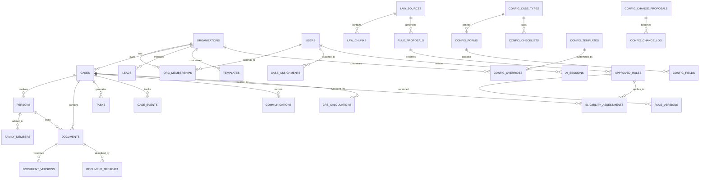

# Data Model Design: Canada Immigration OS

**Document Version:** 1.0  
**Date:** November 13, 2025  
**Author:** AI Data Architect  

---

## Executive Summary

This document defines the comprehensive data model for Canada Immigration OS, including entity relationships, database schemas, and data governance policies. The model is designed to support multi-tenancy, legal compliance, audit requirements, and scalable operations.

**Key Design Principles:**
- **Multi-Tenant Architecture:** Complete data isolation between organizations
- **Audit Trail Compliance:** Full history tracking for legal requirements
- **Flexible Schema:** JSONB fields for evolving immigration requirements
- **Performance Optimization:** Strategic indexing and partitioning
- **Data Privacy:** Encryption and access controls for sensitive information

---

## 1. High-Level Entity Relationship Overview



---

## 2. Core Entity Definitions

### 2.1 Organization & User Management

#### Organizations Table
```sql
CREATE TABLE organizations (
    id UUID PRIMARY KEY DEFAULT gen_random_uuid(),
    name VARCHAR(255) NOT NULL,
    domain VARCHAR(255) UNIQUE,
    type VARCHAR(50) NOT NULL DEFAULT 'law_firm', -- law_firm, solo_practice, consultancy
    settings JSONB DEFAULT '{}',
    subscription_tier VARCHAR(50) DEFAULT 'starter',
    subscription_status VARCHAR(50) DEFAULT 'active',
    billing_info JSONB DEFAULT '{}',
    branding JSONB DEFAULT '{}',
    compliance_settings JSONB DEFAULT '{}',
    created_at TIMESTAMP DEFAULT NOW(),
    updated_at TIMESTAMP DEFAULT NOW(),
    deleted_at TIMESTAMP NULL
);

-- Indexes for performance
CREATE INDEX idx_organizations_domain ON organizations(domain);
CREATE INDEX idx_organizations_type ON organizations(type);
CREATE INDEX idx_organizations_subscription ON organizations(subscription_tier, subscription_status);
```

#### Users Table
```sql
CREATE TABLE users (
    id UUID PRIMARY KEY DEFAULT gen_random_uuid(),
    email VARCHAR(255) UNIQUE NOT NULL,
    encrypted_password VARCHAR(255) NOT NULL,
    first_name VARCHAR(100) NOT NULL,
    last_name VARCHAR(100) NOT NULL,
    phone VARCHAR(20),
    profile JSONB DEFAULT '{}',
    preferences JSONB DEFAULT '{}',
    professional_info JSONB DEFAULT '{}', -- licenses, certifications, etc.
    last_login_at TIMESTAMP,
    email_verified_at TIMESTAMP,
    phone_verified_at TIMESTAMP,
    two_factor_enabled BOOLEAN DEFAULT FALSE,
    two_factor_secret VARCHAR(255),
    created_at TIMESTAMP DEFAULT NOW(),
    updated_at TIMESTAMP DEFAULT NOW(),
    deleted_at TIMESTAMP NULL
);

-- Indexes
CREATE INDEX idx_users_email ON users(email);
CREATE INDEX idx_users_name ON users(last_name, first_name);
CREATE INDEX idx_users_last_login ON users(last_login_at);
```

#### Organization Memberships Table
```sql
CREATE TABLE org_memberships (
    id UUID PRIMARY KEY DEFAULT gen_random_uuid(),
    org_id UUID NOT NULL REFERENCES organizations(id) ON DELETE CASCADE,
    user_id UUID NOT NULL REFERENCES users(id) ON DELETE CASCADE,
    role VARCHAR(50) NOT NULL, -- owner, admin, consultant, staff, paralegal
    permissions JSONB DEFAULT '{}',
    status VARCHAR(50) DEFAULT 'active', -- active, suspended, pending
    invited_by UUID REFERENCES users(id),
    invited_at TIMESTAMP,
    joined_at TIMESTAMP,
    created_at TIMESTAMP DEFAULT NOW(),
    updated_at TIMESTAMP DEFAULT NOW(),
    
    UNIQUE(org_id, user_id)
);

-- Indexes
CREATE INDEX idx_org_memberships_org ON org_memberships(org_id);
CREATE INDEX idx_org_memberships_user ON org_memberships(user_id);
CREATE INDEX idx_org_memberships_role ON org_memberships(role);
```

### 2.2 Case Management

#### Cases Table
```sql
CREATE TABLE cases (
    id UUID PRIMARY KEY DEFAULT gen_random_uuid(),
    org_id UUID NOT NULL REFERENCES organizations(id),
    case_number VARCHAR(50) NOT NULL,
    case_type VARCHAR(100) NOT NULL, -- EXPRESS_ENTRY_FSW, STUDY_PERMIT, etc.
    status VARCHAR(50) NOT NULL DEFAULT 'draft',
    priority VARCHAR(20) DEFAULT 'normal', -- low, normal, high, urgent
    
    -- Client information
    primary_applicant_id UUID REFERENCES persons(id),
    client_data JSONB DEFAULT '{}',
    
    -- Case details
    immigration_program VARCHAR(100),
    target_province VARCHAR(50),
    estimated_timeline JSONB DEFAULT '{}',
    
    -- Financial information
    fee_structure JSONB DEFAULT '{}',
    payment_status VARCHAR(50) DEFAULT 'pending',
    total_fees DECIMAL(10,2),
    paid_amount DECIMAL(10,2) DEFAULT 0,
    
    -- Assignment and tracking
    assigned_consultant_id UUID REFERENCES users(id),
    assigned_staff JSONB DEFAULT '[]', -- Array of user IDs
    
    -- Metadata
    source VARCHAR(50), -- website, referral, marketing, etc.
    tags JSONB DEFAULT '[]',
    custom_fields JSONB DEFAULT '{}',
    
    -- Timestamps
    consultation_date TIMESTAMP,
    retainer_signed_at TIMESTAMP,
    submitted_at TIMESTAMP,
    decision_date TIMESTAMP,
    closed_at TIMESTAMP,
    created_at TIMESTAMP DEFAULT NOW(),
    updated_at TIMESTAMP DEFAULT NOW(),
    deleted_at TIMESTAMP NULL,
    
    -- Constraints
    UNIQUE(org_id, case_number)
);

-- Indexes for performance
CREATE INDEX idx_cases_org_id ON cases(org_id);
CREATE INDEX idx_cases_status ON cases(status);
CREATE INDEX idx_cases_type ON cases(case_type);
CREATE INDEX idx_cases_consultant ON cases(assigned_consultant_id);
CREATE INDEX idx_cases_created_at ON cases(created_at);
CREATE INDEX idx_cases_priority ON cases(priority);

-- Partial index for active cases
CREATE INDEX idx_cases_active ON cases(org_id, status) WHERE deleted_at IS NULL;
```

#### Persons Table
```sql
CREATE TABLE persons (
    id UUID PRIMARY KEY DEFAULT gen_random_uuid(),
    org_id UUID NOT NULL REFERENCES organizations(id),
    case_id UUID REFERENCES cases(id),
    
    -- Personal information
    first_name VARCHAR(100) NOT NULL,
    last_name VARCHAR(100) NOT NULL,
    middle_name VARCHAR(100),
    preferred_name VARCHAR(100),
    
    -- Identity information
    date_of_birth DATE,
    place_of_birth VARCHAR(255),
    gender VARCHAR(20),
    marital_status VARCHAR(50),
    
    -- Contact information
    email VARCHAR(255),
    phone VARCHAR(20),
    address JSONB DEFAULT '{}',
    
    -- Immigration information
    citizenship JSONB DEFAULT '[]', -- Array of citizenships
    passport_info JSONB DEFAULT '{}',
    immigration_status VARCHAR(100),
    
    -- Relationship information
    relationship_to_primary VARCHAR(50), -- primary, spouse, child, dependent
    
    -- Personal details for immigration
    education JSONB DEFAULT '[]',
    work_experience JSONB DEFAULT '[]',
    language_tests JSONB DEFAULT '[]',
    
    -- Metadata
    profile_completion_percentage INTEGER DEFAULT 0,
    custom_fields JSONB DEFAULT '{}',
    
    created_at TIMESTAMP DEFAULT NOW(),
    updated_at TIMESTAMP DEFAULT NOW(),
    deleted_at TIMESTAMP NULL
);

-- Indexes
CREATE INDEX idx_persons_org_id ON persons(org_id);
CREATE INDEX idx_persons_case_id ON persons(case_id);
CREATE INDEX idx_persons_name ON persons(last_name, first_name);
CREATE INDEX idx_persons_email ON persons(email);
CREATE INDEX idx_persons_relationship ON persons(relationship_to_primary);
```

#### Family Members Table
```sql
CREATE TABLE family_members (
    id UUID PRIMARY KEY DEFAULT gen_random_uuid(),
    org_id UUID NOT NULL REFERENCES organizations(id),
    primary_person_id UUID NOT NULL REFERENCES persons(id),
    related_person_id UUID NOT NULL REFERENCES persons(id),
    relationship VARCHAR(50) NOT NULL, -- spouse, child, parent, sibling
    is_accompanying BOOLEAN DEFAULT FALSE,
    is_dependent BOOLEAN DEFAULT FALSE,
    
    created_at TIMESTAMP DEFAULT NOW(),
    updated_at TIMESTAMP DEFAULT NOW(),
    
    UNIQUE(primary_person_id, related_person_id)
);

-- Indexes
CREATE INDEX idx_family_members_primary ON family_members(primary_person_id);
CREATE INDEX idx_family_members_related ON family_members(related_person_id);
```

### 2.3 Document Management

#### Documents Table
```sql
CREATE TABLE documents (
    id UUID PRIMARY KEY DEFAULT gen_random_uuid(),
    org_id UUID NOT NULL REFERENCES organizations(id),
    case_id UUID REFERENCES cases(id),
    person_id UUID REFERENCES persons(id),
    
    -- Document identification
    document_type VARCHAR(100) NOT NULL, -- passport, diploma, ielts, etc.
    category VARCHAR(50) NOT NULL, -- identity, education, work, language, etc.
    title VARCHAR(255) NOT NULL,
    description TEXT,
    
    -- File information
    filename VARCHAR(255) NOT NULL,
    original_filename VARCHAR(255) NOT NULL,
    file_size BIGINT NOT NULL,
    mime_type VARCHAR(100) NOT NULL,
    storage_key VARCHAR(500) NOT NULL, -- S3 key or similar
    
    -- Processing information
    processing_status VARCHAR(50) DEFAULT 'pending', -- pending, processing, completed, failed
    ocr_status VARCHAR(50) DEFAULT 'pending',
    validation_status VARCHAR(50) DEFAULT 'pending',
    
    -- Security and access
    encryption_key_id VARCHAR(255),
    access_level VARCHAR(50) DEFAULT 'case_team', -- public, case_team, consultant_only, admin_only
    
    -- Metadata
    tags JSONB DEFAULT '[]',
    custom_fields JSONB DEFAULT '{}',
    
    -- Timestamps
    uploaded_by UUID REFERENCES users(id),
    uploaded_at TIMESTAMP DEFAULT NOW(),
    expires_at TIMESTAMP,
    created_at TIMESTAMP DEFAULT NOW(),
    updated_at TIMESTAMP DEFAULT NOW(),
    deleted_at TIMESTAMP NULL
);

-- Indexes
CREATE INDEX idx_documents_org_id ON documents(org_id);
CREATE INDEX idx_documents_case_id ON documents(case_id);
CREATE INDEX idx_documents_person_id ON documents(person_id);
CREATE INDEX idx_documents_type ON documents(document_type);
CREATE INDEX idx_documents_status ON documents(processing_status);
CREATE INDEX idx_documents_uploaded_by ON documents(uploaded_by);
```

#### Document Versions Table
```sql
CREATE TABLE document_versions (
    id UUID PRIMARY KEY DEFAULT gen_random_uuid(),
    document_id UUID NOT NULL REFERENCES documents(id) ON DELETE CASCADE,
    version_number INTEGER NOT NULL,
    
    -- File information
    filename VARCHAR(255) NOT NULL,
    file_size BIGINT NOT NULL,
    storage_key VARCHAR(500) NOT NULL,
    checksum VARCHAR(64) NOT NULL,
    
    -- Version metadata
    change_description TEXT,
    uploaded_by UUID REFERENCES users(id),
    
    created_at TIMESTAMP DEFAULT NOW(),
    
    UNIQUE(document_id, version_number)
);

-- Indexes
CREATE INDEX idx_document_versions_document ON document_versions(document_id);
CREATE INDEX idx_document_versions_created ON document_versions(created_at);
```

#### Document Metadata Table
```sql
CREATE TABLE document_metadata (
    id UUID PRIMARY KEY DEFAULT gen_random_uuid(),
    document_id UUID NOT NULL REFERENCES documents(id) ON DELETE CASCADE,
    
    -- Extracted metadata
    extracted_text TEXT,
    ocr_confidence DECIMAL(5,4),
    extracted_data JSONB DEFAULT '{}', -- Structured data from OCR
    
    -- Validation results
    validation_results JSONB DEFAULT '{}',
    quality_score DECIMAL(5,4),
    
    -- AI analysis
    ai_classification JSONB DEFAULT '{}',
    ai_confidence DECIMAL(5,4),
    
    created_at TIMESTAMP DEFAULT NOW(),
    updated_at TIMESTAMP DEFAULT NOW()
);

-- Indexes
CREATE INDEX idx_document_metadata_document ON document_metadata(document_id);
CREATE INDEX idx_document_metadata_confidence ON document_metadata(ocr_confidence);
```

### 2.4 Task & Workflow Management

#### Tasks Table
```sql
CREATE TABLE tasks (
    id UUID PRIMARY KEY DEFAULT gen_random_uuid(),
    org_id UUID NOT NULL REFERENCES organizations(id),
    case_id UUID REFERENCES cases(id),
    
    -- Task details
    title VARCHAR(255) NOT NULL,
    description TEXT,
    task_type VARCHAR(100) NOT NULL, -- document_request, form_completion, review, etc.
    category VARCHAR(50), -- client_action, consultant_action, system_action
    
    -- Assignment
    assigned_to_user_id UUID REFERENCES users(id),
    assigned_to_role VARCHAR(50), -- consultant, paralegal, client
    
    -- Status and priority
    status VARCHAR(50) NOT NULL DEFAULT 'pending', -- pending, in_progress, completed, cancelled
    priority VARCHAR(20) DEFAULT 'normal',
    
    -- Timing
    due_date TIMESTAMP,
    estimated_duration INTEGER, -- in minutes
    actual_duration INTEGER,
    
    -- Dependencies
    depends_on JSONB DEFAULT '[]', -- Array of task IDs
    blocks JSONB DEFAULT '[]', -- Array of task IDs this task blocks
    
    -- Automation
    auto_generated BOOLEAN DEFAULT FALSE,
    template_id UUID,
    
    -- Completion tracking
    completion_percentage INTEGER DEFAULT 0,
    completed_by UUID REFERENCES users(id),
    completed_at TIMESTAMP,
    
    -- Metadata
    custom_fields JSONB DEFAULT '{}',
    
    created_at TIMESTAMP DEFAULT NOW(),
    updated_at TIMESTAMP DEFAULT NOW(),
    deleted_at TIMESTAMP NULL
);

-- Indexes
CREATE INDEX idx_tasks_org_id ON tasks(org_id);
CREATE INDEX idx_tasks_case_id ON tasks(case_id);
CREATE INDEX idx_tasks_assigned_to ON tasks(assigned_to_user_id);
CREATE INDEX idx_tasks_status ON tasks(status);
CREATE INDEX idx_tasks_due_date ON tasks(due_date);
CREATE INDEX idx_tasks_priority ON tasks(priority);
```

#### Checklist Instances Table
```sql
CREATE TABLE checklist_instances (
    id UUID PRIMARY KEY DEFAULT gen_random_uuid(),
    org_id UUID NOT NULL REFERENCES organizations(id),
    case_id UUID NOT NULL REFERENCES cases(id),
    config_checklist_id UUID, -- Reference to configuration
    
    name VARCHAR(255) NOT NULL,
    description TEXT,
    checklist_type VARCHAR(100), -- document_collection, case_preparation, etc.
    
    -- Items and status
    items JSONB NOT NULL DEFAULT '[]',
    completion_status JSONB DEFAULT '{}',
    
    -- Progress tracking
    total_items INTEGER DEFAULT 0,
    completed_items INTEGER DEFAULT 0,
    completion_percentage INTEGER DEFAULT 0,
    
    -- Timing
    started_at TIMESTAMP,
    completed_at TIMESTAMP,
    due_date TIMESTAMP,
    
    created_at TIMESTAMP DEFAULT NOW(),
    updated_at TIMESTAMP DEFAULT NOW()
);

-- Indexes
CREATE INDEX idx_checklist_instances_org ON checklist_instances(org_id);
CREATE INDEX idx_checklist_instances_case ON checklist_instances(case_id);
CREATE INDEX idx_checklist_instances_type ON checklist_instances(checklist_type);
```

### 2.5 Communication & Events

#### Communications Table
```sql
CREATE TABLE communications (
    id UUID PRIMARY KEY DEFAULT gen_random_uuid(),
    org_id UUID NOT NULL REFERENCES organizations(id),
    case_id UUID REFERENCES cases(id),
    
    -- Communication details
    communication_type VARCHAR(50) NOT NULL, -- email, sms, chat, call, meeting
    direction VARCHAR(20) NOT NULL, -- inbound, outbound
    channel VARCHAR(50), -- portal, email, phone, etc.
    
    -- Participants
    from_user_id UUID REFERENCES users(id),
    to_user_id UUID REFERENCES users(id),
    participants JSONB DEFAULT '[]', -- For group communications
    
    -- Content
    subject VARCHAR(500),
    body TEXT,
    attachments JSONB DEFAULT '[]',
    
    -- Status and tracking
    status VARCHAR(50) DEFAULT 'sent', -- draft, sent, delivered, read, replied
    read_at TIMESTAMP,
    replied_at TIMESTAMP,
    
    -- Automation
    auto_generated BOOLEAN DEFAULT FALSE,
    template_id UUID,
    triggered_by VARCHAR(100), -- event that triggered this communication
    
    -- Metadata
    external_id VARCHAR(255), -- ID from external system (email provider, etc.)
    metadata JSONB DEFAULT '{}',
    
    created_at TIMESTAMP DEFAULT NOW(),
    updated_at TIMESTAMP DEFAULT NOW(),
    deleted_at TIMESTAMP NULL
);

-- Indexes
CREATE INDEX idx_communications_org ON communications(org_id);
CREATE INDEX idx_communications_case ON communications(case_id);
CREATE INDEX idx_communications_from ON communications(from_user_id);
CREATE INDEX idx_communications_to ON communications(to_user_id);
CREATE INDEX idx_communications_type ON communications(communication_type);
CREATE INDEX idx_communications_created ON communications(created_at);
```

#### Case Events Table
```sql
CREATE TABLE case_events (
    id UUID PRIMARY KEY DEFAULT gen_random_uuid(),
    org_id UUID NOT NULL REFERENCES organizations(id),
    case_id UUID NOT NULL REFERENCES cases(id),
    
    -- Event details
    event_type VARCHAR(100) NOT NULL, -- status_change, document_uploaded, task_completed, etc.
    event_category VARCHAR(50), -- system, user_action, external
    title VARCHAR(255) NOT NULL,
    description TEXT,
    
    -- Event data
    event_data JSONB DEFAULT '{}',
    previous_state JSONB DEFAULT '{}',
    new_state JSONB DEFAULT '{}',
    
    -- Attribution
    triggered_by_user_id UUID REFERENCES users(id),
    triggered_by_system VARCHAR(100), -- AI agent or system component
    
    -- Visibility
    is_visible_to_client BOOLEAN DEFAULT TRUE,
    is_milestone BOOLEAN DEFAULT FALSE,
    
    -- Metadata
    external_reference VARCHAR(255),
    metadata JSONB DEFAULT '{}',
    
    created_at TIMESTAMP DEFAULT NOW()
);

-- Indexes
CREATE INDEX idx_case_events_org ON case_events(org_id);
CREATE INDEX idx_case_events_case ON case_events(case_id);
CREATE INDEX idx_case_events_type ON case_events(event_type);
CREATE INDEX idx_case_events_created ON case_events(created_at);
CREATE INDEX idx_case_events_milestone ON case_events(is_milestone) WHERE is_milestone = TRUE;
```

---

## 3. Legal & Compliance Data Model

### 3.1 Law Sources & Rules

#### Law Sources Table
```sql
CREATE TABLE law_sources (
    id UUID PRIMARY KEY DEFAULT gen_random_uuid(),
    
    -- Source identification
    url VARCHAR(1000) NOT NULL,
    source_type VARCHAR(50) NOT NULL, -- ircc_website, pnp_website, federal_court, etc.
    jurisdiction VARCHAR(50), -- federal, provincial (BC, ON, etc.)
    
    -- Content information
    title VARCHAR(500),
    content_hash VARCHAR(64) NOT NULL,
    raw_html TEXT,
    extracted_text TEXT,
    
    -- Processing information
    last_fetched_at TIMESTAMP NOT NULL,
    last_changed_at TIMESTAMP,
    processing_status VARCHAR(50) DEFAULT 'pending',
    
    -- Metadata
    metadata JSONB DEFAULT '{}',
    tags JSONB DEFAULT '[]',
    
    created_at TIMESTAMP DEFAULT NOW(),
    updated_at TIMESTAMP DEFAULT NOW(),
    
    UNIQUE(url, content_hash)
);

-- Indexes
CREATE INDEX idx_law_sources_url ON law_sources(url);
CREATE INDEX idx_law_sources_type ON law_sources(source_type);
CREATE INDEX idx_law_sources_jurisdiction ON law_sources(jurisdiction);
CREATE INDEX idx_law_sources_fetched ON law_sources(last_fetched_at);
```

#### Law Chunks Table
```sql
CREATE TABLE law_chunks (
    id UUID PRIMARY KEY DEFAULT gen_random_uuid(),
    law_source_id UUID NOT NULL REFERENCES law_sources(id) ON DELETE CASCADE,
    
    -- Chunk information
    chunk_index INTEGER NOT NULL,
    chunk_text TEXT NOT NULL,
    chunk_hash VARCHAR(64) NOT NULL,
    
    -- Vector embedding
    embedding_vector VECTOR(1536), -- For similarity search
    
    -- Metadata
    section_title VARCHAR(500),
    section_number VARCHAR(100),
    tags JSONB DEFAULT '[]',
    
    created_at TIMESTAMP DEFAULT NOW(),
    
    UNIQUE(law_source_id, chunk_index)
);

-- Indexes
CREATE INDEX idx_law_chunks_source ON law_chunks(law_source_id);
CREATE INDEX idx_law_chunks_hash ON law_chunks(chunk_hash);
-- Vector similarity index (implementation depends on vector DB)
```

#### Rule Proposals Table
```sql
CREATE TABLE rule_proposals (
    id UUID PRIMARY KEY DEFAULT gen_random_uuid(),
    
    -- Proposal details
    rule_id VARCHAR(100) NOT NULL,
    rule_category VARCHAR(100) NOT NULL, -- eligibility, crs, documentation, etc.
    rule_type VARCHAR(50) NOT NULL, -- new, update, delete
    
    -- Rule content
    rule_json JSONB NOT NULL,
    conditions_json JSONB DEFAULT '{}',
    effects_json JSONB DEFAULT '{}',
    
    -- Source information
    source_url VARCHAR(1000),
    source_section VARCHAR(500),
    proposed_by_agent VARCHAR(100) NOT NULL,
    
    -- Proposal metadata
    summary TEXT NOT NULL,
    rationale TEXT,
    impact_assessment JSONB DEFAULT '{}',
    
    -- Status and approval
    status VARCHAR(50) DEFAULT 'pending', -- pending, approved, rejected, superseded
    reviewed_by UUID REFERENCES users(id),
    reviewed_at TIMESTAMP,
    review_notes TEXT,
    
    -- Effective dates
    effective_from TIMESTAMP,
    effective_until TIMESTAMP,
    
    created_at TIMESTAMP DEFAULT NOW(),
    updated_at TIMESTAMP DEFAULT NOW()
);

-- Indexes
CREATE INDEX idx_rule_proposals_rule_id ON rule_proposals(rule_id);
CREATE INDEX idx_rule_proposals_category ON rule_proposals(rule_category);
CREATE INDEX idx_rule_proposals_status ON rule_proposals(status);
CREATE INDEX idx_rule_proposals_agent ON rule_proposals(proposed_by_agent);
CREATE INDEX idx_rule_proposals_created ON rule_proposals(created_at);
```

#### Approved Rules Table
```sql
CREATE TABLE approved_rules (
    id UUID PRIMARY KEY DEFAULT gen_random_uuid(),
    
    -- Rule identification
    rule_id VARCHAR(100) NOT NULL,
    version INTEGER NOT NULL DEFAULT 1,
    rule_category VARCHAR(100) NOT NULL,
    
    -- Rule content
    rule_json JSONB NOT NULL,
    conditions_json JSONB DEFAULT '{}',
    effects_json JSONB DEFAULT '{}',
    
    -- Source and approval
    source_url VARCHAR(1000),
    source_section VARCHAR(500),
    approved_by_user_id UUID NOT NULL REFERENCES users(id),
    approved_at TIMESTAMP NOT NULL DEFAULT NOW(),
    
    -- Status and lifecycle
    is_active BOOLEAN DEFAULT TRUE,
    superseded_by UUID REFERENCES approved_rules(id),
    
    -- Effective dates
    effective_from TIMESTAMP NOT NULL DEFAULT NOW(),
    effective_until TIMESTAMP,
    
    -- Metadata
    description TEXT,
    tags JSONB DEFAULT '[]',
    metadata JSONB DEFAULT '{}',
    
    created_at TIMESTAMP DEFAULT NOW(),
    updated_at TIMESTAMP DEFAULT NOW(),
    
    UNIQUE(rule_id, version)
);

-- Indexes
CREATE INDEX idx_approved_rules_rule_id ON approved_rules(rule_id);
CREATE INDEX idx_approved_rules_category ON approved_rules(rule_category);
CREATE INDEX idx_approved_rules_active ON approved_rules(is_active) WHERE is_active = TRUE;
CREATE INDEX idx_approved_rules_effective ON approved_rules(effective_from, effective_until);
```

### 3.2 Eligibility & Assessment

#### Eligibility Assessments Table
```sql
CREATE TABLE eligibility_assessments (
    id UUID PRIMARY KEY DEFAULT gen_random_uuid(),
    org_id UUID NOT NULL REFERENCES organizations(id),
    case_id UUID NOT NULL REFERENCES cases(id),
    person_id UUID NOT NULL REFERENCES persons(id),
    
    -- Assessment details
    assessment_type VARCHAR(100) NOT NULL, -- initial, updated, final
    immigration_program VARCHAR(100) NOT NULL,
    
    -- Input data
    input_data JSONB NOT NULL,
    rules_version VARCHAR(50) NOT NULL,
    
    -- Results
    is_eligible BOOLEAN,
    eligibility_score DECIMAL(5,2),
    confidence_level DECIMAL(5,4),
    
    -- Detailed results
    assessment_results JSONB NOT NULL,
    rules_applied JSONB NOT NULL, -- Array of rule IDs used
    reasoning JSONB NOT NULL,
    
    -- Recommendations
    recommendations JSONB DEFAULT '[]',
    improvement_suggestions JSONB DEFAULT '[]',
    
    -- Processing information
    assessed_by_agent VARCHAR(100),
    processing_time_ms INTEGER,
    
    -- Review and approval
    reviewed_by_user_id UUID REFERENCES users(id),
    reviewed_at TIMESTAMP,
    review_status VARCHAR(50) DEFAULT 'pending',
    
    created_at TIMESTAMP DEFAULT NOW(),
    updated_at TIMESTAMP DEFAULT NOW()
);

-- Indexes
CREATE INDEX idx_eligibility_assessments_org ON eligibility_assessments(org_id);
CREATE INDEX idx_eligibility_assessments_case ON eligibility_assessments(case_id);
CREATE INDEX idx_eligibility_assessments_person ON eligibility_assessments(person_id);
CREATE INDEX idx_eligibility_assessments_program ON eligibility_assessments(immigration_program);
CREATE INDEX idx_eligibility_assessments_created ON eligibility_assessments(created_at);
```

#### CRS Calculations Table
```sql
CREATE TABLE crs_calculations (
    id UUID PRIMARY KEY DEFAULT gen_random_uuid(),
    org_id UUID NOT NULL REFERENCES organizations(id),
    case_id UUID NOT NULL REFERENCES cases(id),
    person_id UUID NOT NULL REFERENCES persons(id),
    
    -- Calculation details
    calculation_type VARCHAR(50) NOT NULL, -- initial, updated, what_if
    calculation_date TIMESTAMP NOT NULL DEFAULT NOW(),
    
    -- Input factors
    core_factors JSONB NOT NULL,
    spouse_factors JSONB DEFAULT '{}',
    skill_transferability JSONB DEFAULT '{}',
    additional_factors JSONB DEFAULT '{}',
    
    -- Scores
    total_score INTEGER NOT NULL,
    core_score INTEGER NOT NULL,
    spouse_score INTEGER DEFAULT 0,
    skill_transferability_score INTEGER DEFAULT 0,
    additional_score INTEGER DEFAULT 0,
    
    -- Detailed breakdown
    score_breakdown JSONB NOT NULL,
    rules_applied JSONB NOT NULL,
    
    -- Scenarios and recommendations
    improvement_scenarios JSONB DEFAULT '[]',
    recommendations JSONB DEFAULT '[]',
    
    -- Processing information
    calculated_by_agent VARCHAR(100),
    rules_version VARCHAR(50) NOT NULL,
    
    created_at TIMESTAMP DEFAULT NOW()
);

-- Indexes
CREATE INDEX idx_crs_calculations_org ON crs_calculations(org_id);
CREATE INDEX idx_crs_calculations_case ON crs_calculations(case_id);
CREATE INDEX idx_crs_calculations_person ON crs_calculations(person_id);
CREATE INDEX idx_crs_calculations_score ON crs_calculations(total_score);
CREATE INDEX idx_crs_calculations_date ON crs_calculations(calculation_date);
```

---

## 4. AI & System Data Model

### 4.1 AI Sessions & Actions

#### AI Sessions Table
```sql
CREATE TABLE ai_sessions (
    id UUID PRIMARY KEY DEFAULT gen_random_uuid(),
    org_id UUID NOT NULL REFERENCES organizations(id),
    
    -- Session details
    session_type VARCHAR(100) NOT NULL, -- case_analysis, document_processing, client_support, etc.
    initiated_by_user_id UUID REFERENCES users(id),
    case_id UUID REFERENCES cases(id),
    
    -- Session context
    context JSONB DEFAULT '{}',
    initial_prompt TEXT,
    
    -- Status and timing
    status VARCHAR(50) DEFAULT 'active', -- active, completed, failed, timeout
    started_at TIMESTAMP DEFAULT NOW(),
    completed_at TIMESTAMP,
    duration_ms INTEGER,
    
    -- Results
    final_output JSONB DEFAULT '{}',
    confidence_score DECIMAL(5,4),
    
    -- Metadata
    agent_version VARCHAR(50),
    model_version VARCHAR(50),
    
    created_at TIMESTAMP DEFAULT NOW(),
    updated_at TIMESTAMP DEFAULT NOW()
);

-- Indexes
CREATE INDEX idx_ai_sessions_org ON ai_sessions(org_id);
CREATE INDEX idx_ai_sessions_user ON ai_sessions(initiated_by_user_id);
CREATE INDEX idx_ai_sessions_case ON ai_sessions(case_id);
CREATE INDEX idx_ai_sessions_type ON ai_sessions(session_type);
CREATE INDEX idx_ai_sessions_started ON ai_sessions(started_at);
```

#### AI Messages Table
```sql
CREATE TABLE ai_messages (
    id UUID PRIMARY KEY DEFAULT gen_random_uuid(),
    session_id UUID NOT NULL REFERENCES ai_sessions(id) ON DELETE CASCADE,
    
    -- Message details
    message_type VARCHAR(50) NOT NULL, -- user_input, agent_response, system_message
    role VARCHAR(50) NOT NULL, -- user, assistant, system
    content TEXT NOT NULL,
    
    -- Processing information
    tokens_used INTEGER,
    processing_time_ms INTEGER,
    model_used VARCHAR(100),
    
    -- Metadata
    metadata JSONB DEFAULT '{}',
    
    created_at TIMESTAMP DEFAULT NOW()
);

-- Indexes
CREATE INDEX idx_ai_messages_session ON ai_messages(session_id);
CREATE INDEX idx_ai_messages_type ON ai_messages(message_type);
CREATE INDEX idx_ai_messages_created ON ai_messages(created_at);
```

#### AI Actions Table
```sql
CREATE TABLE ai_actions (
    id UUID PRIMARY KEY DEFAULT gen_random_uuid(),
    org_id UUID NOT NULL REFERENCES organizations(id),
    session_id UUID REFERENCES ai_sessions(id),
    
    -- Action details
    action_type VARCHAR(100) NOT NULL, -- rule_proposal, document_analysis, eligibility_check, etc.
    agent_name VARCHAR(100) NOT NULL,
    
    -- Input and output
    input_data JSONB NOT NULL,
    output_data JSONB DEFAULT '{}',
    
    -- Status and results
    status VARCHAR(50) DEFAULT 'pending', -- pending, completed, failed
    success BOOLEAN,
    error_message TEXT,
    
    -- Human oversight
    requires_approval BOOLEAN DEFAULT FALSE,
    approved_by_user_id UUID REFERENCES users(id),
    approved_at TIMESTAMP,
    
    -- Timing
    started_at TIMESTAMP DEFAULT NOW(),
    completed_at TIMESTAMP,
    duration_ms INTEGER,
    
    -- Metadata
    confidence_score DECIMAL(5,4),
    metadata JSONB DEFAULT '{}',
    
    created_at TIMESTAMP DEFAULT NOW()
);

-- Indexes
CREATE INDEX idx_ai_actions_org ON ai_actions(org_id);
CREATE INDEX idx_ai_actions_session ON ai_actions(session_id);
CREATE INDEX idx_ai_actions_type ON ai_actions(action_type);
CREATE INDEX idx_ai_actions_agent ON ai_actions(agent_name);
CREATE INDEX idx_ai_actions_status ON ai_actions(status);
CREATE INDEX idx_ai_actions_approval ON ai_actions(requires_approval, approved_at);
```

### 4.2 Configuration & Templates

#### Configuration Tables
```sql
-- Case Types Configuration
CREATE TABLE config_case_types (
    id UUID PRIMARY KEY DEFAULT gen_random_uuid(),
    org_id UUID REFERENCES organizations(id), -- NULL for system-wide
    
    code VARCHAR(100) NOT NULL,
    label VARCHAR(255) NOT NULL,
    description TEXT,
    category VARCHAR(100), -- express_entry, study_permit, work_permit, etc.
    
    -- Configuration
    config JSONB NOT NULL DEFAULT '{}',
    required_fields JSONB DEFAULT '[]',
    optional_fields JSONB DEFAULT '[]',
    
    -- Status
    is_active BOOLEAN DEFAULT TRUE,
    is_system_default BOOLEAN DEFAULT FALSE,
    
    created_at TIMESTAMP DEFAULT NOW(),
    updated_at TIMESTAMP DEFAULT NOW(),
    
    UNIQUE(COALESCE(org_id, '00000000-0000-0000-0000-000000000000'), code)
);

-- Fields Configuration
CREATE TABLE config_fields (
    id UUID PRIMARY KEY DEFAULT gen_random_uuid(),
    org_id UUID REFERENCES organizations(id),
    case_type_id UUID REFERENCES config_case_types(id),
    
    field_key VARCHAR(100) NOT NULL,
    label VARCHAR(255) NOT NULL,
    input_type VARCHAR(50) NOT NULL, -- text, number, date, select, checkbox, etc.
    
    -- Validation
    validation_rules JSONB DEFAULT '{}',
    is_required BOOLEAN DEFAULT FALSE,
    
    -- Display
    display_order INTEGER DEFAULT 0,
    help_text TEXT,
    placeholder VARCHAR(255),
    
    -- Options for select fields
    options JSONB DEFAULT '[]',
    
    created_at TIMESTAMP DEFAULT NOW(),
    updated_at TIMESTAMP DEFAULT NOW()
);

-- Forms Configuration
CREATE TABLE config_forms (
    id UUID PRIMARY KEY DEFAULT gen_random_uuid(),
    org_id UUID REFERENCES organizations(id),
    case_type_id UUID REFERENCES config_case_types(id),
    
    form_key VARCHAR(100) NOT NULL,
    label VARCHAR(255) NOT NULL,
    description TEXT,
    
    -- Form structure
    steps JSONB DEFAULT '[]', -- Multi-step form configuration
    layout JSONB DEFAULT '{}', -- Layout and grouping configuration
    
    -- Display
    display_order INTEGER DEFAULT 0,
    
    -- Status
    is_active BOOLEAN DEFAULT TRUE,
    
    created_at TIMESTAMP DEFAULT NOW(),
    updated_at TIMESTAMP DEFAULT NOW(),
    
    UNIQUE(COALESCE(org_id, '00000000-0000-0000-0000-000000000000'), case_type_id, form_key)
);

-- Checklists Configuration
CREATE TABLE config_checklists (
    id UUID PRIMARY KEY DEFAULT gen_random_uuid(),
    org_id UUID REFERENCES organizations(id),
    case_type_id UUID REFERENCES config_case_types(id),
    
    checklist_key VARCHAR(100) NOT NULL,
    label VARCHAR(255) NOT NULL,
    description TEXT,
    
    -- Checklist items
    items JSONB NOT NULL DEFAULT '[]',
    dependencies JSONB DEFAULT '{}', -- Task dependencies
    
    -- Visibility conditions
    visibility_conditions JSONB DEFAULT '{}',
    
    -- Status
    is_active BOOLEAN DEFAULT TRUE,
    
    created_at TIMESTAMP DEFAULT NOW(),
    updated_at TIMESTAMP DEFAULT NOW(),
    
    UNIQUE(COALESCE(org_id, '00000000-0000-0000-0000-000000000000'), case_type_id, checklist_key)
);

-- Feature Flags Configuration
CREATE TABLE config_feature_flags (
    id UUID PRIMARY KEY DEFAULT gen_random_uuid(),
    org_id UUID REFERENCES organizations(id), -- NULL for system-wide
    
    flag_key VARCHAR(100) NOT NULL,
    label VARCHAR(255) NOT NULL,
    description TEXT,
    
    -- Flag configuration
    is_enabled BOOLEAN DEFAULT FALSE,
    config JSONB DEFAULT '{}',
    
    -- Rollout configuration
    rollout_percentage INTEGER DEFAULT 0 CHECK (rollout_percentage >= 0 AND rollout_percentage <= 100),
    target_users JSONB DEFAULT '[]',
    
    created_at TIMESTAMP DEFAULT NOW(),
    updated_at TIMESTAMP DEFAULT NOW(),
    
    UNIQUE(COALESCE(org_id, '00000000-0000-0000-0000-000000000000'), flag_key)
);

-- Configuration Change Proposals
CREATE TABLE config_change_proposals (
    id UUID PRIMARY KEY DEFAULT gen_random_uuid(),
    org_id UUID REFERENCES organizations(id),
    
    -- Proposal details
    title VARCHAR(255) NOT NULL,
    description TEXT NOT NULL,
    change_type VARCHAR(100) NOT NULL, -- field_add, field_modify, form_update, etc.
    
    -- Change specification
    target_entity VARCHAR(100) NOT NULL, -- case_types, forms, fields, checklists, etc.
    target_id UUID, -- ID of the entity being changed
    proposed_changes JSONB NOT NULL,
    
    -- Impact assessment
    risk_level VARCHAR(20) DEFAULT 'MEDIUM' CHECK (risk_level IN ('LOW', 'MEDIUM', 'HIGH')),
    affected_entities JSONB DEFAULT '[]',
    rollback_plan TEXT,
    
    -- Approval workflow
    status VARCHAR(50) DEFAULT 'PENDING' CHECK (status IN ('PENDING', 'APPROVED', 'REJECTED', 'APPLIED')),
    approved_by UUID REFERENCES users(id),
    approved_at TIMESTAMP,
    rejection_reason TEXT,
    
    -- Attribution
    proposed_by UUID REFERENCES users(id),
    
    created_at TIMESTAMP DEFAULT NOW(),
    updated_at TIMESTAMP DEFAULT NOW()
);

-- Configuration Change Log
CREATE TABLE config_change_log (
    id UUID PRIMARY KEY DEFAULT gen_random_uuid(),
    org_id UUID REFERENCES organizations(id),
    proposal_id UUID REFERENCES config_change_proposals(id),
    
    -- Change details
    change_type VARCHAR(100) NOT NULL,
    target_entity VARCHAR(100) NOT NULL,
    target_id UUID,
    
    -- Change data
    old_values JSONB,
    new_values JSONB,
    diff JSONB, -- Computed diff for easy review
    
    -- Attribution
    applied_by UUID REFERENCES users(id),
    
    created_at TIMESTAMP DEFAULT NOW()
);

-- Templates
CREATE TABLE templates (
    id UUID PRIMARY KEY DEFAULT gen_random_uuid(),
    org_id UUID REFERENCES organizations(id),
    
    template_type VARCHAR(100) NOT NULL, -- document, email, checklist, etc.
    name VARCHAR(255) NOT NULL,
    description TEXT,
    
    -- Template content
    content TEXT NOT NULL,
    variables JSONB DEFAULT '[]',
    
    -- Configuration
    config JSONB DEFAULT '{}',
    
    -- Status
    is_active BOOLEAN DEFAULT TRUE,
    is_system_default BOOLEAN DEFAULT FALSE,
    version INTEGER DEFAULT 1,
    
    -- Attribution
    created_by UUID REFERENCES users(id),
    
    created_at TIMESTAMP DEFAULT NOW(),
    updated_at TIMESTAMP DEFAULT NOW()
);
```

---

## 5. CRM & Lead Management

### 5.1 Lead Management

#### Leads Table
```sql
CREATE TABLE leads (
    id UUID PRIMARY KEY DEFAULT gen_random_uuid(),
    org_id UUID NOT NULL REFERENCES organizations(id),
    
    -- Lead identification
    lead_number VARCHAR(50),
    status VARCHAR(50) DEFAULT 'new', -- new, qualified, contacted, converted, lost
    
    -- Contact information
    first_name VARCHAR(100),
    last_name VARCHAR(100),
    email VARCHAR(255),
    phone VARCHAR(20),
    
    -- Lead details
    immigration_interest VARCHAR(100), -- express_entry, study_permit, etc.
    current_country VARCHAR(100),
    target_province VARCHAR(50),
    
    -- Lead source and attribution
    source VARCHAR(100), -- website, referral, advertising, etc.
    source_details JSONB DEFAULT '{}',
    utm_parameters JSONB DEFAULT '{}',
    
    -- Scoring and qualification
    lead_score INTEGER DEFAULT 0,
    qualification_status VARCHAR(50), -- unqualified, qualified, disqualified
    qualification_notes TEXT,
    
    -- Assignment and follow-up
    assigned_to_user_id UUID REFERENCES users(id),
    last_contacted_at TIMESTAMP,
    next_follow_up_at TIMESTAMP,
    
    -- Conversion tracking
    converted_to_case_id UUID REFERENCES cases(id),
    converted_at TIMESTAMP,
    conversion_value DECIMAL(10,2),
    
    -- Custom data
    custom_fields JSONB DEFAULT '{}',
    notes TEXT,
    tags JSONB DEFAULT '[]',
    
    created_at TIMESTAMP DEFAULT NOW(),
    updated_at TIMESTAMP DEFAULT NOW(),
    deleted_at TIMESTAMP NULL,
    
    UNIQUE(org_id, lead_number)
);

-- Indexes
CREATE INDEX idx_leads_org ON leads(org_id);
CREATE INDEX idx_leads_status ON leads(status);
CREATE INDEX idx_leads_email ON leads(email);
CREATE INDEX idx_leads_assigned ON leads(assigned_to_user_id);
CREATE INDEX idx_leads_score ON leads(lead_score);
CREATE INDEX idx_leads_source ON leads(source);
CREATE INDEX idx_leads_follow_up ON leads(next_follow_up_at);
```

#### Lead Activities Table
```sql
CREATE TABLE lead_activities (
    id UUID PRIMARY KEY DEFAULT gen_random_uuid(),
    org_id UUID NOT NULL REFERENCES organizations(id),
    lead_id UUID NOT NULL REFERENCES leads(id) ON DELETE CASCADE,
    
    -- Activity details
    activity_type VARCHAR(100) NOT NULL, -- call, email, meeting, note, etc.
    subject VARCHAR(255),
    description TEXT,
    
    -- Timing
    activity_date TIMESTAMP NOT NULL,
    duration_minutes INTEGER,
    
    -- Attribution
    performed_by_user_id UUID REFERENCES users(id),
    
    -- Results
    outcome VARCHAR(100), -- successful, no_answer, callback_requested, etc.
    next_action VARCHAR(255),
    
    -- Metadata
    metadata JSONB DEFAULT '{}',
    
    created_at TIMESTAMP DEFAULT NOW()
);

-- Indexes
CREATE INDEX idx_lead_activities_lead ON lead_activities(lead_id);
CREATE INDEX idx_lead_activities_type ON lead_activities(activity_type);
CREATE INDEX idx_lead_activities_date ON lead_activities(activity_date);
CREATE INDEX idx_lead_activities_user ON lead_activities(performed_by_user_id);
```

---

## 6. Financial & Billing Data Model

### 6.1 Billing & Payments

#### Invoices Table
```sql
CREATE TABLE invoices (
    id UUID PRIMARY KEY DEFAULT gen_random_uuid(),
    org_id UUID NOT NULL REFERENCES organizations(id),
    case_id UUID REFERENCES cases(id),
    
    -- Invoice details
    invoice_number VARCHAR(100) NOT NULL,
    invoice_type VARCHAR(50) DEFAULT 'standard', -- standard, retainer, expense, etc.
    status VARCHAR(50) DEFAULT 'draft', -- draft, sent, paid, overdue, cancelled
    
    -- Financial details
    subtotal DECIMAL(10,2) NOT NULL,
    tax_amount DECIMAL(10,2) DEFAULT 0,
    total_amount DECIMAL(10,2) NOT NULL,
    currency VARCHAR(3) DEFAULT 'CAD',
    
    -- Billing information
    bill_to_name VARCHAR(255) NOT NULL,
    bill_to_email VARCHAR(255),
    billing_address JSONB DEFAULT '{}',
    
    -- Line items
    line_items JSONB NOT NULL DEFAULT '[]',
    
    -- Dates
    invoice_date DATE NOT NULL,
    due_date DATE NOT NULL,
    paid_date DATE,
    
    -- Payment tracking
    payment_method VARCHAR(50),
    payment_reference VARCHAR(255),
    
    -- Metadata
    notes TEXT,
    custom_fields JSONB DEFAULT '{}',
    
    created_by UUID REFERENCES users(id),
    created_at TIMESTAMP DEFAULT NOW(),
    updated_at TIMESTAMP DEFAULT NOW(),
    
    UNIQUE(org_id, invoice_number)
);

-- Indexes
CREATE INDEX idx_invoices_org ON invoices(org_id);
CREATE INDEX idx_invoices_case ON invoices(case_id);
CREATE INDEX idx_invoices_status ON invoices(status);
CREATE INDEX idx_invoices_due_date ON invoices(due_date);
CREATE INDEX idx_invoices_created ON invoices(created_at);
```

#### Payments Table
```sql
CREATE TABLE payments (
    id UUID PRIMARY KEY DEFAULT gen_random_uuid(),
    org_id UUID NOT NULL REFERENCES organizations(id),
    invoice_id UUID REFERENCES invoices(id),
    case_id UUID REFERENCES cases(id),
    
    -- Payment details
    payment_number VARCHAR(100),
    payment_type VARCHAR(50), -- credit_card, bank_transfer, check, cash
    amount DECIMAL(10,2) NOT NULL,
    currency VARCHAR(3) DEFAULT 'CAD',
    
    -- Payment processing
    payment_processor VARCHAR(50), -- stripe, paypal, etc.
    processor_transaction_id VARCHAR(255),
    processor_fee DECIMAL(10,2) DEFAULT 0,
    
    -- Status
    status VARCHAR(50) DEFAULT 'pending', -- pending, completed, failed, refunded
    
    -- Dates
    payment_date TIMESTAMP NOT NULL,
    processed_at TIMESTAMP,
    
    -- Metadata
    payment_method_details JSONB DEFAULT '{}',
    notes TEXT,
    
    created_at TIMESTAMP DEFAULT NOW(),
    updated_at TIMESTAMP DEFAULT NOW()
);

-- Indexes
CREATE INDEX idx_payments_org ON payments(org_id);
CREATE INDEX idx_payments_invoice ON payments(invoice_id);
CREATE INDEX idx_payments_case ON payments(case_id);
CREATE INDEX idx_payments_status ON payments(status);
CREATE INDEX idx_payments_date ON payments(payment_date);
```

---

## 7. Audit & Compliance

### 7.1 Audit Trail

#### Audit Log Table
```sql
CREATE TABLE audit_log (
    id UUID PRIMARY KEY DEFAULT gen_random_uuid(),
    org_id UUID REFERENCES organizations(id),
    
    -- Event details
    event_type VARCHAR(100) NOT NULL, -- create, update, delete, access, etc.
    table_name VARCHAR(100),
    record_id UUID,
    
    -- User and context
    user_id UUID REFERENCES users(id),
    user_email VARCHAR(255),
    user_role VARCHAR(50),
    
    -- Changes
    old_values JSONB,
    new_values JSONB,
    changed_fields JSONB DEFAULT '[]',
    
    -- Request context
    ip_address INET,
    user_agent TEXT,
    request_id VARCHAR(100),
    
    -- Metadata
    description TEXT,
    metadata JSONB DEFAULT '{}',
    
    created_at TIMESTAMP DEFAULT NOW()
);

-- Indexes
CREATE INDEX idx_audit_log_org ON audit_log(org_id);
CREATE INDEX idx_audit_log_user ON audit_log(user_id);
CREATE INDEX idx_audit_log_table ON audit_log(table_name);
CREATE INDEX idx_audit_log_record ON audit_log(record_id);
CREATE INDEX idx_audit_log_created ON audit_log(created_at);
CREATE INDEX idx_audit_log_event_type ON audit_log(event_type);

-- Partition by month for performance
CREATE TABLE audit_log_y2025m01 PARTITION OF audit_log
FOR VALUES FROM ('2025-01-01') TO ('2025-02-01');
-- Additional partitions as needed
```

---

## 8. Data Governance & Security

### 8.1 Data Classification

```sql
-- Data classification for compliance
CREATE TYPE data_classification AS ENUM (
    'public',
    'internal',
    'confidential',
    'restricted'
);

-- Add classification to sensitive tables
ALTER TABLE persons ADD COLUMN data_classification data_classification DEFAULT 'confidential';
ALTER TABLE documents ADD COLUMN data_classification data_classification DEFAULT 'confidential';
ALTER TABLE communications ADD COLUMN data_classification data_classification DEFAULT 'internal';
```

### 8.2 Data Retention Policies

```sql
-- Data retention configuration
CREATE TABLE data_retention_policies (
    id UUID PRIMARY KEY DEFAULT gen_random_uuid(),
    table_name VARCHAR(100) NOT NULL,
    retention_period_days INTEGER NOT NULL,
    archive_after_days INTEGER,
    delete_after_days INTEGER,
    
    -- Conditions
    conditions JSONB DEFAULT '{}',
    
    -- Status
    is_active BOOLEAN DEFAULT TRUE,
    
    created_at TIMESTAMP DEFAULT NOW(),
    updated_at TIMESTAMP DEFAULT NOW(),
    
    UNIQUE(table_name)
);

-- Insert default retention policies
INSERT INTO data_retention_policies (table_name, retention_period_days, archive_after_days, delete_after_days) VALUES
('audit_log', 2555, 365, 2555), -- 7 years for legal compliance
('cases', 2555, 1095, 2555), -- 7 years retention, archive after 3 years
('documents', 2555, 1095, 2555),
('communications', 1095, 365, 1095), -- 3 years
('ai_sessions', 365, 90, 365), -- 1 year
('leads', 1095, 365, 1095); -- 3 years
```

---

## 9. Performance Optimization

### 9.1 Indexing Strategy

```sql
-- Composite indexes for common queries
CREATE INDEX idx_cases_org_status_created ON cases(org_id, status, created_at);
CREATE INDEX idx_documents_case_type_status ON documents(case_id, document_type, processing_status);
CREATE INDEX idx_tasks_assigned_status_due ON tasks(assigned_to_user_id, status, due_date);
CREATE INDEX idx_communications_case_type_created ON communications(case_id, communication_type, created_at);

-- Partial indexes for active records
CREATE INDEX idx_cases_active_consultant ON cases(assigned_consultant_id, status) 
WHERE deleted_at IS NULL AND status IN ('active', 'in_progress');

CREATE INDEX idx_tasks_pending_due ON tasks(assigned_to_user_id, due_date) 
WHERE status IN ('pending', 'in_progress') AND deleted_at IS NULL;
```

### 9.2 Partitioning Strategy

```sql
-- Partition large tables by date
CREATE TABLE case_events_y2025 PARTITION OF case_events
FOR VALUES FROM ('2025-01-01') TO ('2026-01-01');

CREATE TABLE communications_y2025 PARTITION OF communications
FOR VALUES FROM ('2025-01-01') TO ('2026-01-01');

-- Partition audit log by month for better performance
CREATE TABLE audit_log_y2025m02 PARTITION OF audit_log
FOR VALUES FROM ('2025-02-01') TO ('2025-03-01');
```

---

## 10. Data Migration & Seeding

### 10.1 Initial Data Setup

```sql
-- System configuration data
INSERT INTO config_case_types (code, label, description, category, is_system_default) VALUES
('EXPRESS_ENTRY_FSW', 'Express Entry - Federal Skilled Worker', 'Federal Skilled Worker Program through Express Entry', 'express_entry', true),
('EXPRESS_ENTRY_CEC', 'Express Entry - Canadian Experience Class', 'Canadian Experience Class through Express Entry', 'express_entry', true),
('STUDY_PERMIT', 'Study Permit', 'Study Permit for international students', 'temporary_residence', true),
('WORK_PERMIT', 'Work Permit', 'Work Permit for temporary workers', 'temporary_residence', true),
('BC_PNP_TECH', 'BC PNP Tech Pilot', 'British Columbia Provincial Nominee Program - Tech Pilot', 'provincial_nominee', true);

-- Default templates
INSERT INTO templates (template_type, name, content, is_system_default) VALUES
('email', 'Welcome Email', 'Welcome to our immigration services...', true),
('email', 'Document Request', 'We need the following documents...', true),
('document', 'Service Agreement', 'This agreement outlines...', true);
```

---

## Conclusion

This comprehensive data model provides the foundation for Canada Immigration OS with:

**Key Strengths:**
1. **Multi-Tenant Architecture:** Complete data isolation between organizations
2. **Audit Compliance:** Full audit trails for legal and regulatory requirements
3. **Flexible Schema:** JSONB fields for evolving immigration requirements
4. **Performance Optimization:** Strategic indexing and partitioning
5. **Data Security:** Classification and retention policies
6. **AI Integration:** Comprehensive tracking of AI actions and decisions

**Scalability Features:**
- Partitioning for large tables
- Optimized indexes for common query patterns
- Efficient data archival and retention
- Support for horizontal scaling

**Compliance Features:**
- Complete audit trails
- Data classification and retention
- Privacy controls and access logging
- Legal document lifecycle management

The data model supports the complex requirements of immigration consulting while maintaining performance, security, and compliance standards required for a professional legal services platform.