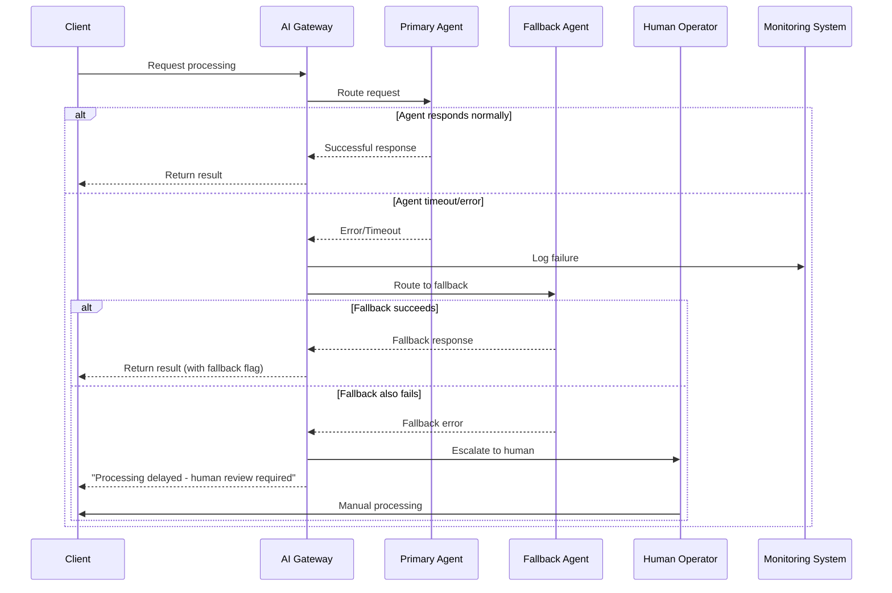

# Sequence Flow Diagrams: Canada Immigration OS

**Document Version:** 1.0  
**Date:** November 13, 2025  
**Author:** AI Solutions Architect  

---

## Executive Summary

This document provides detailed sequence diagrams for key workflows and agent interactions within Canada Immigration OS. These diagrams illustrate how the multi-agent system coordinates to deliver intelligent automation while maintaining human oversight and legal compliance.

**Key Workflows Covered:**
1. New Case Creation & Intake
2. Law Update Detection & Rule Proposal
3. Client Question → CSA → Rules Engine Response
4. Document Processing & Validation
5. Eligibility Assessment & CRS Calculation
6. Case Status Update & Client Communication

---

## 1. New Case Creation & Intake Flow

This sequence shows how a new immigration case is created from initial lead contact through case setup and first client interaction.

**Key Decision Points:**
1. **Lead Scoring Threshold:** Determines immediate vs. nurture follow-up
2. **Document Validation:** Automated validation with human review for edge cases
3. **Case Type Determination:** Mastermind Agent analyzes client profile for optimal pathway

---

## 2. Law Update Detection & Rule Proposal Flow

This sequence demonstrates how the system automatically detects immigration law changes and proposes rule updates for human approval.

**Key Decision Points:**
1. **Change Significance Threshold:** 0.85 similarity threshold for triggering rule review
2. **Human Approval Required:** All rule changes must be approved by qualified human admin
3. **Impact Assessment:** Automatic identification of affected cases for proactive communication

---

## 3. Client Question → CSA → Rules Engine Response Flow

This sequence shows how client questions are processed through the AI system to provide accurate, compliant responses.

**Key Decision Points:**
1. **Confidence Thresholds:** Determine automatic vs. escalated responses
2. **Response Quality:** Continuous learning from client feedback
3. **Human Escalation:** Complex questions routed to qualified consultants

---

## 4. Document Processing & Validation Flow

This sequence illustrates the automated document processing pipeline with quality assurance and validation.

**Key Decision Points:**
1. **Document Classification:** Automatic type detection with confidence scoring
2. **Validation Thresholds:** Different validation rules for different document types
3. **Human Review Triggers:** Complex validation failures escalated to consultants

---

## 5. Eligibility Assessment & CRS Calculation Flow

This sequence shows how the system performs comprehensive eligibility assessments and CRS score calculations.

**Key Decision Points:**
1. **Eligibility Thresholds:** Different communication strategies based on scores
2. **Scenario Modeling:** Interactive what-if analysis for client optimization
3. **Human Consultation Triggers:** Low scores or complex cases escalated to consultants

---

## 6. Case Status Update & Client Communication Flow

This sequence demonstrates how case status updates trigger automated client communications and consultant notifications.

**Key Decision Points:**
1. **Status Classification:** Automatic categorization of status updates
2. **Communication Urgency:** Different notification methods based on status criticality
3. **Follow-up Scheduling:** Automated reminders for client actions

---

## 7. Configuration Management & Schema Updates Flow

This sequence demonstrates how the Config Agent processes natural language configuration requests and safely applies changes to the system.

### 7.1 Configuration API Interactions

---

## 8. Error Handling & Fallback Patterns

### 8.1 Agent Failure Handling

### 8.2 Data Consistency Patterns

---

## 9. Performance Optimization Patterns

### 9.1 Caching Strategy

### 9.2 Batch Processing Pattern

---

## Conclusion

These sequence diagrams provide a comprehensive view of how Canada Immigration OS orchestrates complex workflows through its multi-agent architecture. Key patterns include:

**Agent Coordination:**
- Clear separation of responsibilities between agents
- Event-driven communication for loose coupling
- Human oversight for critical decisions

**Error Handling:**
- Graceful degradation with fallback mechanisms
- Automatic escalation to human operators when needed
- Comprehensive logging and monitoring

**Performance Optimization:**
- Intelligent caching strategies
- Batch processing for efficiency
- Asynchronous processing where appropriate

**Compliance & Auditability:**
- Complete audit trails for all decisions
- Human approval workflows for legal changes
- Transparent reasoning for all AI recommendations

These patterns ensure the system delivers reliable, compliant, and efficient immigration consulting services while maintaining the flexibility to adapt to changing requirements and regulations.