# System Architecture: Canada Immigration OS

**Document Version:** 1.0  
**Date:** November 13, 2025  
**Author:** AI Solutions Architect  

---

## Executive Summary

This document outlines the comprehensive system architecture for Canada Immigration OS, a multi-agent, self-evolving SaaS platform. The architecture is designed for scalability, security, and maintainability while supporting advanced AI capabilities and strict legal compliance requirements.

**Key Architectural Principles:**
- **Microservices Architecture:** Loosely coupled, independently deployable services
- **Multi-Agent AI System:** Specialized AI agents with orchestrated workflows
- **Event-Driven Architecture:** Asynchronous communication and real-time processing
- **Cloud-Native Design:** Kubernetes-based deployment with auto-scaling
- **Security by Design:** Zero-trust security model with end-to-end encryption
- **API-First Approach:** All functionality exposed through well-defined APIs

---

## 1. High-Level Architecture Overview

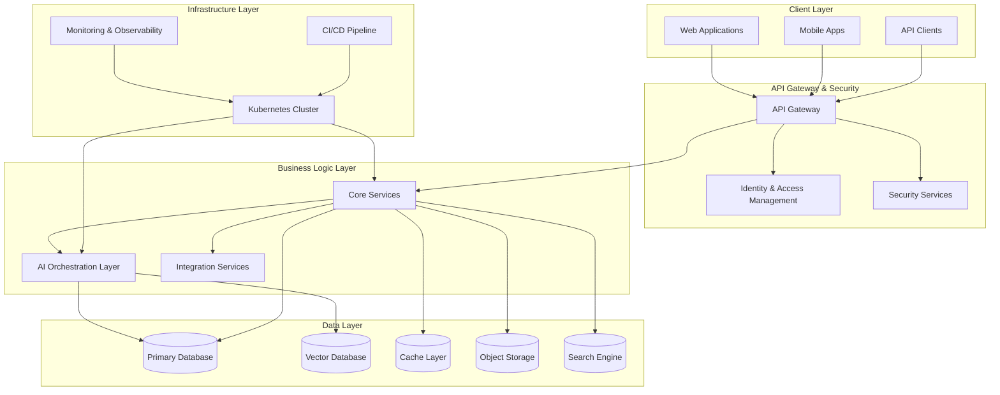

---

## 2. Detailed Architecture Layers

### 2.1 Client Layer

#### Web Applications
**Technology Stack:**
- **Frontend Framework:** React 18+ with TypeScript
- **State Management:** Redux Toolkit with RTK Query
- **UI Components:** Custom design system with Tailwind CSS
- **Build Tool:** Vite for fast development and builds
- **Testing:** Jest, React Testing Library, Playwright E2E

**Applications:**
- **Admin Console:** Platform-level management and configuration
- **Firm Console:** Consultant and staff interface
- **Client Portal:** Self-service client interface
- **Public Website:** Marketing and lead capture

#### Mobile Applications
**Technology Stack:**
- **Framework:** React Native with TypeScript
- **State Management:** Redux Toolkit
- **Navigation:** React Navigation 6
- **Offline Support:** Redux Persist with AsyncStorage
- **Push Notifications:** Firebase Cloud Messaging

**Features:**
- Native iOS and Android applications
- Offline capability for core features
- Biometric authentication
- Camera integration for document capture
- Push notifications for real-time updates

#### API Clients
- **Developer SDKs:** JavaScript, Python, PHP, .NET
- **Third-party Integrations:** Pre-built connectors
- **Webhook Consumers:** External system integrations

### 2.2 API Gateway & Security Layer

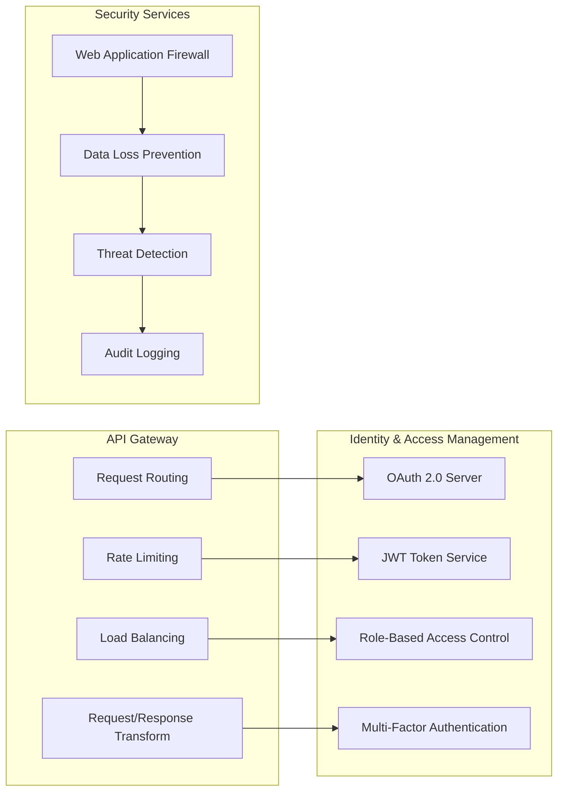

#### API Gateway (Kong/AWS API Gateway)
**Responsibilities:**
- Request routing and load balancing
- Rate limiting and throttling
- Request/response transformation
- API versioning and deprecation management
- Metrics collection and monitoring

**Configuration:**
- **Rate Limits:** 1000 requests/minute per user, 10000/minute per organization
- **Timeout:** 30 seconds for standard requests, 300 seconds for file uploads
- **Retry Policy:** Exponential backoff with jitter
- **Circuit Breaker:** Fail fast when downstream services are unavailable

#### Identity & Access Management
**Components:**
- **OAuth 2.0 Server:** Authorization code flow with PKCE
- **JWT Token Service:** Short-lived access tokens (15 minutes), long-lived refresh tokens (30 days)
- **Role-Based Access Control:** Granular permissions with inheritance
- **Multi-Factor Authentication:** TOTP, SMS, and hardware tokens

**Security Features:**
- **Password Policy:** Minimum 12 characters, complexity requirements
- **Session Management:** Secure session handling with automatic timeout
- **Device Management:** Device registration and trust management
- **Audit Logging:** Complete authentication and authorization logs

### 2.3 Business Logic Layer (Microservices)

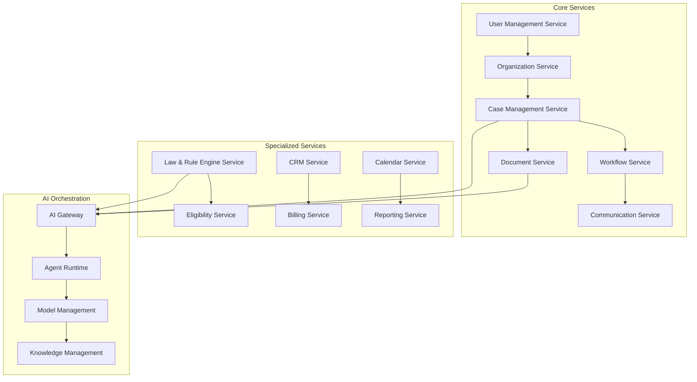

#### Core Services

##### User Management Service
**Responsibilities:**
- User registration, authentication, and profile management
- Role and permission management
- User preferences and settings
- Account lifecycle management

**Technology Stack:**
- **Runtime:** Node.js with Express.js
- **Database:** PostgreSQL with user data encryption
- **Cache:** Redis for session storage
- **Authentication:** Passport.js with multiple strategies

##### Organization Service
**Responsibilities:**
- Multi-tenant organization management
- Firm configuration and branding
- Team member management
- Subscription and billing integration

**Data Model:**
```sql
organizations (
    id UUID PRIMARY KEY,
    name VARCHAR(255) NOT NULL,
    domain VARCHAR(255) UNIQUE,
    settings JSONB,
    subscription_tier VARCHAR(50),
    created_at TIMESTAMP,
    updated_at TIMESTAMP
)

org_memberships (
    id UUID PRIMARY KEY,
    org_id UUID REFERENCES organizations(id),
    user_id UUID REFERENCES users(id),
    role VARCHAR(50) NOT NULL,
    permissions JSONB,
    created_at TIMESTAMP
)
```

##### Case Management Service
**Responsibilities:**
- Case lifecycle management
- Case type configuration and templates
- Task and milestone tracking
- Case analytics and reporting

**Technology Stack:**
- **Runtime:** Python with FastAPI
- **Database:** PostgreSQL with JSONB for flexible case data
- **Message Queue:** Redis for task processing
- **File Storage:** S3-compatible storage for case documents

##### Document Service
**Responsibilities:**
- Secure document storage and retrieval
- Document versioning and access control
- OCR and metadata extraction
- Document validation and compliance checking

**Features:**
- **Storage:** S3-compatible object storage with CDN
- **Processing:** Asynchronous document processing pipeline
- **Security:** End-to-end encryption with client-side keys
- **Compliance:** Audit trails and retention policies

#### Specialized Services

##### Law & Rule Engine Service
**Responsibilities:**
- Immigration law rule management
- Rule validation and execution
- Legal compliance checking
- Regulatory change tracking

**Architecture:**
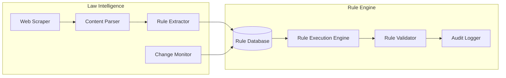

##### Eligibility Service
**Responsibilities:**
- Immigration eligibility assessment
- CRS score calculation
- What-if scenario analysis
- Recommendation generation

**Technology Stack:**
- **Runtime:** Python with scikit-learn for ML models
- **Database:** PostgreSQL for eligibility data
- **Cache:** Redis for calculation results
- **ML Models:** Custom models for eligibility prediction

### 2.4 AI Orchestration Layer

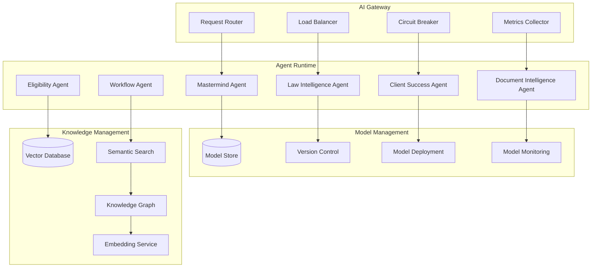

#### AI Gateway
**Responsibilities:**
- Route AI requests to appropriate agents
- Load balancing across agent instances
- Circuit breaker for failed agents
- Request/response transformation
- Metrics collection and monitoring

**Technology Stack:**
- **Runtime:** Go for high performance
- **Load Balancing:** Consistent hashing for agent selection
- **Circuit Breaker:** Hystrix-style circuit breaker pattern
- **Monitoring:** Prometheus metrics with Grafana dashboards

#### Agent Runtime Environment
**Architecture:**
- **Container-based:** Each agent runs in isolated containers
- **Scalable:** Auto-scaling based on request volume
- **Fault-tolerant:** Automatic restart and health checking
- **Stateless:** Agents maintain no persistent state

**Agent Communication:**
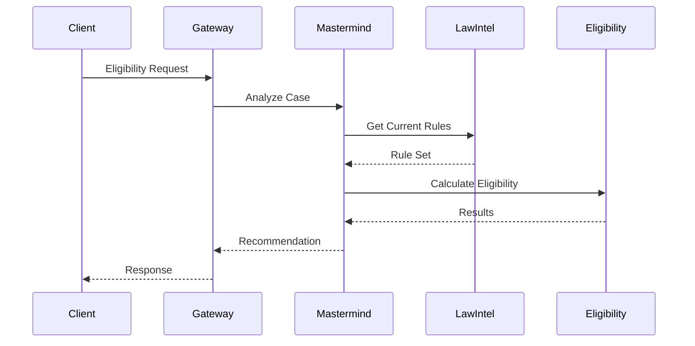

### 2.5 Data Layer

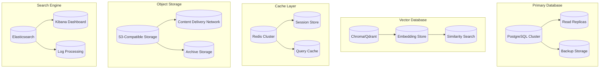

#### Primary Database (PostgreSQL)
**Configuration:**
- **Version:** PostgreSQL 15+ with extensions
- **High Availability:** Master-slave replication with automatic failover
- **Backup Strategy:** Continuous WAL archiving with point-in-time recovery
- **Performance:** Connection pooling with PgBouncer
- **Security:** Row-level security and column encryption

**Schema Design:**
```sql
-- Core entities with multi-tenancy
CREATE TABLE organizations (
    id UUID PRIMARY KEY DEFAULT gen_random_uuid(),
    name VARCHAR(255) NOT NULL,
    domain VARCHAR(255) UNIQUE,
    settings JSONB DEFAULT '{}',
    created_at TIMESTAMP DEFAULT NOW(),
    updated_at TIMESTAMP DEFAULT NOW()
);

CREATE TABLE users (
    id UUID PRIMARY KEY DEFAULT gen_random_uuid(),
    email VARCHAR(255) UNIQUE NOT NULL,
    encrypted_password VARCHAR(255) NOT NULL,
    profile JSONB DEFAULT '{}',
    created_at TIMESTAMP DEFAULT NOW(),
    updated_at TIMESTAMP DEFAULT NOW()
);

CREATE TABLE cases (
    id UUID PRIMARY KEY DEFAULT gen_random_uuid(),
    org_id UUID NOT NULL REFERENCES organizations(id),
    case_type VARCHAR(100) NOT NULL,
    status VARCHAR(50) NOT NULL DEFAULT 'draft',
    client_data JSONB DEFAULT '{}',
    metadata JSONB DEFAULT '{}',
    created_at TIMESTAMP DEFAULT NOW(),
    updated_at TIMESTAMP DEFAULT NOW()
);

-- Indexes for performance
CREATE INDEX idx_cases_org_id ON cases(org_id);
CREATE INDEX idx_cases_status ON cases(status);
CREATE INDEX idx_cases_created_at ON cases(created_at);
```

#### Vector Database (Chroma/Qdrant)
**Purpose:**
- Store document embeddings for semantic search
- Legal knowledge base with similarity search
- Client query matching and response generation
- Case precedent analysis and recommendations

**Configuration:**
- **Embedding Model:** OpenAI text-embedding-ada-002 or custom models
- **Vector Dimensions:** 1536 for OpenAI embeddings
- **Distance Metric:** Cosine similarity
- **Indexing:** HNSW for fast approximate nearest neighbor search

#### Cache Layer (Redis)
**Use Cases:**
- **Session Storage:** User sessions and authentication tokens
- **Query Cache:** Frequently accessed database queries
- **Rate Limiting:** API rate limiting counters
- **Real-time Data:** Live case updates and notifications

**Configuration:**
- **Deployment:** Redis Cluster for high availability
- **Persistence:** RDB snapshots + AOF for durability
- **Memory Policy:** LRU eviction for cache optimization
- **Security:** AUTH password and TLS encryption

### 2.6 Infrastructure Layer

```mermaid
graph TB
    subgraph "Kubernetes Cluster"
        MASTER[Master Nodes]
        WORKER[Worker Nodes]
        INGRESS[Ingress Controller]
        SERVICE_MESH[Service Mesh - Istio]
    end
    
    subgraph "Monitoring & Observability"
        PROMETHEUS[Prometheus]
        GRAFANA[Grafana]
        JAEGER[Jaeger Tracing]
        ALERTMANAGER[Alert Manager]
    end
    
    subgraph "CI/CD Pipeline"
        GITHUB[GitHub Actions]
        REGISTRY[Container Registry]
        ARGOCD[ArgoCD]
        SECURITY_SCAN[Security Scanning]
    end
    
    subgraph "External Services"
        DNS[DNS Management]
        SSL[SSL Certificates]
        BACKUP[Backup Services]
        MONITORING_EXT[External Monitoring]
    end
    
    MASTER --> WORKER
    WORKER --> INGRESS
    INGRESS --> SERVICE_MESH
    
    PROMETHEUS --> GRAFANA
    GRAFANA --> JAEGER
    JAEGER --> ALERTMANAGER
    
    GITHUB --> REGISTRY
    REGISTRY --> ARGOCD
    ARGOCD --> SECURITY_SCAN
    
    DNS --> SSL
    SSL --> BACKUP
    BACKUP --> MONITORING_EXT
```

#### Kubernetes Cluster
**Configuration:**
- **Cloud Provider:** AWS EKS, Azure AKS, or Google GKE
- **Node Configuration:** Mixed instance types for different workloads
- **Auto-scaling:** Cluster autoscaler and horizontal pod autoscaler
- **Security:** Pod security policies and network policies
- **Storage:** Persistent volumes with automatic backup

**Namespace Organization:**
```yaml
# Production namespaces
- production-core      # Core business services
- production-ai        # AI agents and ML services
- production-data      # Database and storage services
- production-monitoring # Monitoring and observability

# Staging namespaces
- staging-core
- staging-ai
- staging-data

# Development namespaces
- dev-core
- dev-ai
- dev-data
```

#### Service Mesh (Istio)
**Features:**
- **Traffic Management:** Load balancing, routing, and failover
- **Security:** mTLS encryption and authentication
- **Observability:** Distributed tracing and metrics
- **Policy Enforcement:** Rate limiting and access control

**Configuration:**
```yaml
apiVersion: networking.istio.io/v1beta1
kind: VirtualService
metadata:
  name: case-service
spec:
  hosts:
  - case-service
  http:
  - match:
    - headers:
        version:
          exact: v2
    route:
    - destination:
        host: case-service
        subset: v2
  - route:
    - destination:
        host: case-service
        subset: v1
```

---

## 3. Security Architecture

### 3.1 Zero Trust Security Model

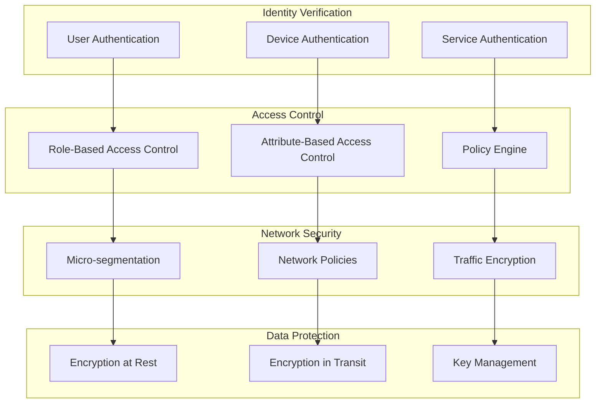

### 3.2 Data Encryption Strategy

**Encryption at Rest:**
- **Database:** AES-256 encryption with customer-managed keys
- **File Storage:** S3 server-side encryption with KMS
- **Backups:** Encrypted backups with separate key management
- **Logs:** Encrypted log storage with retention policies

**Encryption in Transit:**
- **Client-Server:** TLS 1.3 with perfect forward secrecy
- **Service-to-Service:** mTLS with certificate rotation
- **Database Connections:** SSL/TLS with certificate validation
- **Message Queues:** Encrypted message transport

### 3.3 Compliance Framework

**Canadian Privacy Laws:**
- **PIPEDA Compliance:** Personal Information Protection and Electronic Documents Act
- **Provincial Privacy Laws:** BC PIPA, Alberta PIPA, Quebec Law 25
- **Data Residency:** All data stored and processed in Canada
- **Cross-Border Restrictions:** No data transfer without explicit consent

**Security Standards:**
- **SOC 2 Type II:** Annual compliance audits
- **ISO 27001:** Information security management system
- **PCI DSS:** Payment card industry compliance
- **GDPR:** European data protection regulation compliance

---

## 4. Scalability & Performance

### 4.1 Scalability Strategy

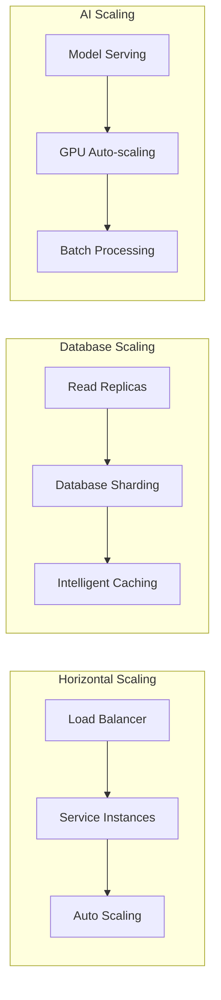

**Performance Targets:**
- **Response Time:** <200ms for 95% of API requests
- **Throughput:** 10,000+ concurrent users
- **Availability:** 99.9% uptime (8.76 hours downtime/year)
- **Scalability:** Linear scaling to 100,000+ users
- **Data Processing:** 1TB+ document processing per day

### 4.2 Caching Strategy

**Multi-Level Caching:**
1. **Browser Cache:** Static assets and API responses
2. **CDN Cache:** Global content distribution
3. **Application Cache:** Redis for frequently accessed data
4. **Database Cache:** Query result caching
5. **AI Model Cache:** Cached model predictions

**Cache Invalidation:**
- **Time-based:** TTL for different data types
- **Event-based:** Cache invalidation on data updates
- **Manual:** Administrative cache clearing
- **Intelligent:** ML-based cache optimization

---

## 5. Disaster Recovery & Business Continuity

### 5.1 Backup Strategy

```mermaid
graph TB
    subgraph "Database Backups"
        CONTINUOUS[Continuous WAL Archiving]
        DAILY[Daily Full Backups]
        PITR[Point-in-Time Recovery]
    end
    
    subgraph "File Storage Backups"
        VERSIONING[Object Versioning]
        CROSS_REGION[Cross-Region Replication]
        LIFECYCLE[Lifecycle Management]
    end
    
    subgraph "Application Backups"
        CONFIG[Configuration Backups]
        SECRETS[Secret Management]
        DEPLOYMENT[Deployment Artifacts]
    end
    
    CONTINUOUS --> DAILY
    DAILY --> PITR
    
    VERSIONING --> CROSS_REGION
    CROSS_REGION --> LIFECYCLE
    
    CONFIG --> SECRETS
    SECRETS --> DEPLOYMENT
```

**Recovery Objectives:**
- **RTO (Recovery Time Objective):** 4 hours for full system recovery
- **RPO (Recovery Point Objective):** 1 hour maximum data loss
- **Backup Retention:** 7 years for compliance requirements
- **Testing:** Monthly disaster recovery testing
- **Documentation:** Detailed runbooks and procedures

### 5.2 High Availability Design

**Multi-Region Deployment:**
- **Primary Region:** Canada Central (Toronto)
- **Secondary Region:** Canada East (Montreal)
- **Failover:** Automatic failover with health checks
- **Data Sync:** Real-time data replication
- **Load Distribution:** Geographic load balancing

---

## 6. Monitoring & Observability

### 6.1 Monitoring Stack

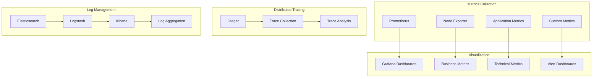

### 6.2 Key Metrics & Alerts

**Business Metrics:**
- User registration and activation rates
- Case processing times and success rates
- Revenue and subscription metrics
- Customer satisfaction scores

**Technical Metrics:**
- API response times and error rates
- Database performance and connection pools
- AI model accuracy and processing times
- Infrastructure resource utilization

**Alert Thresholds:**
- **Critical:** System down, data loss, security breach
- **Warning:** High error rates, performance degradation
- **Info:** Capacity planning, maintenance windows

---

## 7. Development & Deployment

### 7.1 CI/CD Pipeline

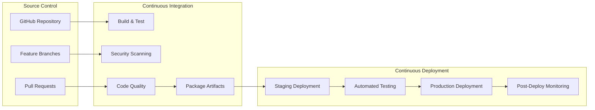

**Deployment Strategy:**
- **Blue-Green Deployment:** Zero-downtime deployments
- **Canary Releases:** Gradual rollout with monitoring
- **Feature Flags:** Runtime feature toggling
- **Rollback:** Automatic rollback on failure detection

### 7.2 Development Environment

**Local Development:**
- **Docker Compose:** Local service orchestration
- **Hot Reloading:** Fast development iteration
- **Mock Services:** External service mocking
- **Test Data:** Synthetic test data generation

**Testing Strategy:**
- **Unit Tests:** 90%+ code coverage
- **Integration Tests:** API and service testing
- **E2E Tests:** Full user journey testing
- **Performance Tests:** Load and stress testing
- **Security Tests:** Vulnerability scanning

---

## 8. Technology Stack Summary

### 8.1 Programming Languages & Frameworks

**Backend Services:**
- **Node.js/TypeScript:** API services and business logic
- **Python/FastAPI:** AI services and data processing
- **Go:** High-performance services and infrastructure
- **SQL:** Database queries and stored procedures

**Frontend Applications:**
- **React/TypeScript:** Web applications
- **React Native/TypeScript:** Mobile applications
- **HTML/CSS/JavaScript:** Static websites

### 8.2 Infrastructure & Tools

**Cloud Platform:**
- **Primary:** AWS Canada or Azure Canada
- **Container Orchestration:** Kubernetes (EKS/AKS)
- **Service Mesh:** Istio
- **API Gateway:** Kong or AWS API Gateway

**Databases & Storage:**
- **Primary Database:** PostgreSQL 15+
- **Vector Database:** Chroma or Qdrant
- **Cache:** Redis Cluster
- **Object Storage:** S3-compatible storage
- **Search:** Elasticsearch

**AI/ML Platform:**
- **Model Serving:** TensorFlow Serving or MLflow
- **Vector Embeddings:** OpenAI or custom models
- **Model Training:** Python with scikit-learn, TensorFlow
- **GPU Computing:** NVIDIA GPUs for model inference

**Monitoring & Observability:**
- **Metrics:** Prometheus + Grafana
- **Tracing:** Jaeger
- **Logging:** ELK Stack (Elasticsearch, Logstash, Kibana)
- **APM:** Application Performance Monitoring

---

## 9. Migration & Implementation Strategy

### 9.1 Implementation Phases

**Phase 1: Foundation (Months 1-3)**
- Core infrastructure setup
- Basic microservices implementation
- Database schema and data models
- Authentication and authorization
- Basic web and mobile applications

**Phase 2: Core Features (Months 4-6)**
- Case management system
- Document processing pipeline
- Basic AI agents implementation
- Client portal development
- Integration framework

**Phase 3: Advanced Features (Months 7-9)**
- Advanced AI agents
- CRM and lead management
- Advanced reporting and analytics
- Mobile applications
- Integration marketplace

**Phase 4: Scale & Optimize (Months 10-12)**
- Performance optimization
- Advanced security features
- Enterprise features
- International expansion preparation
- Production hardening

### 9.2 Risk Mitigation

**Technical Risks:**
- **Complexity Management:** Incremental development and testing
- **Performance Issues:** Early performance testing and optimization
- **Security Vulnerabilities:** Security-first development and regular audits
- **Scalability Challenges:** Cloud-native architecture and auto-scaling

**Business Risks:**
- **Market Competition:** Rapid development and unique value proposition
- **Regulatory Changes:** Flexible architecture and compliance monitoring
- **Customer Adoption:** User-centric design and feedback integration
- **Technical Debt:** Code quality standards and regular refactoring

---

## Conclusion

This system architecture provides a comprehensive foundation for building Canada Immigration OS as a scalable, secure, and maintainable platform. The architecture balances complexity with practicality, ensuring that the system can grow with the business while maintaining high standards of performance, security, and reliability.

**Key Architectural Strengths:**
1. **Scalability:** Cloud-native design with auto-scaling capabilities
2. **Security:** Zero-trust model with comprehensive data protection
3. **Maintainability:** Microservices architecture with clear boundaries
4. **Flexibility:** API-first design enabling easy integration and customization
5. **Observability:** Comprehensive monitoring and alerting systems
6. **Compliance:** Built-in compliance with Canadian privacy and security regulations

The architecture serves as a blueprint for implementation while remaining flexible enough to adapt to changing requirements and technological advances. Regular architecture reviews and updates will ensure the system continues to meet evolving business needs and industry standards.