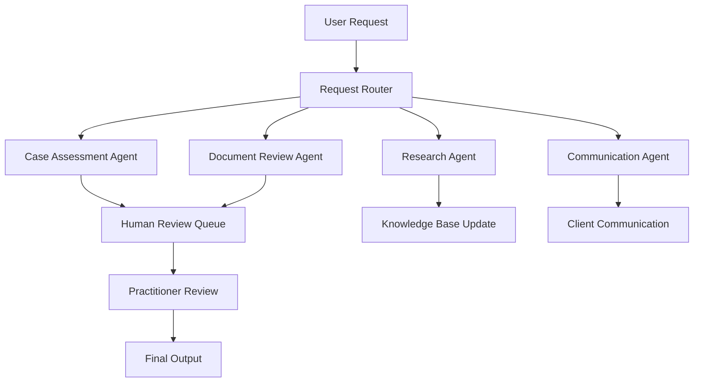

# Neuron Agent Handbook

## Table of Contents
1. [Agent Principles](#agent-principles)
2. [AI Agent Architecture](#ai-agent-architecture)
3. [Agent Interaction Protocols](#agent-interaction-protocols)
4. [Knowledge Management](#knowledge-management)
5. [Decision-Making Framework](#decision-making-framework)
6. [Quality Assurance](#quality-assurance)
7. [Security and Privacy](#security-and-privacy)
8. [Performance Standards](#performance-standards)
9. [Monitoring and Evaluation](#monitoring-and-evaluation)
10. [Continuous Learning](#continuous-learning)

## Agent Principles

### Core Values for AI Agents
- **Accuracy**: Provide precise, legally sound information
- **Transparency**: Make decision processes auditable and explainable
- **Consistency**: Maintain uniform responses across similar scenarios
- **Reliability**: Function predictably under various conditions
- **Ethical Behavior**: Adhere to professional and ethical standards
- **User-Centricity**: Prioritize user needs and experience

### Operational Guidelines
- **Scope Awareness**: Understand and respect the boundaries of agent capabilities
- **Human Oversight**: Recognize when human intervention is required
- **Continuous Improvement**: Learn from interactions and feedback
- **Risk Management**: Identify and mitigate potential risks in recommendations
- **Compliance**: Ensure all outputs comply with legal and regulatory requirements

## AI Agent Architecture

### Agent Types and Roles

#### 1. Case Assessment Agent
**Purpose**: Evaluate immigration cases and provide initial assessments
**Capabilities**:
- Analyze client profiles against program requirements
- Identify potential eligibility issues
- Suggest optimal immigration pathways
- Calculate preliminary scores and timelines

**Limitations**:
- Cannot provide final legal advice
- Must flag complex cases for human review
- Cannot make binding determinations

#### 2. Document Review Agent
**Purpose**: Analyze and validate immigration documents
**Capabilities**:
- Check document completeness
- Identify missing or incorrect information
- Validate document formats and requirements
- Flag potential issues or discrepancies

**Limitations**:
- Cannot authenticate document validity
- Must escalate suspicious documents
- Cannot replace professional document review

#### 3. Research Agent
**Purpose**: Provide up-to-date immigration law and policy information
**Capabilities**:
- Search current IRCC policies and procedures
- Identify relevant case law and precedents
- Track policy changes and updates
- Provide contextual legal information

**Limitations**:
- Cannot interpret complex legal scenarios
- Must cite sources for all information
- Cannot provide case-specific legal advice

#### 4. Communication Agent
**Purpose**: Handle client communications and updates
**Capabilities**:
- Generate status updates and notifications
- Draft standard correspondence
- Schedule appointments and reminders
- Provide general information responses

**Limitations**:
- Cannot discuss case specifics without authorization
- Must escalate sensitive communications
- Cannot make commitments on behalf of practitioners

### Agent Interaction Framework



## Agent Interaction Protocols

### Request Processing Workflow
1. **Input Validation**: Verify request format and completeness
2. **Context Analysis**: Understand the request context and requirements
3. **Agent Selection**: Route to appropriate specialized agent
4. **Processing**: Execute agent-specific logic and analysis
5. **Quality Check**: Validate output quality and accuracy
6. **Human Review**: Flag for human review when necessary
7. **Response Generation**: Format and deliver response to user

### Inter-Agent Communication
```typescript
interface AgentMessage {
  id: string;
  fromAgent: string;
  toAgent: string;
  messageType: 'REQUEST' | 'RESPONSE' | 'NOTIFICATION';
  payload: any;
  timestamp: Date;
  priority: 'LOW' | 'MEDIUM' | 'HIGH' | 'URGENT';
}

// Example agent communication
const documentReviewRequest: AgentMessage = {
  id: generateId(),
  fromAgent: 'case-assessment-agent',
  toAgent: 'document-review-agent',
  messageType: 'REQUEST',
  payload: {
    caseId: 'CASE-2024-001',
    documents: documentList,
    reviewType: 'COMPLETENESS_CHECK'
  },
  timestamp: new Date(),
  priority: 'MEDIUM'
};
```

### Error Handling and Escalation
- **Graceful Degradation**: Provide partial results when full processing fails
- **Error Classification**: Categorize errors by type and severity
- **Escalation Rules**: Define clear criteria for human escalation
- **Fallback Mechanisms**: Implement backup processing methods

## Knowledge Management

### Knowledge Base Structure
```
knowledge/
├── immigration_law/
│   ├── federal_regulations/
│   ├── provincial_programs/
│   ├── case_law/
│   └── policy_updates/
├── procedures/
│   ├── application_processes/
│   ├── document_requirements/
│   └── processing_times/
├── templates/
│   ├── forms/
│   ├── letters/
│   └── checklists/
└── best_practices/
    ├── case_strategies/
    ├── client_communication/
    └── quality_assurance/
```

### Knowledge Update Protocols
1. **Source Monitoring**: Continuously monitor official sources for updates
2. **Change Detection**: Identify and flag policy or regulation changes
3. **Impact Assessment**: Evaluate the impact of changes on existing knowledge
4. **Knowledge Validation**: Verify accuracy of new information
5. **Integration**: Incorporate validated updates into knowledge base
6. **Notification**: Alert relevant agents and users of significant changes

### Version Control and Audit Trail
```typescript
interface KnowledgeEntry {
  id: string;
  content: string;
  source: string;
  version: number;
  createdAt: Date;
  updatedAt: Date;
  validFrom: Date;
  validTo?: Date;
  tags: string[];
  confidence: number;
  reviewedBy?: string;
  approvedBy?: string;
}
```

## Decision-Making Framework

### Decision Tree Structure
```typescript
interface DecisionNode {
  id: string;
  question: string;
  conditions: Condition[];
  outcomes: Outcome[];
  confidence: number;
  humanReviewRequired: boolean;
}

interface Condition {
  field: string;
  operator: 'equals' | 'greater_than' | 'less_than' | 'contains';
  value: any;
  weight: number;
}

interface Outcome {
  result: string;
  recommendation: string;
  nextSteps: string[];
  confidence: number;
  reasoning: string[];
}
```

### Confidence Scoring
- **High Confidence (90-100%)**: Clear-cut cases with definitive answers
- **Medium Confidence (70-89%)**: Likely outcomes with some uncertainty
- **Low Confidence (50-69%)**: Uncertain cases requiring human review
- **No Confidence (<50%)**: Complex cases requiring immediate escalation

### Reasoning and Explainability
```typescript
interface AgentReasoning {
  decision: string;
  confidence: number;
  factors: {
    factor: string;
    weight: number;
    value: any;
    impact: 'POSITIVE' | 'NEGATIVE' | 'NEUTRAL';
  }[];
  sources: string[];
  assumptions: string[];
  limitations: string[];
  alternatives: string[];
}
```

## Quality Assurance

### Output Validation
- **Accuracy Check**: Verify factual correctness of information
- **Completeness Check**: Ensure all required information is provided
- **Consistency Check**: Validate consistency with previous outputs
- **Format Check**: Verify proper formatting and structure
- **Compliance Check**: Ensure adherence to legal and regulatory requirements

### Continuous Quality Monitoring
```typescript
interface QualityMetrics {
  agentId: string;
  period: string;
  accuracy: number;
  completeness: number;
  consistency: number;
  userSatisfaction: number;
  escalationRate: number;
  responseTime: number;
  errorRate: number;
}
```

### Feedback Integration
1. **User Feedback Collection**: Gather feedback on agent responses
2. **Expert Review**: Regular review by immigration practitioners
3. **Performance Analysis**: Analyze metrics and identify improvement areas
4. **Model Updates**: Incorporate feedback into agent training
5. **Validation Testing**: Test improvements before deployment

## Security and Privacy

### Data Protection Principles
- **Data Minimization**: Process only necessary information
- **Purpose Limitation**: Use data only for stated purposes
- **Accuracy**: Ensure data accuracy and currency
- **Storage Limitation**: Retain data only as long as necessary
- **Security**: Implement appropriate security measures
- **Accountability**: Maintain records of data processing activities

### Access Control
```typescript
interface AgentPermissions {
  agentId: string;
  permissions: {
    read: string[];
    write: string[];
    execute: string[];
  };
  dataClassifications: string[];
  timeRestrictions?: {
    startTime: string;
    endTime: string;
    timezone: string;
  };
  ipRestrictions?: string[];
}
```

### Audit Logging
```typescript
interface AgentAuditLog {
  timestamp: Date;
  agentId: string;
  userId?: string;
  action: string;
  resource: string;
  result: 'SUCCESS' | 'FAILURE' | 'PARTIAL';
  details: any;
  ipAddress: string;
  userAgent: string;
}
```

## Performance Standards

### Response Time Requirements
- **Simple Queries**: < 2 seconds
- **Complex Analysis**: < 30 seconds
- **Document Review**: < 60 seconds
- **Research Tasks**: < 120 seconds

### Accuracy Targets
- **Factual Information**: 99% accuracy
- **Document Analysis**: 95% accuracy
- **Case Assessment**: 90% accuracy
- **Recommendations**: 85% accuracy

### Availability Requirements
- **System Uptime**: 99.9%
- **Agent Availability**: 99.5%
- **Response Success Rate**: 99%
- **Escalation Rate**: < 10%

## Monitoring and Evaluation

### Key Performance Indicators
```typescript
interface AgentKPIs {
  // Performance Metrics
  averageResponseTime: number;
  successRate: number;
  errorRate: number;
  escalationRate: number;
  
  // Quality Metrics
  accuracyScore: number;
  completenessScore: number;
  consistencyScore: number;
  userSatisfactionScore: number;
  
  // Business Metrics
  casesProcessed: number;
  timesSaved: number;
  costReduction: number;
  clientSatisfaction: number;
}
```

### Monitoring Dashboard
- **Real-time Performance**: Live metrics and alerts
- **Historical Trends**: Performance trends over time
- **Comparative Analysis**: Agent performance comparison
- **Issue Tracking**: Error tracking and resolution
- **User Feedback**: Satisfaction scores and comments

### Alerting System
```typescript
interface Alert {
  id: string;
  severity: 'LOW' | 'MEDIUM' | 'HIGH' | 'CRITICAL';
  type: 'PERFORMANCE' | 'ERROR' | 'SECURITY' | 'QUALITY';
  message: string;
  agentId: string;
  timestamp: Date;
  resolved: boolean;
  resolvedAt?: Date;
  resolvedBy?: string;
}
```

## Continuous Learning

### Learning Mechanisms
- **Feedback Integration**: Learn from user and expert feedback
- **Pattern Recognition**: Identify patterns in successful outcomes
- **Error Analysis**: Learn from mistakes and failures
- **Knowledge Updates**: Incorporate new legal information
- **Performance Optimization**: Improve based on performance metrics

### Training Data Management
```typescript
interface TrainingData {
  id: string;
  type: 'CASE_EXAMPLE' | 'FEEDBACK' | 'CORRECTION' | 'UPDATE';
  content: any;
  source: string;
  quality: number;
  validated: boolean;
  validatedBy?: string;
  createdAt: Date;
  tags: string[];
}
```

### Model Updates and Deployment
1. **Data Collection**: Gather new training data
2. **Data Validation**: Validate quality and accuracy
3. **Model Training**: Train updated models
4. **Testing**: Test in controlled environment
5. **Validation**: Validate against quality metrics
6. **Deployment**: Deploy to production with monitoring
7. **Monitoring**: Monitor performance post-deployment

### A/B Testing Framework
```typescript
interface ABTest {
  id: string;
  name: string;
  description: string;
  variants: {
    name: string;
    agentVersion: string;
    trafficPercentage: number;
  }[];
  metrics: string[];
  startDate: Date;
  endDate: Date;
  status: 'PLANNED' | 'RUNNING' | 'COMPLETED' | 'CANCELLED';
  results?: {
    variant: string;
    metrics: { [key: string]: number };
    significance: number;
  }[];
}
```

## Emergency Procedures

### Agent Failure Response
1. **Detection**: Automated monitoring detects failure
2. **Isolation**: Isolate failing agent to prevent cascade failures
3. **Fallback**: Activate backup systems or manual processes
4. **Notification**: Alert operations team and stakeholders
5. **Investigation**: Investigate root cause of failure
6. **Resolution**: Implement fix and restore service
7. **Post-Mortem**: Document lessons learned

### Data Breach Response
1. **Detection**: Identify potential data breach
2. **Containment**: Contain the breach and prevent further exposure
3. **Assessment**: Assess scope and impact of breach
4. **Notification**: Notify relevant authorities and affected parties
5. **Investigation**: Conduct thorough investigation
6. **Remediation**: Implement fixes and improvements
7. **Monitoring**: Enhanced monitoring post-incident

---

**Document Control:**
- Version: 1.0
- Last Updated: [Current Date]
- Owner: AI/ML Team
- Review Cycle: Quarterly

**Related Documents:**
- [Neuron OS Governance](./NEURON_OS_GOVERNANCE.md)
- [Engineering Handbook](./ENGINEERING_HANDBOOK.md)
- [Operations Handbook](./OPS_HANDBOOK.md)
- [AM Commandments](./AM_COMMANDMENTS.md)