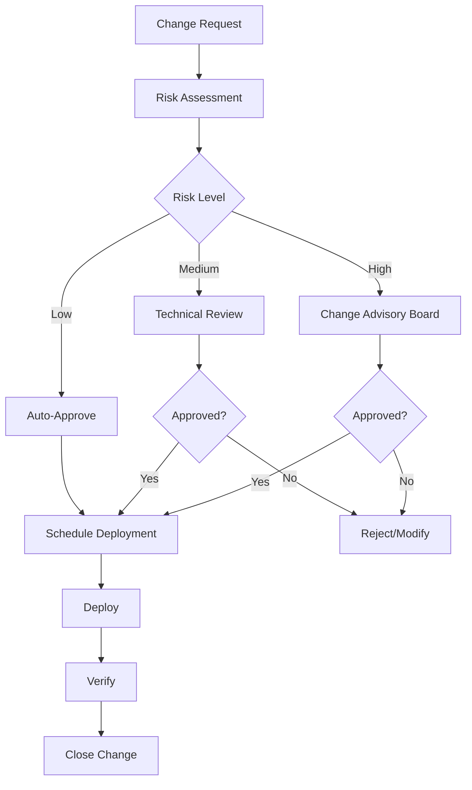

# Neuron Operations Handbook

## Table of Contents
1. [Operations Overview](#operations-overview)
2. [Service Level Agreements](#service-level-agreements)
3. [Incident Management](#incident-management)
4. [Change Management](#change-management)
5. [Capacity Planning](#capacity-planning)
6. [Backup and Recovery](#backup-and-recovery)
7. [Security Operations](#security-operations)
8. [Monitoring and Alerting](#monitoring-and-alerting)
9. [Vendor Management](#vendor-management)
10. [Business Continuity](#business-continuity)

## Operations Overview

### Mission Statement
The Operations team ensures the reliable, secure, and efficient operation of the Neuron platform, enabling immigration practitioners to serve their clients effectively while maintaining the highest standards of data protection and system availability.

### Core Responsibilities
- **System Reliability**: Maintain 99.9% uptime for critical services
- **Performance Management**: Ensure optimal system performance
- **Security Operations**: Protect client data and system integrity
- **Incident Response**: Rapid response to and resolution of incidents
- **Change Management**: Safe and controlled deployment of changes
- **Capacity Planning**: Proactive scaling and resource management
- **Vendor Relations**: Management of third-party service providers
- **Compliance**: Ensure adherence to regulatory requirements

### Team Structure
- **Operations Manager**: Overall operations strategy and coordination
- **Site Reliability Engineers**: System reliability and performance
- **Security Operations**: Security monitoring and incident response
- **Database Administrators**: Database management and optimization
- **Network Engineers**: Network infrastructure and connectivity
- **DevOps Engineers**: Deployment automation and CI/CD

## Service Level Agreements

### System Availability
- **Critical Services**: 99.9% uptime (8.76 hours downtime/year)
- **Standard Services**: 99.5% uptime (43.8 hours downtime/year)
- **Development Services**: 99.0% uptime (87.6 hours downtime/year)

### Performance Standards
- **API Response Time**: 95th percentile < 200ms
- **Database Query Time**: 95th percentile < 100ms
- **Page Load Time**: 95th percentile < 3 seconds
- **Search Response Time**: 95th percentile < 1 second

### Support Response Times
- **Critical (P1)**: 15 minutes initial response, 4 hours resolution
- **High (P2)**: 1 hour initial response, 24 hours resolution
- **Medium (P3)**: 4 hours initial response, 72 hours resolution
- **Low (P4)**: 24 hours initial response, 1 week resolution

### Data Protection
- **Backup Frequency**: Daily automated backups
- **Backup Retention**: 30 days online, 1 year archived
- **Recovery Time Objective (RTO)**: 4 hours for critical systems
- **Recovery Point Objective (RPO)**: 1 hour maximum data loss

## Incident Management

### Incident Classification
```typescript
enum IncidentSeverity {
  P1_CRITICAL = 'P1',    // System down, data loss, security breach
  P2_HIGH = 'P2',        // Major functionality impaired
  P3_MEDIUM = 'P3',      // Minor functionality impaired
  P4_LOW = 'P4'          // Cosmetic issues, feature requests
}

interface Incident {
  id: string;
  severity: IncidentSeverity;
  title: string;
  description: string;
  affectedServices: string[];
  reportedBy: string;
  assignedTo: string;
  status: 'OPEN' | 'IN_PROGRESS' | 'RESOLVED' | 'CLOSED';
  createdAt: Date;
  resolvedAt?: Date;
  rootCause?: string;
  resolution?: string;
  preventionMeasures?: string[];
}
```

### Incident Response Process
1. **Detection**: Automated monitoring or manual reporting
2. **Triage**: Assess severity and assign appropriate resources
3. **Investigation**: Identify root cause and impact
4. **Communication**: Notify stakeholders and provide updates
5. **Resolution**: Implement fix and verify resolution
6. **Post-Mortem**: Document lessons learned and improvements

### Communication Templates
```markdown
## Incident Notification Template

**Incident ID**: INC-2024-001
**Severity**: P1 - Critical
**Status**: Investigating
**Affected Services**: User Authentication, Case Management
**Impact**: Users unable to log in to the system
**Started**: 2024-01-15 14:30 UTC
**Next Update**: 2024-01-15 15:00 UTC

**Current Actions**:
- Investigating authentication service failures
- Implementing temporary workaround
- Monitoring system health

**Workaround**: None available at this time

For updates, visit: https://status.neuron.com/incidents/INC-2024-001
```

### Escalation Matrix
- **P1 Incidents**: Immediate escalation to Operations Manager and CTO
- **P2 Incidents**: Escalation after 2 hours if not resolved
- **P3 Incidents**: Escalation after 24 hours if not resolved
- **P4 Incidents**: Weekly review for resolution progress

## Change Management

### Change Categories
- **Emergency Changes**: Critical fixes requiring immediate deployment
- **Standard Changes**: Pre-approved, low-risk changes
- **Normal Changes**: Regular changes requiring approval process
- **Major Changes**: Significant changes requiring extensive planning

### Change Approval Process


### Deployment Windows
- **Production**: Tuesday/Thursday 10:00-14:00 UTC (maintenance windows)
- **Staging**: Monday-Friday 09:00-17:00 UTC
- **Development**: 24/7 availability
- **Emergency**: As needed with proper authorization

### Rollback Procedures
```bash
# Automated rollback script
#!/bin/bash
DEPLOYMENT_ID=$1
ENVIRONMENT=$2

echo "Initiating rollback for deployment $DEPLOYMENT_ID in $ENVIRONMENT"

# Stop current services
kubectl rollout undo deployment/neuron-api -n $ENVIRONMENT

# Verify rollback
kubectl rollout status deployment/neuron-api -n $ENVIRONMENT

# Run health checks
./scripts/health-check.sh $ENVIRONMENT

# Notify team
./scripts/notify-rollback.sh $DEPLOYMENT_ID $ENVIRONMENT
```

## Capacity Planning

### Resource Monitoring
- **CPU Utilization**: Target 70% average, 90% peak
- **Memory Usage**: Target 80% average, 95% peak
- **Disk Usage**: Target 70% average, 85% peak
- **Network Bandwidth**: Monitor for saturation

### Scaling Triggers
```yaml
# Horizontal Pod Autoscaler configuration
apiVersion: autoscaling/v2
kind: HorizontalPodAutoscaler
metadata:
  name: neuron-api-hpa
spec:
  scaleTargetRef:
    apiVersion: apps/v1
    kind: Deployment
    name: neuron-api
  minReplicas: 3
  maxReplicas: 20
  metrics:
  - type: Resource
    resource:
      name: cpu
      target:
        type: Utilization
        averageUtilization: 70
  - type: Resource
    resource:
      name: memory
      target:
        type: Utilization
        averageUtilization: 80
```

### Capacity Forecasting
- **Historical Analysis**: Analyze past usage patterns
- **Growth Projections**: Project future capacity needs
- **Seasonal Adjustments**: Account for immigration season variations
- **Buffer Planning**: Maintain 20% capacity buffer

## Backup and Recovery

### Backup Strategy
```yaml
# Backup configuration
backups:
  database:
    frequency: daily
    retention: 30_days
    encryption: true
    compression: true
    
  files:
    frequency: hourly
    retention: 7_days
    incremental: true
    
  configuration:
    frequency: on_change
    retention: 90_days
    versioned: true
```

### Recovery Procedures
1. **Assess Damage**: Determine scope of data loss or corruption
2. **Select Recovery Point**: Choose appropriate backup based on RPO
3. **Prepare Environment**: Set up recovery environment
4. **Restore Data**: Execute restoration procedures
5. **Verify Integrity**: Validate restored data
6. **Resume Operations**: Bring systems back online
7. **Document**: Record recovery process and lessons learned

### Disaster Recovery Testing
- **Monthly**: Backup restoration tests
- **Quarterly**: Partial disaster recovery drills
- **Annually**: Full disaster recovery simulation
- **Documentation**: Maintain updated recovery procedures

## Security Operations

### Security Monitoring
```typescript
interface SecurityEvent {
  id: string;
  timestamp: Date;
  type: 'LOGIN_ATTEMPT' | 'DATA_ACCESS' | 'SYSTEM_CHANGE' | 'ANOMALY';
  severity: 'LOW' | 'MEDIUM' | 'HIGH' | 'CRITICAL';
  source: string;
  user?: string;
  details: any;
  investigated: boolean;
  resolved: boolean;
}
```

### Threat Detection
- **Intrusion Detection**: Monitor for unauthorized access attempts
- **Anomaly Detection**: Identify unusual system behavior
- **Vulnerability Scanning**: Regular security assessments
- **Log Analysis**: Automated analysis of security logs

### Security Incident Response
1. **Detection**: Automated alerts or manual discovery
2. **Containment**: Isolate affected systems
3. **Eradication**: Remove threat and vulnerabilities
4. **Recovery**: Restore systems to normal operation
5. **Lessons Learned**: Document and improve procedures

### Access Management
```typescript
interface AccessRequest {
  id: string;
  requestedBy: string;
  requestedFor: string;
  accessType: 'READ' | 'WRITE' | 'ADMIN';
  resources: string[];
  justification: string;
  approvedBy?: string;
  expiresAt?: Date;
  status: 'PENDING' | 'APPROVED' | 'DENIED' | 'EXPIRED';
}
```

## Monitoring and Alerting

### Monitoring Stack
- **Infrastructure**: Prometheus + Grafana
- **Application**: New Relic / DataDog
- **Logs**: ELK Stack (Elasticsearch, Logstash, Kibana)
- **Uptime**: Pingdom / StatusCake
- **Security**: Splunk / SIEM solution

### Alert Configuration
```yaml
# Sample alert rules
groups:
- name: neuron-api
  rules:
  - alert: HighErrorRate
    expr: rate(http_requests_total{status=~"5.."}[5m]) > 0.1
    for: 5m
    labels:
      severity: critical
    annotations:
      summary: "High error rate detected"
      description: "Error rate is {{ $value }} errors per second"
      
  - alert: HighResponseTime
    expr: histogram_quantile(0.95, rate(http_request_duration_seconds_bucket[5m])) > 0.5
    for: 10m
    labels:
      severity: warning
    annotations:
      summary: "High response time detected"
      description: "95th percentile response time is {{ $value }} seconds"
```

### Dashboard Requirements
- **Executive Dashboard**: High-level KPIs and system health
- **Operations Dashboard**: Detailed system metrics and alerts
- **Application Dashboard**: Application-specific metrics
- **Security Dashboard**: Security events and threat indicators

## Vendor Management

### Vendor Categories
- **Critical Vendors**: Essential for system operation
- **Important Vendors**: Significant impact on operations
- **Standard Vendors**: Regular business services
- **Development Vendors**: Development and testing tools

### Vendor Assessment Criteria
```typescript
interface VendorAssessment {
  vendorName: string;
  serviceType: string;
  criticalityLevel: 'CRITICAL' | 'IMPORTANT' | 'STANDARD';
  
  // Technical Assessment
  reliability: number;        // 1-5 scale
  performance: number;        // 1-5 scale
  scalability: number;        // 1-5 scale
  
  // Security Assessment
  securityCertifications: string[];
  dataProtection: number;     // 1-5 scale
  accessControls: number;     // 1-5 scale
  
  // Business Assessment
  financialStability: number; // 1-5 scale
  supportQuality: number;     // 1-5 scale
  contractTerms: number;      // 1-5 scale
  
  overallScore: number;
  recommendedAction: 'CONTINUE' | 'REVIEW' | 'REPLACE';
}
```

### Service Level Management
- **SLA Monitoring**: Track vendor performance against SLAs
- **Regular Reviews**: Quarterly vendor performance reviews
- **Contract Management**: Maintain current contracts and renewals
- **Risk Assessment**: Evaluate vendor-related risks

## Business Continuity

### Business Impact Analysis
```typescript
interface BusinessFunction {
  name: string;
  description: string;
  criticalityLevel: 'CRITICAL' | 'IMPORTANT' | 'STANDARD';
  rto: number;  // Recovery Time Objective (hours)
  rpo: number;  // Recovery Point Objective (hours)
  dependencies: string[];
  alternativeProcesses: string[];
  keyPersonnel: string[];
}
```

### Continuity Strategies
- **High Availability**: Redundant systems and failover capabilities
- **Geographic Distribution**: Multi-region deployment
- **Alternative Processes**: Manual procedures for critical functions
- **Communication Plans**: Stakeholder notification procedures

### Testing and Maintenance
- **Monthly**: Test backup and recovery procedures
- **Quarterly**: Business continuity plan review
- **Semi-Annually**: Full business continuity exercise
- **Annually**: Complete plan update and validation

### Crisis Communication
```markdown
## Crisis Communication Plan

### Internal Communication
1. **Immediate Team**: Slack #ops-emergency channel
2. **Management**: Direct phone calls within 15 minutes
3. **All Staff**: Company-wide email within 1 hour
4. **Board**: CEO notification within 2 hours

### External Communication
1. **Clients**: Status page update within 30 minutes
2. **Partners**: Email notification within 1 hour
3. **Regulators**: As required by law (typically 72 hours)
4. **Media**: Prepared statements if needed

### Communication Templates
- Incident notification
- Progress updates
- Resolution announcement
- Post-incident summary
```

---

**Document Control:**
- Version: 1.0
- Last Updated: [Current Date]
- Owner: Operations Team
- Review Cycle: Quarterly

**Related Documents:**
- [Neuron OS Governance](./NEURON_OS_GOVERNANCE.md)
- [Engineering Handbook](./ENGINEERING_HANDBOOK.md)
- [Agent Handbook](./AGENT_HANDBOOK.md)
- [AM Commandments](./AM_COMMANDMENTS.md)

**Emergency Contacts:**
- Operations Manager: [Contact Information]
- Security Team: [Contact Information]
- Vendor Support: [Contact Information]
- Legal Counsel: [Contact Information]