# User Flow Diagrams: Canada Immigration OS

**Document Version:** 1.0  
**Date:** November 13, 2025  
**Author:** AI UX Architect  

---

## Executive Summary

This document provides comprehensive user flow diagrams for Canada Immigration OS, illustrating the key user journeys from initial lead contact through successful permanent residence approval. These flows demonstrate how the multi-agent AI system enhances the user experience while maintaining human oversight and legal compliance.

**Key User Journeys Covered:**
1. Lead Discovery → Client Conversion
2. Client Onboarding → Case Setup
3. Document Collection → Validation
4. Eligibility Assessment → Strategy Planning
5. Application Preparation → Submission
6. Case Monitoring → Decision Management

---

## 1. Lead Discovery → Client Conversion Flow

This flow shows how potential clients discover the firm, engage with services, and convert to paying clients.

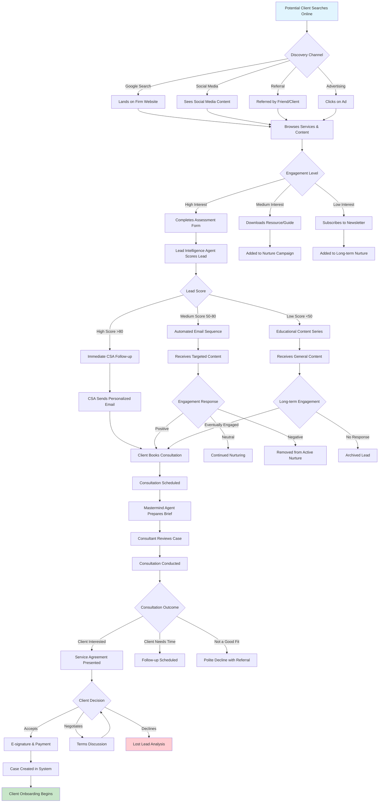

**Key Decision Points:**
- **Lead Scoring Threshold:** Determines immediate vs. nurture follow-up strategy
- **Consultation Outcome:** Drives different follow-up approaches
- **Service Agreement:** Critical conversion point with negotiation flexibility

---

## 2. Client Onboarding → Case Setup Flow

This flow demonstrates how new clients are onboarded and their cases are set up in the system.

```mermaid
flowchart TD
    A[Service Agreement Signed] --> B[CSA Triggers Onboarding]
    
    B --> C[Welcome Package Sent]
    C --> D[Client Portal Access Created]
    D --> E[Login Credentials Sent]
    
    E --> F[Client Logs into Portal]
    F --> G[Guided Onboarding Tour]
    G --> H[Profile Setup Wizard]
    
    H --> I[Basic Information Collection]
    I --> J[Immigration Goals Assessment]
    J --> K[Family Information Gathering]
    K --> L[Background Information]
    
    L --> M[Mastermind Agent Analyzes Profile]
    M --> N[Case Type Determination]
    N --> O[Initial Strategy Recommendation]
    
    O --> P[Consultant Reviews Recommendations]
    P --> Q{Consultant Approval}
    
    Q -->|Approved| R[Case Configuration Finalized]
    Q -->|Modifications Needed| S[Consultant Adjusts Strategy]
    
    S --> R
    
    R --> T[Custom Checklist Generated]
    T --> U[Document Requirements Created]
    U --> V[Timeline Established]
    
    V --> W[Client Dashboard Populated]
    W --> X[Initial Tasks Assigned]
    X --> Y[Welcome Call Scheduled]
    
    Y --> Z[CSA Conducts Welcome Call]
    Z --> AA[Client Questions Addressed]
    AA --> BB[Next Steps Explained]
    
    BB --> CC[Client Begins Document Collection]
    
    style A fill:#e1f5fe
    style CC fill:#c8e6c9
```

**Key Features:**
- **Guided Onboarding:** Step-by-step wizard for profile completion
- **AI-Powered Analysis:** Mastermind Agent provides initial case strategy
- **Human Oversight:** Consultant reviews and approves AI recommendations
- **Personalized Setup:** Custom checklists and timelines for each case

---

## 3. Document Collection → Validation Flow

This flow shows how clients upload documents and the system processes and validates them.

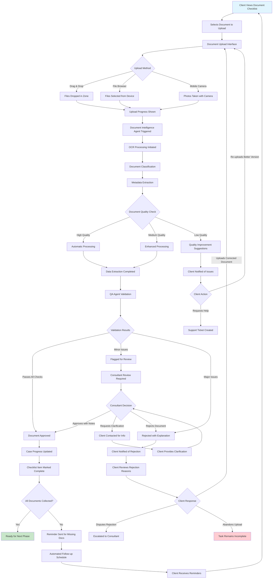

**Key Features:**
- **Multiple Upload Methods:** Supports various client preferences and devices
- **AI-Powered Processing:** Automatic OCR, classification, and validation
- **Quality Assurance:** Multi-level validation with human oversight
- **Smart Reminders:** Automated follow-up for incomplete documents

---

## 4. Eligibility Assessment → Strategy Planning Flow

This flow illustrates how the system assesses client eligibility and develops immigration strategies.

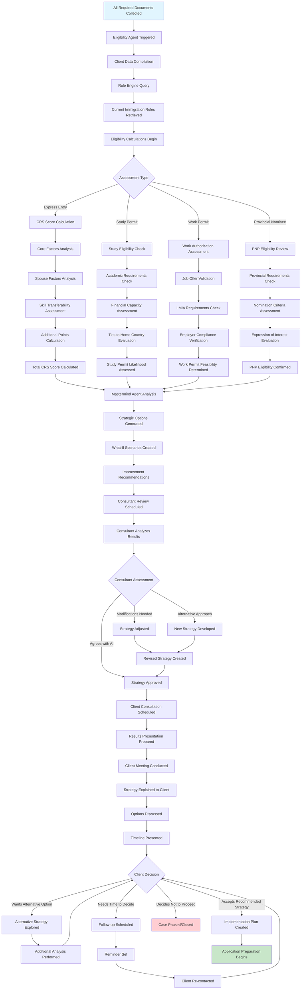

**Key Features:**
- **Comprehensive Assessment:** Multiple immigration pathways evaluated
- **AI-Powered Analysis:** Automated calculations with rule engine integration
- **Strategic Planning:** What-if scenarios and improvement recommendations
- **Human Expertise:** Consultant review and client consultation

---

## 5. Application Preparation → Submission Flow

This flow shows how applications are prepared, reviewed, and submitted to immigration authorities.

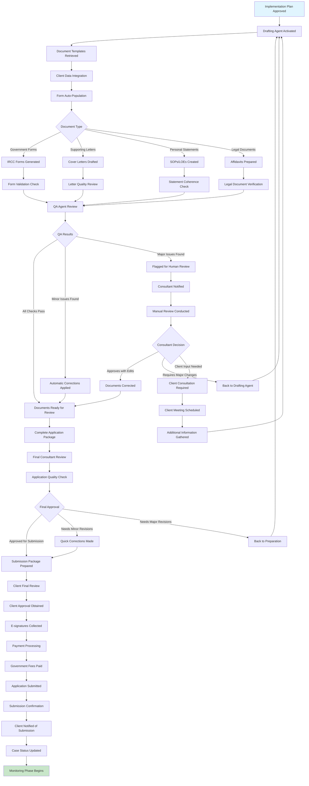

**Key Features:**
- **Automated Drafting:** AI generates documents from templates and client data
- **Multi-Level QA:** Automated and human quality assurance
- **Client Involvement:** Final review and approval by client
- **Seamless Submission:** Integrated payment and submission process

---

## 6. Case Monitoring → Decision Management Flow

This flow demonstrates how cases are monitored after submission and how decisions are managed.

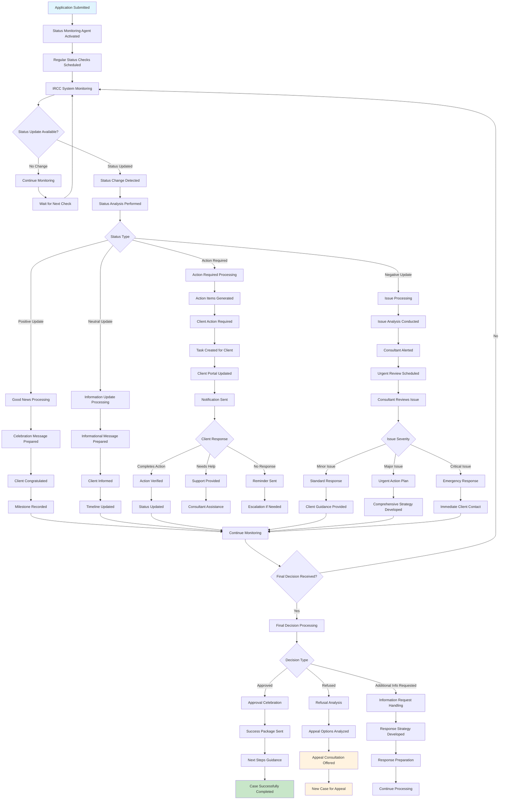

**Key Features:**
- **Automated Monitoring:** Regular status checks without manual intervention
- **Intelligent Categorization:** Different responses based on status type
- **Proactive Communication:** Immediate client notification of changes
- **Issue Escalation:** Automatic escalation for complex situations

---

## 7. Mobile User Experience Flow

This flow shows how clients interact with the system through mobile devices.

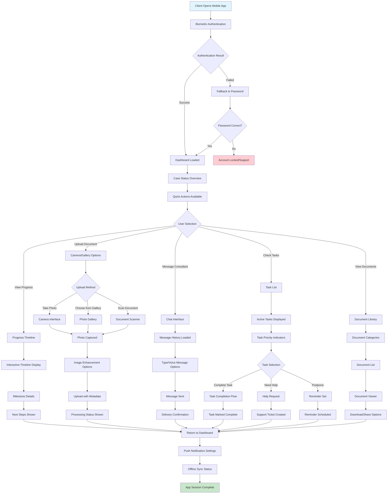

**Key Features:**
- **Biometric Security:** Fingerprint/face recognition for quick access
- **Offline Capability:** Core features work without internet connection
- **Camera Integration:** Easy document capture and upload
- **Push Notifications:** Real-time updates and reminders

---

## 8. Error Handling & Recovery Flows

### 8.1 System Error Recovery

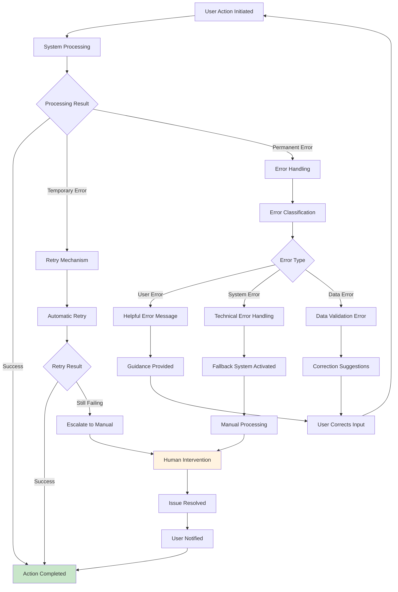

### 8.2 Data Loss Prevention

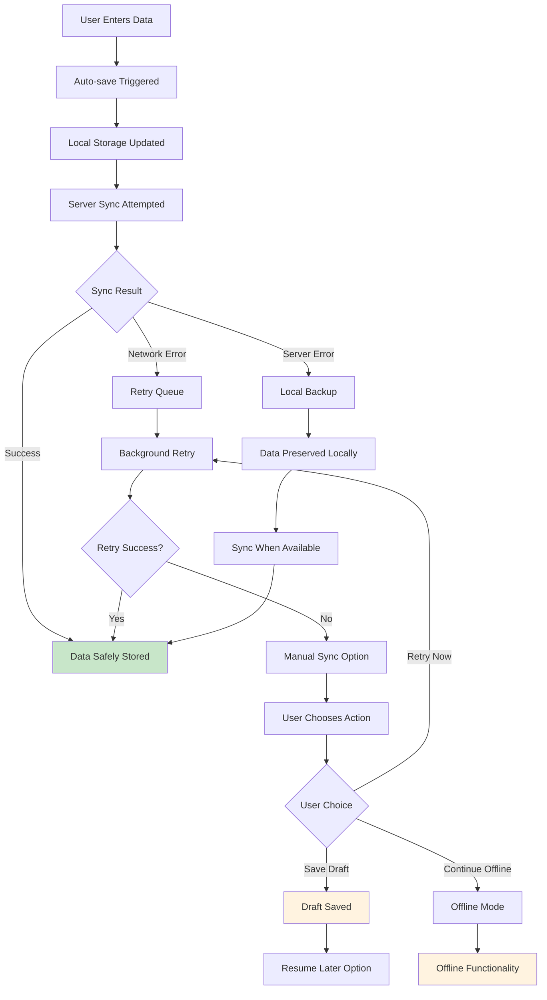

---

## 9. Accessibility & Inclusive Design

### 9.1 Screen Reader Support Flow

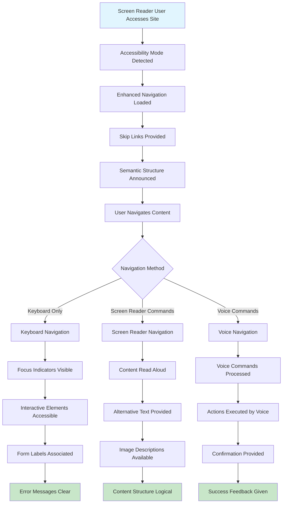

---

## 10. Performance Optimization Flows

### 10.1 Progressive Loading

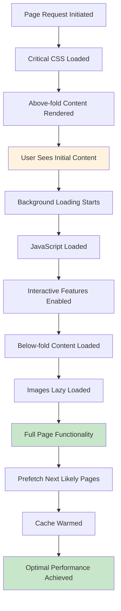

---

## Conclusion

These user flow diagrams provide a comprehensive view of how users interact with Canada Immigration OS across all key journeys. The flows demonstrate:

**User-Centric Design:**
- Clear, logical progression through complex processes
- Multiple paths to accommodate different user preferences
- Graceful error handling and recovery options

**AI Enhancement:**
- Intelligent automation that enhances rather than replaces human interaction
- Personalized experiences based on user behavior and preferences
- Proactive communication and support

**Accessibility & Inclusion:**
- Support for users with disabilities
- Multiple interaction methods (touch, voice, keyboard)
- Clear feedback and guidance throughout all processes

**Performance & Reliability:**
- Progressive loading for fast initial experiences
- Offline capability for core functions
- Robust error handling and data protection

These flows serve as the blueprint for creating an exceptional user experience that makes complex immigration processes accessible, transparent, and efficient for all users while maintaining the highest standards of legal compliance and professional service.