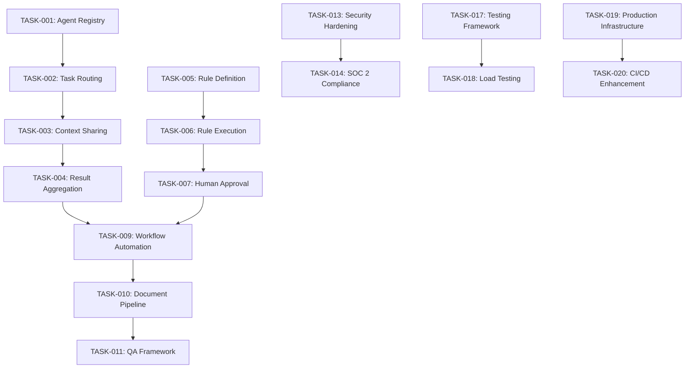

# Phase 1 Implementation Tasks

## Phase Overview

**Phase 1: Foundation Hardening (Nov 2024 - Mar 2025)**

This phase focuses on completing the core platform foundation with enterprise-grade reliability, implementing the AI agent orchestration framework, and establishing a comprehensive rule engine for immigration law compliance.

---

## Task Categories

### Critical Path Tasks (P0)
These tasks are essential for Phase 1 completion and block other work if not completed.

### High Priority Tasks (P1)
Important tasks that significantly impact user experience and platform capabilities.

### Medium Priority Tasks (P2)
Valuable enhancements that can be deferred if necessary.

---

## AI Agent Orchestration System

### TASK-001: Agent Registry and Lifecycle Management
**Priority:** P0  
**Estimated Effort:** 3 weeks  
**Assigned To:** Backend Team Lead  

#### Description
Implement a comprehensive agent registry system that manages the lifecycle of all AI agents in the platform.

#### Acceptance Criteria
- [ ] Agent registration and deregistration system
- [ ] Agent health monitoring and status tracking
- [ ] Agent versioning and deployment management
- [ ] Agent capability discovery and metadata
- [ ] Agent load balancing and scaling
- [ ] Comprehensive logging and audit trail

#### Technical Requirements
- RESTful API for agent management
- Database schema for agent metadata
- Health check endpoints for all agents
- Automated agent deployment pipeline
- Monitoring dashboard for agent status

#### Dependencies
- Database schema updates
- Monitoring infrastructure setup
- CI/CD pipeline configuration

#### Definition of Done
- All acceptance criteria met
- Unit tests with >90% coverage
- Integration tests passing
- Documentation complete
- Code review approved

---

### TASK-002: Task Distribution and Routing System
**Priority:** P0  
**Estimated Effort:** 4 weeks  
**Assigned To:** Senior Backend Developer  

#### Description
Build an intelligent task distribution system that routes work to appropriate AI agents based on capabilities, load, and context.

#### Acceptance Criteria
- [ ] Task queue management system
- [ ] Intelligent routing based on agent capabilities
- [ ] Load balancing across agent instances
- [ ] Priority-based task scheduling
- [ ] Task retry and error handling
- [ ] Performance monitoring and optimization

#### Technical Requirements
- Message queue system (Redis/RabbitMQ)
- Task routing algorithms
- Agent capability matching
- Performance metrics collection
- Error handling and recovery

#### Dependencies
- Agent registry system (TASK-001)
- Message queue infrastructure
- Monitoring system setup

---

### TASK-003: Context Sharing and State Management
**Priority:** P0  
**Estimated Effort:** 3 weeks  
**Assigned To:** Senior Backend Developer  

#### Description
Implement a context sharing system that allows AI agents to share information and maintain state across multi-step workflows.

#### Acceptance Criteria
- [ ] Shared context storage system
- [ ] Context versioning and history
- [ ] Context access control and permissions
- [ ] Context cleanup and garbage collection
- [ ] Context synchronization across agents
- [ ] Context backup and recovery

#### Technical Requirements
- Distributed cache system (Redis Cluster)
- Context serialization and deserialization
- Access control mechanisms
- Data consistency guarantees
- Performance optimization

#### Dependencies
- Agent registry system (TASK-001)
- Task routing system (TASK-002)
- Database infrastructure

---

### TASK-004: Result Aggregation and Validation
**Priority:** P0  
**Estimated Effort:** 2 weeks  
**Assigned To:** Backend Developer  

#### Description
Create a system to aggregate results from multiple AI agents and validate the combined output for consistency and quality.

#### Acceptance Criteria
- [ ] Result collection and aggregation
- [ ] Cross-agent result validation
- [ ] Conflict detection and resolution
- [ ] Quality scoring and assessment
- [ ] Result formatting and presentation
- [ ] Audit trail for all decisions

#### Technical Requirements
- Result aggregation algorithms
- Validation rule engine
- Conflict resolution strategies
- Quality metrics calculation
- Audit logging system

#### Dependencies
- Context sharing system (TASK-003)
- Quality assurance framework

---

## Immigration Rule Engine

### TASK-005: Rule Definition and Storage System
**Priority:** P0  
**Estimated Effort:** 4 weeks  
**Assigned To:** Senior Backend Developer  

#### Description
Build a comprehensive system for defining, storing, and managing immigration law rules and regulations.

#### Acceptance Criteria
- [ ] Rule definition language and schema
- [ ] Rule storage and indexing system
- [ ] Rule categorization and tagging
- [ ] Rule versioning and history
- [ ] Rule import/export capabilities
- [ ] Rule validation and testing framework

#### Technical Requirements
- Rule definition DSL (Domain Specific Language)
- Database schema for rule storage
- Rule indexing for fast retrieval
- Version control system for rules
- Rule validation engine

#### Dependencies
- Database infrastructure
- Version control system
- Testing framework

---

### TASK-006: Rule Execution Engine
**Priority:** P0  
**Estimated Effort:** 5 weeks  
**Assigned To:** Senior Backend Developer + AI Engineer  

#### Description
Implement a high-performance rule execution engine that can evaluate immigration rules against case data.

#### Acceptance Criteria
- [ ] Rule parsing and compilation
- [ ] Efficient rule evaluation algorithms
- [ ] Support for complex rule conditions
- [ ] Rule dependency resolution
- [ ] Performance optimization and caching
- [ ] Detailed execution logging

#### Technical Requirements
- Rule parsing and AST generation
- Rule evaluation algorithms
- Dependency graph resolution
- Caching mechanisms
- Performance monitoring

#### Dependencies
- Rule definition system (TASK-005)
- Performance monitoring infrastructure

---

### TASK-007: Human Approval Workflow
**Priority:** P0  
**Estimated Effort:** 3 weeks  
**Assigned To:** Full-Stack Developer  

#### Description
Create a workflow system for human review and approval of rule changes and critical decisions.

#### Acceptance Criteria
- [ ] Approval workflow definition
- [ ] Multi-level approval process
- [ ] Approval request notifications
- [ ] Approval history and audit trail
- [ ] Approval delegation and escalation
- [ ] Integration with user management

#### Technical Requirements
- Workflow engine
- Notification system
- User interface for approvals
- Audit logging
- Role-based permissions

#### Dependencies
- User management system
- Notification infrastructure
- Frontend framework

---

### TASK-008: Rule Performance Optimization
**Priority:** P1  
**Estimated Effort:** 2 weeks  
**Assigned To:** Backend Developer  

#### Description
Optimize rule execution performance for high-volume processing and real-time evaluation.

#### Acceptance Criteria
- [ ] Rule execution performance benchmarks
- [ ] Caching strategies for frequently used rules
- [ ] Rule compilation and optimization
- [ ] Parallel rule evaluation
- [ ] Performance monitoring and alerting
- [ ] Scalability testing and validation

#### Technical Requirements
- Performance benchmarking tools
- Caching infrastructure
- Parallel processing capabilities
- Monitoring and alerting
- Load testing framework

#### Dependencies
- Rule execution engine (TASK-006)
- Monitoring infrastructure
- Performance testing tools

---

## Enhanced Case Management

### TASK-009: Advanced Workflow Automation
**Priority:** P0  
**Estimated Effort:** 4 weeks  
**Assigned To:** Full-Stack Developer + Business Analyst  

#### Description
Implement advanced workflow automation capabilities for immigration case processing.

#### Acceptance Criteria
- [ ] Visual workflow designer
- [ ] Conditional workflow logic
- [ ] Automated task generation
- [ ] Workflow templates by case type
- [ ] Workflow monitoring and analytics
- [ ] Integration with AI agents

#### Technical Requirements
- Workflow engine (BPMN compatible)
- Visual workflow designer UI
- Workflow execution runtime
- Template management system
- Analytics and reporting

#### Dependencies
- AI agent orchestration system
- User interface framework
- Database schema updates

---

### TASK-010: Document Processing Pipeline
**Priority:** P0  
**Estimated Effort:** 5 weeks  
**Assigned To:** AI Engineer + Backend Developer  

#### Description
Build a comprehensive document processing pipeline with AI-powered classification, extraction, and validation.

#### Acceptance Criteria
- [ ] Automated document classification
- [ ] OCR and data extraction
- [ ] Document quality assessment
- [ ] Fraud detection capabilities
- [ ] Multi-format support (PDF, images)
- [ ] Integration with case workflows

#### Technical Requirements
- Document classification models
- OCR integration (Tesseract, cloud services)
- Data extraction algorithms
- Quality assessment metrics
- Fraud detection models

#### Dependencies
- AI model training infrastructure
- File storage system
- Machine learning pipeline

---

### TASK-011: Quality Assurance Framework
**Priority:** P0  
**Estimated Effort:** 3 weeks  
**Assigned To:** QA Engineer + Backend Developer  

#### Description
Establish a comprehensive quality assurance framework for all case processing activities.

#### Acceptance Criteria
- [ ] Quality metrics definition and tracking
- [ ] Automated quality checks
- [ ] Quality scoring algorithms
- [ ] Quality reporting and dashboards
- [ ] Quality improvement recommendations
- [ ] Integration with AI agents

#### Technical Requirements
- Quality metrics database
- Automated testing framework
- Quality scoring algorithms
- Reporting and visualization
- Integration APIs

#### Dependencies
- Case management system
- Reporting infrastructure
- AI agent system

---

### TASK-012: Performance Monitoring System
**Priority:** P1  
**Estimated Effort:** 2 weeks  
**Assigned To:** DevOps Engineer  

#### Description
Implement comprehensive performance monitoring for all platform components.

#### Acceptance Criteria
- [ ] Real-time performance metrics
- [ ] Performance alerting and notifications
- [ ] Performance trend analysis
- [ ] Capacity planning insights
- [ ] Performance optimization recommendations
- [ ] Integration with existing monitoring

#### Technical Requirements
- Metrics collection and storage
- Real-time dashboards
- Alerting system
- Trend analysis tools
- Capacity planning models

#### Dependencies
- Monitoring infrastructure (Prometheus, Grafana)
- Alerting system (AlertManager)
- Database for metrics storage

---

## Security and Compliance

### TASK-013: Security Hardening
**Priority:** P0  
**Estimated Effort:** 3 weeks  
**Assigned To:** Security Engineer + DevOps  

#### Description
Implement comprehensive security hardening across all platform components.

#### Acceptance Criteria
- [ ] Security vulnerability assessment
- [ ] Penetration testing and remediation
- [ ] Security configuration hardening
- [ ] Access control and authentication
- [ ] Data encryption at rest and in transit
- [ ] Security monitoring and alerting

#### Technical Requirements
- Security scanning tools
- Penetration testing framework
- Encryption implementation
- Access control systems
- Security monitoring tools

#### Dependencies
- Infrastructure setup
- Authentication system
- Monitoring infrastructure

---

### TASK-014: SOC 2 Type II Compliance
**Priority:** P0  
**Estimated Effort:** 4 weeks  
**Assigned To:** Compliance Officer + Security Engineer  

#### Description
Achieve SOC 2 Type II compliance readiness for enterprise customer requirements.

#### Acceptance Criteria
- [ ] SOC 2 control implementation
- [ ] Compliance documentation
- [ ] Audit trail and logging
- [ ] Policy and procedure documentation
- [ ] Employee training and certification
- [ ] Third-party audit preparation

#### Technical Requirements
- Compliance management system
- Audit logging infrastructure
- Policy management tools
- Training management system
- Documentation platform

#### Dependencies
- Security hardening (TASK-013)
- Audit logging system
- Policy management framework

---

## User Interface Enhancements

### TASK-015: Consultant Dashboard Improvements
**Priority:** P1  
**Estimated Effort:** 3 weeks  
**Assigned To:** Frontend Team Lead  

#### Description
Enhance the consultant dashboard with improved usability, performance, and functionality.

#### Acceptance Criteria
- [ ] Redesigned dashboard layout
- [ ] Real-time case status updates
- [ ] Advanced filtering and search
- [ ] Customizable dashboard widgets
- [ ] Mobile-responsive design
- [ ] Performance optimization

#### Technical Requirements
- React component library updates
- Real-time data synchronization
- Advanced search implementation
- Widget framework
- Mobile optimization

#### Dependencies
- Design system updates
- Backend API enhancements
- Real-time infrastructure

---

### TASK-016: Client Portal Enhancements
**Priority:** P1  
**Estimated Effort:** 3 weeks  
**Assigned To:** Frontend Developer  

#### Description
Improve the client portal with enhanced self-service capabilities and user experience.

#### Acceptance Criteria
- [ ] Improved document upload experience
- [ ] Real-time case status tracking
- [ ] Enhanced communication features
- [ ] Self-service appointment scheduling
- [ ] Mobile-optimized interface
- [ ] Accessibility improvements

#### Technical Requirements
- File upload optimization
- Real-time status updates
- Communication system integration
- Scheduling system integration
- Accessibility compliance (WCAG 2.1)

#### Dependencies
- Backend API updates
- Real-time infrastructure
- Scheduling system

---

## Testing and Quality Assurance

### TASK-017: Automated Testing Framework
**Priority:** P0  
**Estimated Effort:** 2 weeks  
**Assigned To:** QA Engineer  

#### Description
Establish comprehensive automated testing framework for all platform components.

#### Acceptance Criteria
- [ ] Unit testing framework and standards
- [ ] Integration testing suite
- [ ] End-to-end testing automation
- [ ] Performance testing framework
- [ ] Test data management
- [ ] Continuous testing pipeline

#### Technical Requirements
- Testing frameworks (Jest, Pytest, Playwright)
- Test data generation tools
- CI/CD integration
- Test reporting and analytics
- Test environment management

#### Dependencies
- CI/CD pipeline
- Test environment infrastructure
- Test data management system

---

### TASK-018: Load Testing and Performance Validation
**Priority:** P1  
**Estimated Effort:** 2 weeks  
**Assigned To:** Performance Engineer  

#### Description
Conduct comprehensive load testing and performance validation for production readiness.

#### Acceptance Criteria
- [ ] Load testing scenarios and scripts
- [ ] Performance baseline establishment
- [ ] Scalability testing and validation
- [ ] Performance bottleneck identification
- [ ] Performance optimization recommendations
- [ ] Production readiness assessment

#### Technical Requirements
- Load testing tools (K6, JMeter)
- Performance monitoring integration
- Test environment scaling
- Performance analysis tools
- Optimization recommendations

#### Dependencies
- Performance monitoring system (TASK-012)
- Test environment infrastructure
- Production-like test data

---

## Infrastructure and DevOps

### TASK-019: Production Infrastructure Setup
**Priority:** P0  
**Estimated Effort:** 3 weeks  
**Assigned To:** DevOps Team Lead  

#### Description
Set up production-ready infrastructure with high availability, scalability, and security.

#### Acceptance Criteria
- [ ] Production environment provisioning
- [ ] High availability configuration
- [ ] Auto-scaling setup
- [ ] Backup and disaster recovery
- [ ] Security configuration
- [ ] Monitoring and alerting integration

#### Technical Requirements
- Cloud infrastructure (AWS/GCP/Azure)
- Container orchestration (Kubernetes)
- Load balancing and auto-scaling
- Backup and recovery systems
- Security configuration

#### Dependencies
- Cloud provider selection
- Security requirements
- Monitoring infrastructure

---

### TASK-020: CI/CD Pipeline Enhancement
**Priority:** P1  
**Estimated Effort:** 2 weeks  
**Assigned To:** DevOps Engineer  

#### Description
Enhance CI/CD pipeline for automated testing, deployment, and rollback capabilities.

#### Acceptance Criteria
- [ ] Automated build and test pipeline
- [ ] Deployment automation
- [ ] Rollback capabilities
- [ ] Environment promotion workflow
- [ ] Security scanning integration
- [ ] Performance testing integration

#### Technical Requirements
- CI/CD platform (GitHub Actions, GitLab CI)
- Deployment automation tools
- Security scanning tools
- Performance testing integration
- Rollback mechanisms

#### Dependencies
- Testing framework (TASK-017)
- Security scanning tools
- Production infrastructure (TASK-019)

---

## Task Dependencies and Timeline

### Critical Path Analysis


### Phase 1 Timeline
```yaml
week_1_2:
  - "TASK-001: Agent Registry (Start)"
  - "TASK-005: Rule Definition (Start)"
  - "TASK-017: Testing Framework"

week_3_4:
  - "TASK-001: Agent Registry (Complete)"
  - "TASK-002: Task Routing (Start)"
  - "TASK-013: Security Hardening (Start)"

week_5_6:
  - "TASK-005: Rule Definition (Complete)"
  - "TASK-006: Rule Execution (Start)"
  - "TASK-003: Context Sharing (Start)"

week_7_8:
  - "TASK-002: Task Routing (Complete)"
  - "TASK-007: Human Approval (Start)"
  - "TASK-019: Production Infrastructure (Start)"

week_9_10:
  - "TASK-003: Context Sharing (Complete)"
  - "TASK-004: Result Aggregation"
  - "TASK-009: Workflow Automation (Start)"

week_11_12:
  - "TASK-006: Rule Execution (Complete)"
  - "TASK-010: Document Pipeline (Start)"
  - "TASK-015: Dashboard Improvements (Start)"

week_13_14:
  - "TASK-007: Human Approval (Complete)"
  - "TASK-011: QA Framework (Start)"
  - "TASK-014: SOC 2 Compliance (Start)"

week_15_16:
  - "TASK-009: Workflow Automation (Complete)"
  - "TASK-018: Load Testing"
  - "TASK-020: CI/CD Enhancement"
```

---

## Resource Allocation

### Team Assignments
```yaml
backend_team:
  lead: "Senior Backend Developer"
  members: 3
  focus: "AI orchestration, rule engine, case management"

frontend_team:
  lead: "Frontend Team Lead"
  members: 2
  focus: "UI enhancements, user experience"

ai_team:
  lead: "AI Engineer"
  members: 2
  focus: "Document processing, AI integration"

devops_team:
  lead: "DevOps Team Lead"
  members: 2
  focus: "Infrastructure, deployment, monitoring"

qa_team:
  lead: "QA Engineer"
  members: 2
  focus: "Testing, quality assurance, compliance"
```

### Skill Requirements
- **Backend Development:** Python/FastAPI, PostgreSQL, Redis, microservices
- **Frontend Development:** React, TypeScript, modern web technologies
- **AI/ML:** Machine learning, NLP, document processing, model deployment
- **DevOps:** Kubernetes, cloud platforms, CI/CD, monitoring
- **QA:** Test automation, performance testing, security testing

---

## Success Criteria and Acceptance

### Phase 1 Completion Criteria
- [ ] All P0 tasks completed and deployed
- [ ] 95% automated test coverage achieved
- [ ] Performance benchmarks met
- [ ] Security audit passed
- [ ] SOC 2 compliance readiness achieved
- [ ] Production deployment successful
- [ ] Customer pilot program launched

### Quality Gates
- **Code Quality:** 90%+ test coverage, code review approval
- **Performance:** <2s response time, 99.9% uptime
- **Security:** Zero critical vulnerabilities, security audit passed
- **Compliance:** SOC 2 readiness, audit trail complete

---

*This task list is maintained by the development team and updated regularly based on progress and changing requirements.*

**Document Version:** 1.0  
**Last Updated:** 2025-11-17  
**Next Review:** 2025-11-24