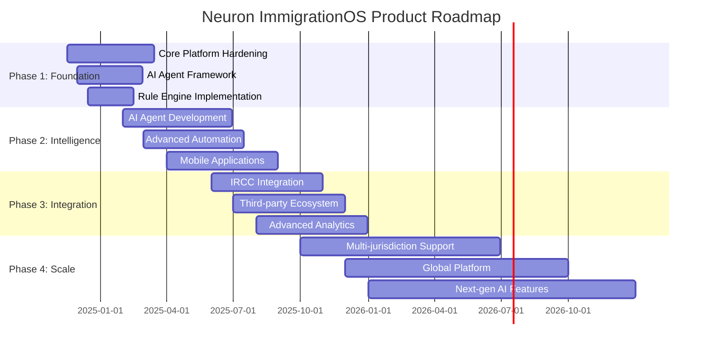

# Product Roadmap

## Document Purpose

This document outlines the strategic product roadmap for the Neuron ImmigrationOS platform, defining key milestones, deliverables, and success criteria for each development phase.

---

## Roadmap Overview

### Vision Statement
**"To become the definitive AI-powered platform for immigration consulting, transforming how consultants serve clients and how clients navigate their immigration journey."**

### Strategic Objectives
1. **Market Leadership:** Establish dominant position in Canadian immigration consulting
2. **AI Innovation:** Pioneer AI-driven automation in immigration services
3. **User Experience:** Deliver exceptional experience for consultants and clients
4. **Scalability:** Build platform capable of serving thousands of consultants globally
5. **Compliance:** Maintain highest standards of legal and regulatory compliance

---

## Roadmap Timeline



---

## Phase 1: Foundation Hardening (Nov 2024 - Mar 2025)

### Phase Objectives
- Complete core platform foundation with enterprise-grade reliability
- Implement AI agent orchestration framework
- Establish comprehensive rule engine for immigration law compliance
- Achieve production readiness for initial customer deployment

### Key Milestones

#### Milestone 1.1: AI Agent Orchestration (Dec 2024)
**Deliverables:**
- Multi-agent coordination framework
- Agent registry and lifecycle management
- Task distribution and routing system
- Context sharing and state management
- Basic error handling and recovery

**Success Criteria:**
- 5+ AI agents working in coordination
- 95% task completion rate
- <2 second average response time
- Comprehensive audit trail

#### Milestone 1.2: Immigration Rule Engine (Jan 2025)
**Deliverables:**
- Comprehensive rule definition system
- Rule execution and validation engine
- Human approval workflow
- Rule versioning and audit trail
- Performance-optimized rule processing

**Success Criteria:**
- 100+ immigration rules implemented
- 99.9% rule execution accuracy
- <100ms rule evaluation time
- Complete audit and compliance tracking

#### Milestone 1.3: Enhanced Case Management (Feb 2025)
**Deliverables:**
- Advanced case workflow automation
- Document processing pipeline
- Quality assurance framework
- Performance monitoring system
- Security and compliance hardening

**Success Criteria:**
- 50% reduction in manual case processing time
- 99.5% system uptime
- SOC 2 Type II compliance readiness
- <1 second average page load time

#### Milestone 1.4: Production Readiness (Mar 2025)
**Deliverables:**
- Complete testing and quality assurance
- Production deployment infrastructure
- Monitoring and alerting systems
- Customer onboarding processes
- Support and documentation

**Success Criteria:**
- 95% test coverage across all modules
- Zero critical security vulnerabilities
- 24/7 monitoring and alerting
- Customer onboarding process validated

### Phase 1 Success Metrics
```yaml
success_metrics:
  technical:
    - "99.9% system uptime"
    - "95% automated test coverage"
    - "<2 second average response time"
    - "Zero critical security issues"
  
  business:
    - "10+ pilot customers onboarded"
    - "90% customer satisfaction score"
    - "50% reduction in case processing time"
    - "100% regulatory compliance"
  
  user_experience:
    - "4.5+ app store rating"
    - "80% feature adoption rate"
    - "90% user task completion rate"
    - "<5% user error rate"
```

---

## Phase 2: AI and Intelligence (Feb 2025 - Aug 2025)

### Phase Objectives
- Deploy comprehensive AI agent ecosystem
- Implement advanced automation and intelligence features
- Launch mobile applications for consultants and clients
- Achieve market-leading AI capabilities in immigration consulting

### Key Milestones

#### Milestone 2.1: Core AI Agents (Apr 2025)
**Deliverables:**
- Mastermind Consultant Agent (domain expertise)
- Eligibility & CRS Agent (assessment and scoring)
- Document Processing Agent (OCR and validation)
- Form-Filling Agent (automated form completion)
- QA Agent (quality assurance and validation)

**Success Criteria:**
- 12+ specialized AI agents operational
- 90% automation rate for routine tasks
- 95% accuracy in eligibility assessments
- 80% reduction in form completion time

#### Milestone 2.2: Advanced Document Intelligence (May 2025)
**Deliverables:**
- AI-powered document classification
- Intelligent data extraction and validation
- Fraud detection capabilities
- Multi-language document processing
- Automated quality scoring

**Success Criteria:**
- 95% document classification accuracy
- 90% data extraction accuracy
- 99% fraud detection rate
- Support for 10+ languages

#### Milestone 2.3: Mobile Applications (Jul 2025)
**Deliverables:**
- Native iOS application
- Native Android application
- Offline synchronization
- Push notifications
- Mobile-optimized workflows

**Success Criteria:**
- 4.5+ app store rating
- 80% mobile user adoption
- 95% offline functionality
- <3 second app launch time

#### Milestone 2.4: Predictive Analytics (Aug 2025)
**Deliverables:**
- Application success prediction
- Processing time estimation
- Risk assessment and flagging
- Optimization recommendations
- Trend analysis and insights

**Success Criteria:**
- 85% prediction accuracy
- 90% user satisfaction with recommendations
- 30% improvement in application success rates
- Real-time analytics dashboard

### Phase 2 Success Metrics
```yaml
success_metrics:
  ai_performance:
    - "90% task automation rate"
    - "95% AI decision accuracy"
    - "85% prediction accuracy"
    - "99% system reliability"
  
  user_adoption:
    - "100+ active customers"
    - "10,000+ cases processed"
    - "80% mobile app adoption"
    - "95% user retention rate"
  
  business_impact:
    - "70% reduction in processing time"
    - "50% increase in consultant productivity"
    - "40% improvement in success rates"
    - "90% customer satisfaction"
```

---

## Phase 3: Integration and Ecosystem (Jun 2025 - Dec 2025)

### Phase Objectives
- Integrate with IRCC systems for real-time status monitoring
- Build comprehensive third-party integration ecosystem
- Implement advanced analytics and business intelligence
- Establish platform as central hub for immigration services

### Key Milestones

#### Milestone 3.1: IRCC Integration Platform (Sep 2025)
**Deliverables:**
- Real-time application status monitoring
- Automated status update notifications
- Processing time tracking and predictions
- Government correspondence management
- Compliance monitoring and reporting

**Success Criteria:**
- Real-time status updates for 95% of applications
- 99% accuracy in status information
- <1 minute notification delivery time
- 100% compliance with IRCC requirements

#### Milestone 3.2: Third-Party Ecosystem (Oct 2025)
**Deliverables:**
- API platform and developer portal
- Integration marketplace
- Partner onboarding system
- Webhook and event framework
- Revenue sharing platform

**Success Criteria:**
- 20+ third-party integrations
- 100+ API partners
- $1M+ ecosystem revenue
- 95% API uptime

#### Milestone 3.3: Advanced Analytics Platform (Nov 2025)
**Deliverables:**
- Business intelligence dashboard
- Custom reporting engine
- Predictive analytics suite
- Performance benchmarking
- Market intelligence features

**Success Criteria:**
- 50+ standard reports
- Custom dashboard creation
- Real-time data processing
- 90% user adoption of analytics

#### Milestone 3.4: Enterprise Features (Dec 2025)
**Deliverables:**
- Advanced security and compliance
- Multi-office support
- White-label capabilities
- Enterprise integrations
- Advanced user management

**Success Criteria:**
- SOC 2 Type II certification
- 10+ enterprise customers
- 99.99% security compliance
- Advanced role-based access control

### Phase 3 Success Metrics
```yaml
success_metrics:
  integration:
    - "95% IRCC integration coverage"
    - "20+ third-party integrations"
    - "99.9% API uptime"
    - "100% data accuracy"
  
  ecosystem:
    - "100+ partner integrations"
    - "$1M+ ecosystem revenue"
    - "1000+ developers using APIs"
    - "95% partner satisfaction"
  
  enterprise:
    - "50+ enterprise customers"
    - "10,000+ consultant users"
    - "100,000+ cases processed"
    - "99% enterprise retention"
```

---

## Phase 4: Scale and Innovation (Oct 2025 - Dec 2026)

### Phase Objectives
- Expand to multiple immigration jurisdictions
- Implement next-generation AI and machine learning capabilities
- Achieve global platform scale and market leadership
- Pioneer future of immigration technology

### Key Milestones

#### Milestone 4.1: Multi-Jurisdiction Expansion (Mar 2026)
**Deliverables:**
- United States immigration support
- Australia immigration support
- United Kingdom immigration support
- Localization framework
- Multi-currency and multi-language support

**Success Criteria:**
- 4+ countries supported
- 10+ languages supported
- 1000+ international customers
- 95% localization accuracy

#### Milestone 4.2: Next-Generation AI (Jun 2026)
**Deliverables:**
- Large language model integration
- Advanced natural language processing
- Conversational AI interfaces
- Autonomous case processing
- Self-improving AI systems

**Success Criteria:**
- 95% natural language understanding
- 90% autonomous case processing
- 99% AI decision accuracy
- Continuous learning and improvement

#### Milestone 4.3: Global Platform Scale (Sep 2026)
**Deliverables:**
- Global infrastructure deployment
- Multi-region data centers
- Advanced scalability features
- Global compliance framework
- Worldwide support organization

**Success Criteria:**
- 99.99% global uptime
- <100ms response time globally
- 10,000+ consultant customers
- 1M+ cases processed annually

#### Milestone 4.4: Market Leadership (Dec 2026)
**Deliverables:**
- Industry-leading feature set
- Comprehensive competitive advantages
- Market-dominant position
- Innovation leadership
- Ecosystem platform leadership

**Success Criteria:**
- #1 market position in target segments
- 50%+ market share in key regions
- Industry recognition and awards
- Thought leadership position

### Phase 4 Success Metrics
```yaml
success_metrics:
  scale:
    - "10,000+ consultant customers"
    - "1M+ cases processed annually"
    - "99.99% global uptime"
    - "50+ countries served"
  
  innovation:
    - "95% AI automation rate"
    - "Industry-leading NPS score"
    - "10+ patents filed"
    - "Thought leadership recognition"
  
  market_leadership:
    - "50%+ market share"
    - "$100M+ annual revenue"
    - "Global brand recognition"
    - "Industry standard platform"
```

---

## Risk Management and Mitigation

### Strategic Risks

#### Technology Risks
```yaml
technology_risks:
  ai_complexity:
    risk: "AI system complexity and reliability"
    probability: "Medium"
    impact: "High"
    mitigation:
      - "Incremental AI deployment"
      - "Comprehensive testing framework"
      - "Human oversight and validation"
      - "Fallback mechanisms"
  
  scalability:
    risk: "Platform scalability under load"
    probability: "Medium"
    impact: "High"
    mitigation:
      - "Cloud-native architecture"
      - "Horizontal scaling design"
      - "Performance testing and monitoring"
      - "Capacity planning and management"
```

#### Market Risks
```yaml
market_risks:
  competition:
    risk: "Competitive pressure and market disruption"
    probability: "High"
    impact: "Medium"
    mitigation:
      - "Continuous innovation and R&D"
      - "Strong customer relationships"
      - "Intellectual property protection"
      - "Market leadership maintenance"
  
  regulatory_changes:
    risk: "Immigration law and policy changes"
    probability: "High"
    impact: "Medium"
    mitigation:
      - "Flexible rule engine architecture"
      - "Rapid adaptation capabilities"
      - "Legal expert advisory board"
      - "Continuous monitoring and updates"
```

#### Operational Risks
```yaml
operational_risks:
  talent_acquisition:
    risk: "Difficulty hiring and retaining key talent"
    probability: "Medium"
    impact: "High"
    mitigation:
      - "Competitive compensation packages"
      - "Strong company culture and mission"
      - "Professional development opportunities"
      - "Remote work flexibility"
  
  customer_adoption:
    risk: "Slower than expected customer adoption"
    probability: "Medium"
    impact: "High"
    mitigation:
      - "Strong customer success program"
      - "Comprehensive training and support"
      - "Continuous user feedback integration"
      - "Flexible pricing and packaging"
```

---

## Success Measurement Framework

### Key Performance Indicators (KPIs)

#### Product KPIs
```yaml
product_kpis:
  functionality:
    - "Feature completion rate vs. roadmap"
    - "User story acceptance rate"
    - "System reliability and uptime"
    - "Performance benchmarks achievement"
  
  quality:
    - "Defect density and resolution time"
    - "Customer satisfaction scores"
    - "User experience metrics"
    - "Security and compliance scores"
  
  innovation:
    - "AI automation rate improvement"
    - "New capability delivery rate"
    - "Competitive advantage metrics"
    - "Technology leadership indicators"
```

#### Business KPIs
```yaml
business_kpis:
  growth:
    - "Customer acquisition rate"
    - "Revenue growth rate"
    - "Market share expansion"
    - "Geographic expansion success"
  
  retention:
    - "Customer retention rate"
    - "Net Promoter Score (NPS)"
    - "Customer lifetime value"
    - "Churn rate and reasons"
  
  efficiency:
    - "Customer acquisition cost"
    - "Revenue per customer"
    - "Operational efficiency metrics"
    - "Time to value for customers"
```

### Reporting and Review Cadence

#### Weekly Reviews
- Development progress against milestones
- Key metrics and performance indicators
- Risk assessment and mitigation status
- Resource allocation and capacity planning

#### Monthly Reviews
- Phase progress and milestone achievement
- Customer feedback and satisfaction
- Competitive landscape analysis
- Financial performance and projections

#### Quarterly Reviews
- Strategic alignment and roadmap adjustments
- Market position and competitive analysis
- Technology trends and innovation opportunities
- Long-term planning and resource allocation

---

## Roadmap Evolution and Adaptation

### Continuous Planning Process
- **Market Feedback Integration:** Regular customer and market feedback incorporation
- **Technology Evolution:** Adaptation to new technologies and capabilities
- **Competitive Response:** Strategic responses to competitive moves
- **Regulatory Changes:** Adaptation to immigration law and policy changes

### Roadmap Update Process
1. **Quarterly Assessment:** Comprehensive review of progress and market conditions
2. **Stakeholder Input:** Feedback from customers, partners, and internal teams
3. **Strategic Alignment:** Ensure continued alignment with business objectives
4. **Communication:** Clear communication of changes to all stakeholders

---

*This roadmap is a living document that evolves based on market feedback, technical discoveries, and strategic priorities. Regular updates ensure continued alignment with business objectives and market opportunities.*

**Document Version:** 1.0  
**Last Updated:** 2025-11-17  
**Next Review:** 2025-12-17